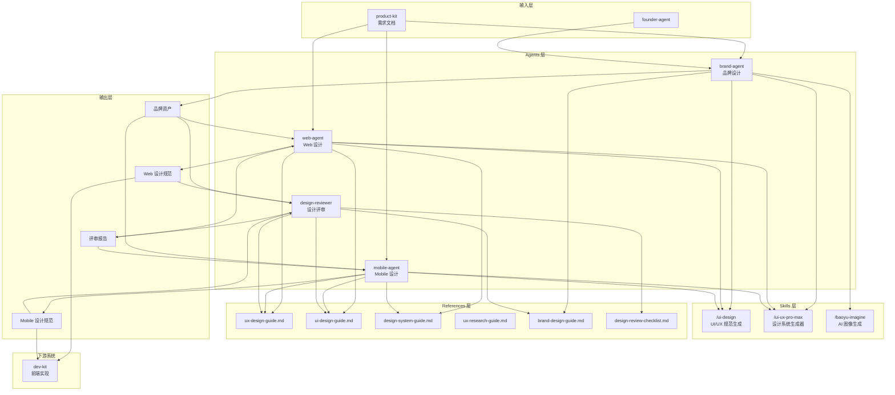

## 架构图



## 关键模块与职责

### 1. Agents 层

#### brand-agent（sonnet 模型）
- **职责**：品牌设计专家，负责品牌策略、视觉识别、Logo 设计、品牌规范
- **核心能力**：
  - 品牌策略：定位、个性、语调、受众、故事
  - 视觉识别：Logo、色彩、字体、视觉风格、图标风格
  - 品牌规范：使用规则、规格、正确/错误用法、应用示例
  - 品牌一致性：跨产品品牌对齐、营销模板、社交媒体指南
- **可用 Skills**：/ui-ux-pro-max, /baoyu-imagine
- **工具**：Bash, Read, Write, Edit, Glob, Grep, Agent
- **设计流程**：
  1. Discovery（理解产品、受众、竞品、目标）
  2. Strategy（定位、个性、语调、关键信息）
  3. Visual Identity（色彩、字体、Logo、风格）
  4. Guidelines（规范文档、使用示例、资产文件）

#### web-agent（sonnet 模型）
- **职责**：Web 平台设计专家，负责响应式设计、Dashboard、Landing Page
- **核心能力**：
  - 信息架构：结构、导航、层级、路径
  - UX 设计：用户流程、交互模式、状态管理、微交互
  - 视觉设计：布局、网格、色彩应用、图标选择
  - 组件规格：结构、变体、令牌、响应式、无障碍
- **技术栈**：React, Vue, Next.js, Svelte, Tailwind CSS
- **可用 Skills**：/ui-design, /ui-ux-pro-max, /baoyu-imagine
- **工具**：Bash, Read, Write, Edit, Glob, Grep, Agent
- **设计流程**：
  1. 理解需求（需求、用户故事、目标、约束）
  2. 信息架构（页面清单、导航、层级）
  3. 用户流程（流程图、状态转换、边缘情况）
  4. 视觉设计（设计系统、品牌应用、响应式布局）
  5. 交接（设计决策文档、组件规格）

#### mobile-agent（sonnet 模型）
- **职责**：Mobile 平台设计专家，负责 iOS/Android/跨平台应用设计
- **核心能力**：
  - 平台特定设计：HIG 合规、Material Design 3 合规
  - 触摸与手势：目标尺寸、手势模式、触觉反馈
  - Mobile UX 模式：导航、输入、刷新、滚动、弹窗
  - 响应式 Mobile：多设备尺寸、平板、横屏、分屏
- **支持平台**：iOS (SwiftUI), Android (Jetpack Compose), React Native, Flutter, uni-app
- **可用 Skills**：/ui-design, /ui-ux-pro-max, /baoyu-imagine
- **工具**：Bash, Read, Write, Edit, Glob, Grep, Agent
- **设计流程**：
  1. 理解需求（需求、平台、品牌、特定需求）
  2. 平台策略（原生 vs 跨平台、共享 vs 特定组件）
  3. 用户流程（Mobile 特定流程、手势、离线场景）
  4. 视觉设计（设计系统、品牌应用、设备尺寸）
  5. 交接（平台特定规格、资产导出、动画规格）

#### design-reviewer（sonnet 模型）
- **职责**：设计评审专家，负责一致性检查、无障碍合规、品牌合规
- **核心能力**：
  - 设计一致性：视觉、组件、间距、字体、色彩一致性
  - 无障碍合规：WCAG 2.1 AA、对比度、键盘、屏幕阅读器
  - 品牌合规：Logo、色彩、字体、语调、风格一致性
  - UX 质量：流程完整性、状态覆盖、反馈、导航
  - 设计系统合规：令牌使用、组件遵循、命名、文档
- **可用 Skills**：/ui-ux-pro-max（参考标准）
- **工具**：Bash, Read, Write, Edit, Glob, Grep, Agent
- **评审流程**：
  1. 收集上下文（目标、品牌指南、平台、重点）
  2. 系统评审（视觉、无障碍、品牌、UX、平台特定）
  3. 问题文档（严重级别、类别、位置、描述、修复建议）
  4. 报告生成（摘要、按严重级别/类别分类、详细发现、建议）

### 2. Skills 层

#### /ui-design skill
- **职责**：从产品需求生成 UI/UX 设计规范
- **流程**：
  1. 理解上下文（需求、用户故事、目标、约束）
  2. 信息架构（页面清单、导航、层级）
  3. 交互设计（用户流程、状态转换、错误/空状态）
  4. 组件规格（UI 组件、布局规则、交互行为、无障碍）
  5. 设计令牌（色彩、字体、间距、圆角、阴影）

#### /ui-ux-pro-max skill
- **职责**：设计系统生成器，提供全面的设计智能
- **能力矩阵**：
  - 50+ 设计风格（glassmorphism, minimalism, brutalism 等）
  - 97 色彩系统（按产品类型分类）
  - 57 字体配对（Google Fonts）
  - 25 图表类型
  - 9 技术栈支持（html-tailwind, react, nextjs, vue, svelte, swiftui, react-native, flutter, shadcn）
- **使用方式**：
  ```bash
  # 生成完整设计系统
  python3 scripts/search.py "<query>" --design-system -p "ProjectName"
  
  # 按域搜索
  python3 scripts/search.py "<keyword>" --domain <domain>
  
  # 按栈搜索
  python3 scripts/search.py "<keyword>" --stack <stack>
  ```

#### /baoyu-imagine skill
- **职责**：AI 图像生成，支持多提供商
- **支持提供商**：
  - OpenAI (DALL-E)
  - Azure OpenAI
  - Google (Imagen)
  - DashScope (通义万相)
  - Replicate
  - OpenRouter
  - Minimax
  - Zai
- **用途**：
  - Logo 概念生成
  - 品牌视觉素材
  - 设计 Mockup
  - 插画风格探索

### 3. References 层

| 文档 | 内容 | 用途 |
|------|------|------|
| `ux-design-guide.md` | UX 原则、用户流程、线框图、可用性启发式 | web-agent, mobile-agent 参考 |
| `ui-design-guide.md` | UI 原则、设计令牌、色彩系统、字体排版 | web-agent, mobile-agent 参考 |
| `design-system-guide.md` | 设计系统架构、令牌分类、组件库、主题系统 | 所有 agent 参考 |
| `ux-research-guide.md` | 用户研究方法、可用性测试、访谈、旅程地图 | 辅助研究参考 |
| `brand-design-guide.md` | 品牌设计流程、视觉识别、品牌规范 | brand-agent, design-reviewer 参考 |
| `design-review-checklist.md` | 设计评审清单、无障碍检查、品牌合规 | design-reviewer 参考 |

### 4. 工作流模式

#### 新产品完整设计
```
brand-agent → web-agent / mobile-agent → design-reviewer → dev-kit
    │              │              │
  品牌定义      平台设计        评审验收
```

#### 仅 Web 设计
```
web-agent → design-reviewer → dev-kit
```

#### 仅 Mobile 设计
```
mobile-agent → design-reviewer → dev-kit
```

#### 多平台并行设计
```
brand-agent → web-agent + mobile-agent (并行) → design-reviewer → dev-kit
```

### 5. 数据流

```
product-kit 输出 → brand-agent → 品牌资产
                         ↓
                    web-agent / mobile-agent → 设计规范
                         ↓
                    design-reviewer → 评审报告
                         ↓
                    dev-kit → 前端实现
```

### 6. 与其他系统集成

#### 上游系统
| 系统 | 输入内容 | 触发条件 |
|------|----------|----------|
| product-kit | 需求文档、用户故事、验收标准 | 设计阶段开始 |
| opc-founder | 设计任务调度 | `/opc` 命令调度 |

#### 下游系统
| 系统 | 输出内容 | 交接格式 |
|------|----------|----------|
| dev-kit | 设计规范、组件规格、设计令牌 | Markdown + JSON |

## 技术选型与约束

### 技术栈
- **Agent 框架**：Claude Code Agent SDK
- **模型选择**：所有 agent 使用 sonnet 模型
- **工具集**：Bash, Read, Write, Edit, Glob, Grep, Agent
- **设计系统工具**：Python 脚本（ui-ux-pro-max）

### 设计约束
1. **一人公司模式**：所有工具设计为单人使用
2. **平台覆盖**：支持 Web + iOS + Android + 跨平台
3. **无障碍优先**：所有设计必须满足 WCAG 2.1 AA
4. **品牌一致性**：跨平台品牌必须一致应用

### 扩展性设计
- Agents 可独立调用或通过 founder-agent 编排
- Skills 可独立使用或组合使用
- References 可作为独立参考或集成到 agent 流程
- 支持新增设计风格、色彩系统、字体配对

### 质量保障
- 所有设计必须通过 design-reviewer 评审
- 无障碍合规必须满足 WCAG 2.1 AA
- 品牌合规必须满足品牌规范
- 输出格式结构化，便于 dev-kit 解析