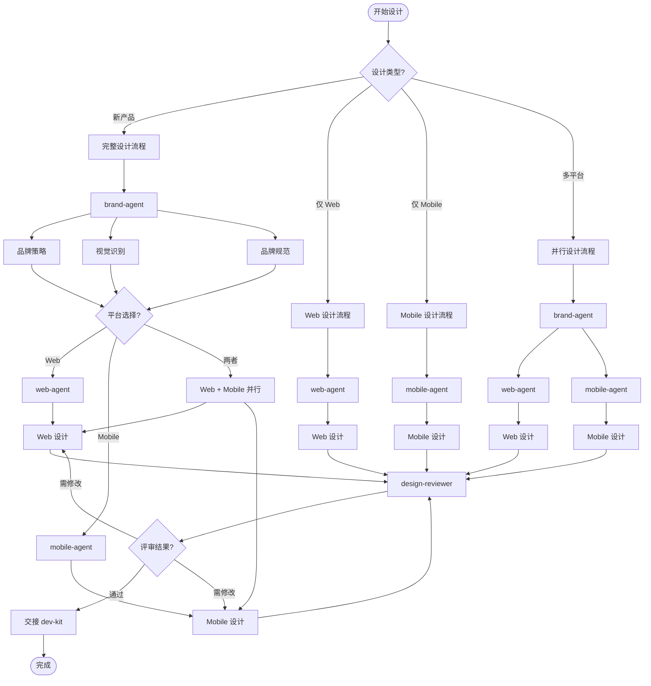
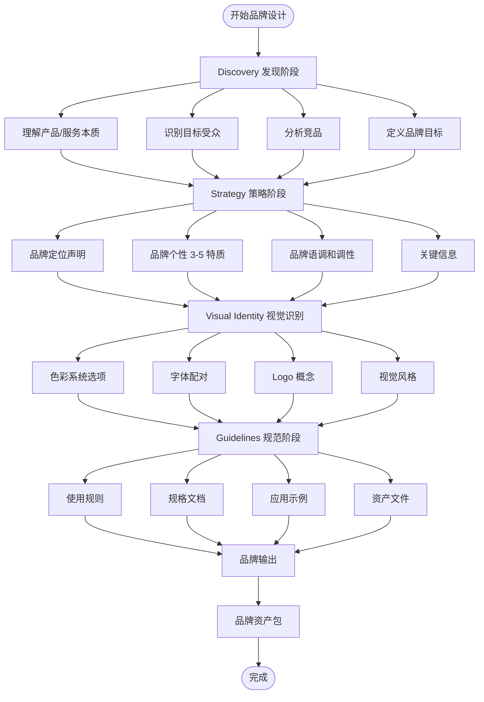
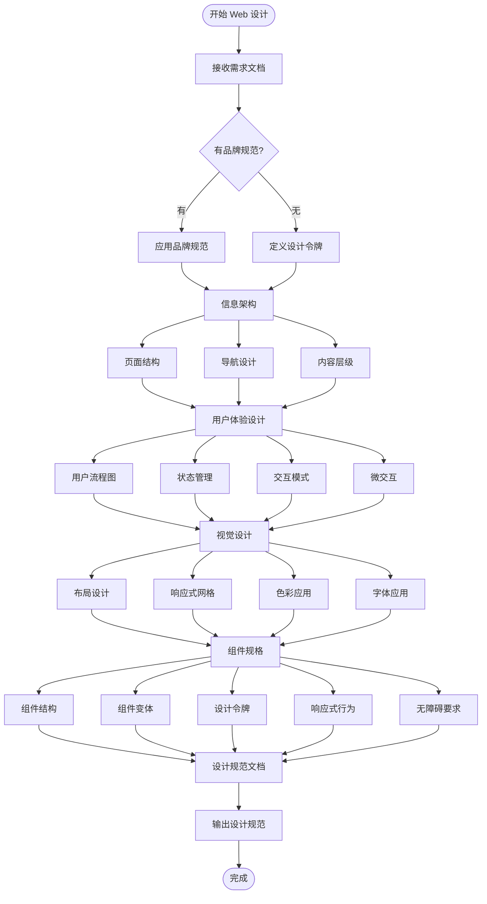
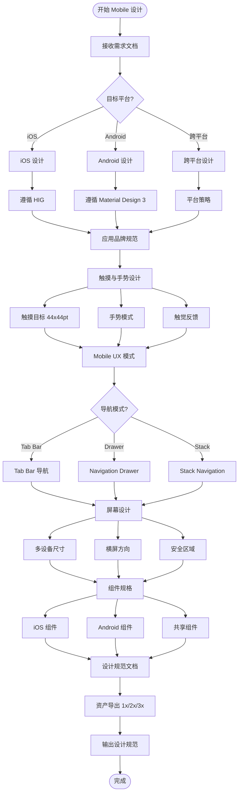
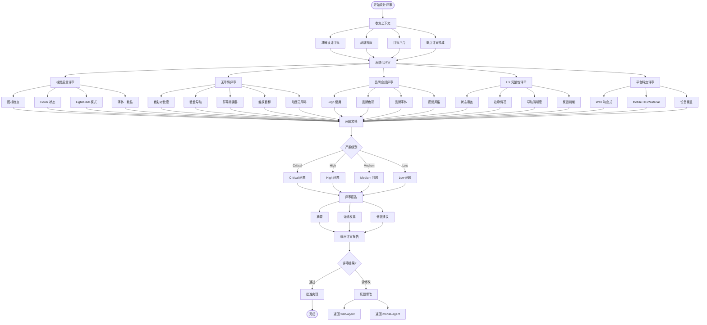

## 流程图

### 完整设计流程



### brand-agent 设计流程



### web-agent 设计流程



### mobile-agent 设计流程



### design-reviewer 评审流程



### Skills 使用流程

```mermaid
flowchart TD
    Start([开始 Skill 使用]) --> SkillSelect{选择 Skill?}
    
    SkillSelect -->|/ui-design| UIDesign[/ui-design skill]
    SkillSelect -->|/ui-ux-pro-max| UIUXProMax[/ui-ux-pro-max skill]
    SkillSelect -->|/baoyu-imagine| BaoyuImagine[/baoyu-imagine skill]
    
    UIDesign --> AnalyzeContext[分析上下文]
    AnalyzeContext --> IA[信息架构]
    IA --> Interaction[交互设计]
    Interaction --> Components[组件规格]
    Components --> Tokens[设计令牌]
    Tokens --> UISpecs[UI 设计规范]
    
    UIUXProMax --> AnalyzeQuery[分析查询]
    AnalyzeQuery --> DesignSystem[生成设计系统]
    DesignSystem --> Persist{持久化?}
    
    Persist -->|是| MasterFile[MASTER.md]
    Persist -->|否| DirectOutput[直接输出]
    
    MasterFile --> PageOverride{页面覆盖?}
    PageOverride -->|是| PageFile[pages/page.md]
    PageOverride -->|否| SystemOutput[设计系统输出]
    
    PageFile --> SystemOutput
    DirectOutput --> SystemOutput
    SystemOutput --> DSOutput[设计系统]
    
    BaoyuImagine --> ProviderSelect{选择提供商?}
    
    ProviderSelect -->|OpenAI| OpenAI[OpenAI DALL-E]
    ProviderSelect -->|Azure| Azure[Azure OpenAI]
    ProviderSelect -->|Google| Google[Google Imagen]
    ProviderSelect -->|DashScope| DashScope[通义万相]
    ProviderSelect -->|Replicate| Replicate[Replicate]
    
    OpenAI --> Generate[生成图像]
    Azure --> Generate
    Google --> Generate
    DashScope --> Generate
    Replicate --> Generate
    
    Generate --> ImageOutput[图像输出]
    
    UISpecs --> End([完成])
    DSOutput --> End
    ImageOutput --> End
```

## 关键分支与异常

### 品牌设计阶段异常处理

| 异常场景 | 处理方式 |
|----------|----------|
| 产品定位不明确 | 引导用户澄清产品本质和目标受众 |
| 品牌个性冲突 | 建议选择 3-5 个一致的特质 |
| Logo 生成失败 | 使用不同提供商或调整提示词 |
| 色彩系统不合适 | 提供替代色彩系统选项 |

### Web 设计阶段异常处理

| 异常场景 | 处理方式 |
|----------|----------|
| 无品牌规范 | 先调用 brand-agent 或定义临时设计令牌 |
| 响应式断点不合适 | 根据产品类型调整断点 |
| 无障碍合规失败 | 标记问题，提供修复建议 |
| 组件规格不完整 | 使用检查清单补充缺失项 |

### Mobile 设计阶段异常处理

| 异常场景 | 处理方式 |
|----------|----------|
| 平台选择不明确 | 引导用户选择 iOS/Android/跨平台 |
| 平台指南冲突 | 优先遵循目标平台指南 |
| 触摸目标过小 | 强制使用最小 44x44pt |
| 设备覆盖不全 | 补充小屏/大屏/平板设计 |

### 设计评审阶段异常处理

| 异常场景 | 处理方式 |
|----------|----------|
| Critical 问题 | 必须修复后才能继续 |
| High 问题过多 | 建议分批修复 |
| 品牌合规失败 | 返回 brand-agent 重新定义 |
| 无障碍合规失败 | 提供具体修复方案 |

### Skills 使用异常处理

| 异常场景 | 处理方式 |
|----------|----------|
| API 密钥缺失 | 引导用户配置 API 密钥 |
| 图像生成失败 | 使用替代提供商 |
| 设计系统不匹配 | 调整查询关键词 |
| 输出格式错误 | 自动修复格式 |

### Agent 协作异常处理

| 异常场景 | 处理方式 |
|----------|----------|
| Agent 选择错误 | founder-agent 重新评估 |
| 交接失败 | 记录错误，重试交接 |
| 输出格式不兼容 | 自动转换格式 |
| 评审循环过多 | 建议人工介入 |