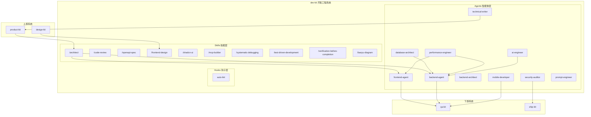

## 架构图



## 关键模块与职责

### Skills 技能层

| Skill | 职责 | 输入 | 输出 |
|-------|------|------|------|
| `/architect` | 架构设计文档生成 | 需求文档、设计规范 | 架构文档（系统概览、组件分解、API设计、数据模型） |
| `/code-review` | 代码审查 | 代码文件 | 审查报告（Bug/安全/性能/可读性） |
| `/openapi-spec` | OpenAPI 规范生成 | API 描述 | OpenAPI 3.1 YAML/JSON |
| `/frontend-design` | 前端界面生成 | 设计规范 | 前端代码 |
| `/shadcn-ui` | shadcn/ui 组件集成 | 组件需求 | 组件代码 |
| `/mcp-builder` | MCP 服务器开发指南 | 功能需求 | MCP 服务器代码 |
| `/systematic-debugging` | 系统化调试 | 错误信息 | 调试报告、修复方案 |
| `/test-driven-development` | TDD 开发流程 | 功能需求 | 测试代码、实现代码 |
| `/verification-before-completion` | 完成验证 | 实现代码 | 验证报告 |
| `/baoyu-diagram` | 图表生成 | 图表描述 | SVG 图表 |

### Agents 智能体层

| Agent | 模型 | 职责 | 协作关系 |
|-------|------|------|----------|
| frontend-agent | sonnet | 前端开发、组件架构、性能优化 | 接收 design-kit，交付 qa-kit |
| backend-agent | sonnet | 后端开发、API、数据层 | 接收 backend-architect，交付 frontend-agent |
| backend-architect | inherit | API 设计、微服务、分布式系统 | 与 database-architect 协作 |
| security-auditor | opus | DevSecOps、OWASP、安全审计 | 跨所有开发流程 |
| mobile-developer | inherit | React Native/Flutter/原生开发 | 与 frontend-agent 协作 |
| database-architect | inherit | 数据建模、Schema 设计、迁移规划 | 先于 backend-architect |
| performance-engineer | sonnet | 性能分析、优化、基准测试 | 跨前后端 |
| ai-engineer | opus | AI 系统工程、模型部署、MLOps | 与 backend-agent 协作 |
| prompt-engineer | inherit | 提示词工程、LLM 优化 | 与 ai-engineer 协作 |
| technical-writer | sonnet | 技术文档、API 文档 | 跨所有开发流程 |

### Hooks 钩子层

| Hook | 触发时机 | 职责 |
|------|----------|------|
| auto-lint | 文件编辑后 | 自动执行 lint（eslint/py_compile/go vet/cargo check） |

## 技术选型与约束

### 模型选型

- **opus 模型**：security-auditor、ai-engineer（需要深度推理能力）
- **sonnet 模型**：frontend-agent、backend-agent、performance-engineer、technical-writer（平衡性能与质量）
- **inherit 模型**：backend-architect、mobile-developer、database-architect、prompt-engineer（继承调用者模型）

### 协作约束

1. **数据库优先**：database-architect 在 backend-architect 之前工作
2. **设计先行**：design-kit 的输出是 frontend-agent 的输入
3. **测试验证**：所有实现必须通过 verification-before-completion
4. **安全审计**：关键功能需经过 security-auditor 审查

### 工作流集成

```
TDD + SDD 实现流程:

Phase 1: SPEC (from product-kit)
  /spec-driven-development
  Output: Interface Contract, Data Model, Behavior Rules

Phase 2: ARCHITECTURE
  /architect
  Output: System design, component structure

Phase 3: TDD IMPLEMENTATION
  For each spec item:
  1. /test-driven-development -> RED (write failing test)
  2. Implement minimal code -> GREEN
  3. Refactor -> REFACTOR
  4. /verification-before-completion

Phase 4: QUALITY
  /code-review -> /systematic-debugging (if issues)
  qa-kit: /test-plan -> /e2e-test
```
