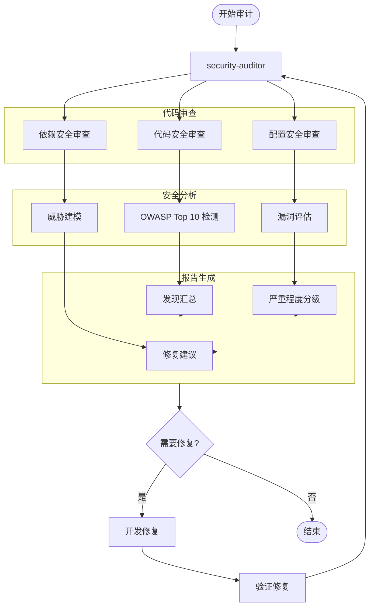

## 流程图

### 新功能开发流程

```mermaid
flowchart TD
    Start([开始]) --> Req[需求分析]
    Req --> Arch[/architect 架构设计]
    Arch --> DB{需要数据库?}
    DB -->|是| DBArch[database-architect 数据建模]
    DB -->|否| API{需要 API?}
    DBArch --> API
    API -->|是| BAArch[backend-architect API 设计]
    API -->|否| FE{需要前端?}
    BAArch --> BE[backend-agent 后端实现]
    BE --> FE
    FE -->|是| FEDev[frontend-agent 前端实现]
    FE -->|否| Review[/code-review 代码审查]
    FEDev --> Review
    Review --> Issues{有问题?}
    Issues -->|是| Debug[/systematic-debugging 调试]
    Debug --> Fix[修复问题]
    Fix --> Review
    Issues -->|否| Verify[/verification-before-completion 验证]
    Verify --> QA[qa-kit 测试]
    QA --> Deploy[ship-kit 部署]
    Deploy --> End([结束])
```

### TDD 开发流程

```mermaid
flowchart TD
    Start([开始]) --> Spec[功能规格]
    Spec --> TDD[/test-driven-development]
    
    subgraph RED["RED Phase"]
        WriteTest[编写失败测试]
        VerifyFail[验证测试失败]
    end
    
    subgraph GREEN["GREEN Phase"]
        WriteCode[编写最小实现]
        VerifyPass[验证测试通过]
    end
    
    subgraph REFACTOR["REFACTOR Phase"]
        Cleanup[重构代码]
        VerifyStill[验证测试仍通过]
    end
    
    TDD --> WriteTest
    WriteTest --> VerifyFail
    VerifyFail --> WriteCode
    WriteCode --> VerifyPass
    VerifyPass --> Cleanup
    Cleanup --> VerifyStill
    VerifyStill --> More{更多功能?}
    More -->|是| WriteTest
    More -->|否| Verify[/verification-before-completion]
    Verify --> End([结束])
```

### 系统化调试流程

```mermaid
flowchart TD
    Start([发现 Bug]) --> Debug[/systematic-debugging]
    
    subgraph Phase1["Phase 1: 根因调查"]
        Read[阅读错误信息]
        Reproduce[复现问题]
        Trace[追踪执行流]
    end
    
    subgraph Phase2["Phase 2: 模式分析"]
        Find[找到工作示例]
        Compare[对比差异]
        Identify[识别关键差异]
    end
    
    subgraph Phase3["Phase 3: 假设验证"]
        Hypothesis[形成假设]
        Test[最小测试]
        Validate{验证假设}
    end
    
    subgraph Phase4["Phase 4: 实现修复"]
        CreateTest[创建失败测试]
        Implement[实现修复]
        VerifyFix[验证修复]
    end
    
    Debug --> Read
    Read --> Reproduce
    Reproduce --> Trace
    Trace --> Find
    Find --> Compare
    Compare --> Identify
    Identify --> Hypothesis
    Hypothesis --> Test
    Test --> Validate
    Validate -->|假设错误| Hypothesis
    Validate -->|假设正确| CreateTest
    CreateTest --> Implement
    Implement --> VerifyFix
    VerifyFix --> Fixed{问题解决?}
    Fixed -->|否| Read
    Fixed -->|是| End([结束])
```

### 安全审计流程



## 关键分支与异常

### 分支 1: 数据库优先架构

**触发条件**: 新项目或重大架构变更

**流程**:
1. database-architect 设计数据模型
2. backend-architect 基于 Schema 设计 API
3. backend-agent 实现后端服务
4. frontend-agent 实现前端界面

**异常处理**:
- Schema 变更: 重新评估影响范围，更新迁移计划
- 性能问题: 调用 performance-engineer 优化

### 分支 2: 安全左移

**触发条件**: 涉及敏感数据或认证功能

**流程**:
1. 设计阶段: security-auditor 参与威胁建模
2. 开发阶段: /code-review 包含安全检查
3. 测试阶段: 安全测试用例覆盖
4. 部署前: 安全审计确认

**异常处理**:
- 发现漏洞: 立即修复，重新审计
- 合规问题: 调整架构满足合规要求

### 分支 3: 性能优化

**触发条件**: 性能指标不达标

**流程**:
1. performance-engineer 分析瓶颈
2. 定位问题代码或配置
3. 提出优化方案
4. 实施优化
5. 验证改进效果

**异常处理**:
- 优化无效: 回滚，尝试其他方案
- 引入新问题: 修复新问题，保持优化

### 分支 4: 移动开发

**触发条件**: 需要移动端支持

**流程**:
1. mobile-developer 选择技术栈（React Native/Flutter/原生）
2. 实现跨平台或原生代码
3. 平台特定优化
4. 设备测试覆盖

**异常处理**:
- 平台差异: 使用条件编译或平台特定代码
- 性能问题: 原生模块优化

### 分支 5: AI 功能集成

**触发条件**: 需要 AI/ML 功能

**流程**:
1. ai-engineer 设计 AI 架构
2. prompt-engineer 优化提示词
3. 集成 LLM 或模型服务
4. 测试和优化

**异常处理**:
- 模型不可用: 使用备用模型或本地模型
- 响应质量差: 优化提示词或增加示例
