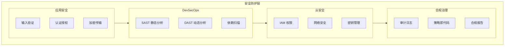

## 安全架构

### 安全分层模型



### 安全 Agent 职责

security-auditor Agent（opus 模型）负责：

1. **安全审计**
   - 代码安全审查
   - 架构安全评估
   - 渗透测试指导

2. **OWASP 合规**
   - OWASP Top 10 检测
   - OWASP ASVS 验证
   - OWASP SAMM 成熟度评估

3. **DevSecOps 集成**
   - CI/CD 安全流水线
   - 安全自动化
   - 安全左移实践

## 安全最佳实践

### 1. 输入验证

**原则**：永远不信任用户输入

```javascript
// Bad: 直接使用用户输入
const query = `SELECT * FROM users WHERE id = ${userId}`;

// Good: 参数化查询
const query = 'SELECT * FROM users WHERE id = ?';
db.query(query, [userId]);
```

**验证清单**：
- [ ] 所有输入进行类型验证
- [ ] 使用白名单而非黑名单
- [ ] 输出进行编码处理
- [ ] 文件上传进行验证

### 2. 认证授权

**认证最佳实践**：
- 使用 OAuth 2.0/OIDC
- 实现 MFA 多因素认证
- JWT 安全配置
- 会话管理安全

**授权最佳实践**：
- RBAC 角色访问控制
- ABAC 属性访问控制
- 最小权限原则
- 零信任架构

### 3. 加密传输

**数据加密**：
- TLS 1.3 强制使用
- 敏感数据加密存储
- 密钥轮换策略
- 安全密钥管理

**传输安全**：
```yaml
# TLS 配置示例
tls:
  version: "1.3"
  ciphers:
    - TLS_AES_256_GCM_SHA384
    - TLS_CHACHA20_POLY1305_SHA256
  certificates:
    - type: "ecdsa"
      curve: "P-256"
```

### 4. 安全 Headers

```yaml
# 推荐安全 Headers
headers:
  Content-Security-Policy: "default-src 'self'; script-src 'self' 'unsafe-inline'"
  X-Content-Type-Options: "nosniff"
  X-Frame-Options: "DENY"
  X-XSS-Protection: "1; mode=block"
  Strict-Transport-Security: "max-age=31536000; includeSubDomains"
  Referrer-Policy: "strict-origin-when-cross-origin"
  Permissions-Policy: "geolocation=(), microphone=(), camera=()"
```

### 5. 密钥管理

**密钥存储**：
- 使用 Vault 或云密钥管理服务
- 环境变量注入（不硬编码）
- 密钥轮换自动化
- 审计日志记录

**禁止做法**：
- 禁止在代码中硬编码密钥
- 禁止在日志中输出敏感信息
- 禁止在 URL 中传递密钥
- 禁止明文存储密码

## OWASP 合规

### OWASP Top 10 (2021) 检测

| 排名 | 漏洞类型 | 检测方法 | 修复建议 |
|------|----------|----------|----------|
| A01 | 访问控制失效 | 代码审查、渗透测试 | RBAC、最小权限 |
| A02 | 加密失败 | 配置审计、数据流分析 | TLS、加密存储 |
| A03 | 注入 | SAST、输入验证 | 参数化查询、ORM |
| A04 | 不安全设计 | 威胁建模 | 安全架构评审 |
| A05 | 安全配置错误 | 配置扫描 | 安全基线、硬化 |
| A06 | 易受攻击组件 | 依赖扫描 | SBOM、更新策略 |
| A07 | 认证失败 | 渗透测试 | MFA、会话管理 |
| A08 | 软件和数据完整性失败 | CI/CD 审计 | 签名验证、SLSA |
| A09 | 日志监控失败 | 日志审计 | SIEM、告警配置 |
| A10 | SSRF | 输入验证、网络隔离 | 白名单、网络策略 |

### OWASP ASVS 验证级别

| 级别 | 描述 | 适用场景 |
|------|------|----------|
| Level 1 | 基础安全 | 低风险应用 |
| Level 2 | 标准安全 | 一般商业应用 |
| Level 3 | 高级安全 | 高风险应用（金融、医疗） |

### OWASP SAMM 成熟度

| 级别 | 描述 | 特征 |
|------|------|------|
| Level 1 | 初始 | 临时安全活动 |
| Level 2 | 定义 | 标准化安全流程 |
| Level 3 | 优化 | 持续改进、自动化 |

## DevSecOps 集成

### CI/CD 安全流水线

```yaml
# 安全流水线示例
stages:
  - sast
  - build
  - dast
  - deploy

sast:
  tools:
    - semgrep
    - codeql
    - eslint-security
  fail_on: critical

dependency-scan:
  tools:
    - snyk
    - owasp-dependency-check
  fail_on: high

dast:
  tools:
    - owasp-zap
    - burp-suite
  schedule: weekly

container-scan:
  tools:
    - trivy
    - twistlock
  fail_on: high
```

### 安全左移实践

1. **设计阶段**
   - 威胁建模（STRIDE/PASTA）
   - 安全架构评审
   - 隐私影响评估

2. **开发阶段**
   - 安全编码培训
   - SAST 集成 IDE
   - 预提交 Hook

3. **测试阶段**
   - DAST 自动扫描
   - 渗透测试
   - 安全回归测试

4. **部署阶段**
   - 基础设施安全扫描
   - 配置合规检查
   - 运行时保护

## 安全审计清单

### 代码安全审计

- [ ] 输入验证完整性
- [ ] 输出编码正确性
- [ ] 认证机制安全性
- [ ] 授权检查完整性
- [ ] 加密使用正确性
- [ ] 错误处理安全性
- [ ] 日志脱敏完整性
- [ ] 会话管理安全性

### 架构安全审计

- [ ] 组件边界清晰
- [ ] 信任边界定义
- [ ] 数据流安全
- [ ] API 安全设计
- [ ] 微服务安全通信
- [ ] 数据库安全配置
- [ ] 缓存安全策略
- [ ] 第三方集成安全

### 云安全审计

- [ ] IAM 最小权限
- [ ] 网络隔离配置
- [ ] 加密传输配置
- [ ] 密钥管理策略
- [ ] 备份恢复安全
- [ ] 日志监控完整
- [ ] 合规报告生成
- [ ] 事件响应流程
