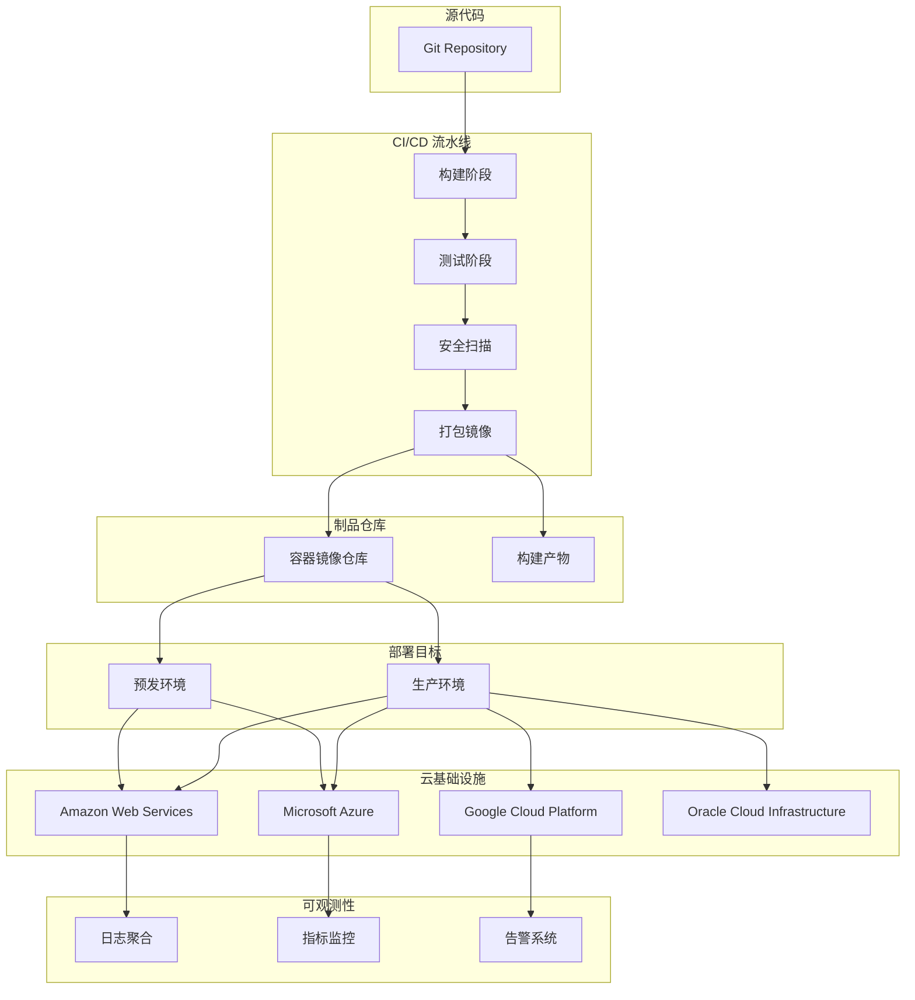

## 架构图

## 关键模块与职责

### devops-agent
- **部署执行**：执行部署计划，管理部署流程
- **环境管理**：dev/staging/production 环境配置
- **CI/CD 管理**：维护构建流水线与自动化流程
- **监控配置**：设置健康检查与告警规则

### cloud-architect
- **架构设计**：多云架构方案与迁移规划
- **IaC 管理**：Terraform/CloudFormation 模板维护
- **成本优化**：资源调优与 FinOps 实践
- **安全架构**：网络安全与合规配置

### incident-responder
- **事故响应**：生产事故快速响应与处理
- **故障排查**：根因分析与系统恢复
- **事后复盘**：无责复盘与改进建议
- **SRE 实践**：可靠性工程与错误预算管理

## 技术选型与约束

### 部署策略
| 策略 | 适用场景 | 优点 | 缺点 |
|------|----------|------|------|
| Rolling Update | 常规发布 | 零停机 | 回滚较慢 |
| Blue-Green | 重要发布 | 快速回滚 | 资源翻倍 |
| Canary | 风险发布 | 渐进验证 | 复杂度高 |

### 云平台支持
| 平台 | IaC 工具 | CI/CD 集成 | 成本优化 |
|------|----------|------------|----------|
| AWS | Terraform/CDK | CodePipeline | Reserved Instances |
| Azure | Terraform/Bicep | Azure DevOps | Reserved VM |
| GCP | Terraform | Cloud Build | Committed Use |
| OCI | Terraform | OCI DevOps | Flexible Shapes |

### 约束条件
- 所有基础设施变更必须通过 IaC
- 生产部署需要审批流程
- 敏感信息通过 Secrets 管理
- 遵循云平台最佳实践框架
