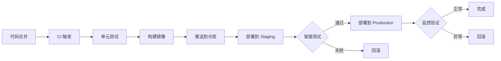
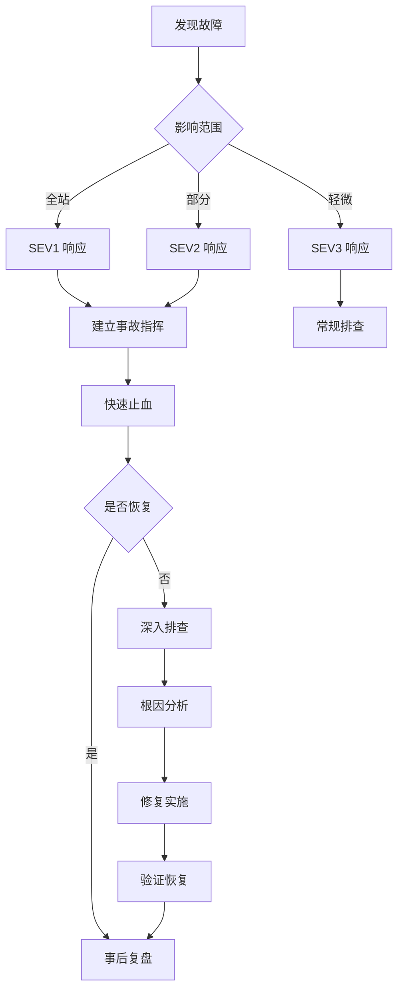

## 部署流程

### 标准部署流程



### 部署前检查清单

```markdown
## Pre-Deployment
- [ ] 所有测试通过（单元、集成、E2E）
- [ ] 代码审查已批准
- [ ] 变更日志已更新
- [ ] 环境变量已配置
- [ ] 回滚计划已记录

## Deployment
- [ ] 部署到 Staging
- [ ] 冒烟测试通过
- [ ] 部署到 Production
- [ ] 健康检查通过

## Post-Deployment
- [ ] 监控告警已配置
- [ ] 文档已更新
- [ ] 团队已通知
```

### 回滚流程

**Kubernetes 回滚**：
```bash
# 查看部署历史
kubectl rollout history deployment/my-app -n production

# 回滚到上一版本
kubectl rollout undo deployment/my-app -n production

# 回滚到指定版本
kubectl rollout undo deployment/my-app -n production --to-revision=3

# 检查回滚状态
kubectl rollout status deployment/my-app -n production
```

**数据库迁移回滚**：
```bash
# 执行回滚脚本
./scripts/db-rollback.sh $MIGRATION_VERSION

# 验证数据完整性
./scripts/verify-data-integrity.sh
```

## 运维手册

### 环境管理

| 环境 | 用途 | 访问权限 | 数据 |
|------|------|----------|------|
| Development | 开发测试 | 开发团队 | 模拟数据 |
| Staging | 预发验证 | 开发+QA | 脱敏数据 |
| Production | 生产服务 | 运维团队 | 真实数据 |

### 配置管理

**Secrets 管理**：
```bash
# AWS Secrets Manager
aws secretsmanager get-secret-value --secret-id prod/db-credentials

# Kubernetes Secrets
kubectl get secrets -n production
kubectl describe secret db-credentials -n production
```

**配置更新流程**：
1. 在配置仓库更新配置文件
2. 提交 PR 并通过审查
3. 合并后自动触发配置同步
4. 验证配置生效

### 监控配置

**健康检查端点**：
```yaml
livenessProbe:
  httpGet:
    path: /health/live
    port: 8080
  initialDelaySeconds: 30
  periodSeconds: 10

readinessProbe:
  httpGet:
    path: /health/ready
    port: 8080
  initialDelaySeconds: 5
  periodSeconds: 5
```

**告警规则示例**：
```yaml
# Prometheus 告警规则
groups:
- name: app-alerts
  rules:
  - alert: HighErrorRate
    expr: rate(http_requests_total{status=~"5.."}[5m]) > 0.05
    for: 5m
    labels:
      severity: critical
    annotations:
      summary: "High error rate detected"
```

## 故障排查

### 常见问题诊断

#### 服务无响应

```bash
# 1. 检查 Pod 状态
kubectl get pods -n production -l app=my-app
kubectl describe pod <pod-name> -n production

# 2. 检查日志
kubectl logs -n production <pod-name> --tail=100
kubectl logs -n production -l app=my-app --tail=100

# 3. 检查资源使用
kubectl top pods -n production
kubectl top nodes

# 4. 检查网络连通性
kubectl exec -n production <pod-name> -- curl -I http://localhost:8080/health
```

#### 数据库连接问题

```bash
# 检查数据库连接
kubectl exec -n production <pod-name> -- nc -zv $DB_HOST $DB_PORT

# 检查连接池状态
kubectl exec -n production <pod-name> -- curl localhost:8080/metrics | grep db_pool

# 检查数据库慢查询
psql -h $DB_HOST -U $DB_USER -c "
SELECT pid, now() - query_start AS duration, query
FROM pg_stat_activity
WHERE state = 'active' AND duration > interval '5 seconds'
ORDER BY duration DESC;"
```

#### 内存泄漏

```bash
# 获取堆内存快照
kubectl exec -n production <pod-name> -- kill -USR1 1

# 分析内存使用
kubectl exec -n production <pod-name> -- curl localhost:8080/debug/pprof/heap > heap.out
go tool pprof heap.out

# 重启服务
kubectl rollout restart deployment/my-app -n production
```

### 故障排查流程



### 应急联系人

| 角色 | 职责 | 联系方式 |
|------|------|----------|
| 事故指挥官 | 决策协调 | @oncall-ic |
| 技术负责人 | 技术排查 | @tech-lead |
| 沟通负责人 | 对外沟通 | @comms-lead |

## 日常运维任务

### 每日检查
- [ ] 检查监控告警
- [ ] 查看错误日志
- [ ] 确认备份状态
- [ ] 检查证书有效期

### 每周检查
- [ ] 审查成本报告
- [ ] 检查安全扫描结果
- [ ] 更新依赖版本
- [ ] 清理测试环境

### 每月检查
- [ ] 灾难恢复演练
- [ ] 访问权限审计
- [ ] 容量规划评估
- [ ] 文档更新
