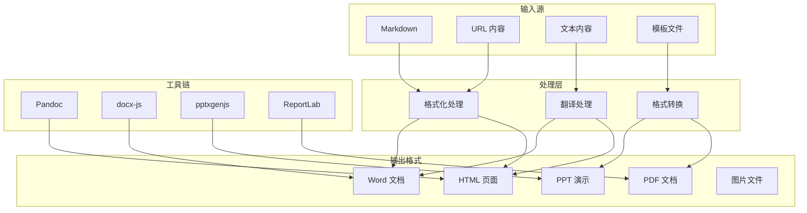

## 架构图

## 关键模块与职责

### docs-agent
- **文档生成**：创建专业报告、提案、演示文稿
- **格式转换**：Markdown <-> HTML <-> DOCX <-> PDF
- **翻译服务**：多模式翻译与术语管理
- **内容处理**：格式化、美化、压缩优化

### /docx Skill
- **创建文档**：使用 docx-js 生成 Word 文档
- **编辑文档**：解包 -> 编辑 XML -> 打包
- **格式控制**：样式、表格、图片、页眉页脚
- **追踪变更**：支持修订模式和批注

### /pdf Skill
- **PDF 操作**：合并、拆分、旋转、加水印
- **内容提取**：文本、表格、图片提取
- **OCR 支持**：扫描件文字识别
- **表单填写**：PDF 表单数据填充

### /pptx Skill
- **演示创建**：使用 pptxgenjs 生成 PPT
- **模板编辑**：基于模板修改内容
- **设计指南**：配色、排版、视觉元素
- **质量检查**：视觉 QA 和内容验证

### /baoyu-translate Skill
- **三种模式**：
  - Quick：直接翻译
  - Normal：分析 -> 翻译
  - Refined：分析 -> 翻译 -> 审查 -> 润色
- **术语管理**：自定义术语表、一致性保证
- **分块处理**：长文档智能分块翻译

## 技术选型与约束

### 文档格式支持

| 格式 | 创建 | 编辑 | 转换 | 工具 |
|------|------|------|------|------|
| DOCX | docx-js | XML 编辑 | Pandoc | docx-js |
| PDF | ReportLab | pypdf | 多格式 | pypdf, pdfplumber |
| PPTX | pptxgenjs | XML 编辑 | PDF | pptxgenjs |
| HTML | 原生 | 原生 | Markdown | markdown-it |
| Markdown | 原生 | 原生 | HTML/DOCX | Pandoc |

### 翻译模式对比

| 模式 | 步骤 | 适用场景 | 输出质量 |
|------|------|----------|----------|
| Quick | 翻译 | 短文本、非正式内容 | 基础 |
| Normal | 分析 -> 翻译 | 文章、博客 | 良好 |
| Refined | 分析 -> 翻译 -> 审查 -> 润色 | 出版级文档 | 优秀 |

### 约束条件
- DOCX 创建需使用 docx-js 库
- PDF 处理依赖 pypdf 和 pdfplumber
- PPTX 创建使用 pptxgenjs
- 翻译需配置目标语言和术语表
- 大文档需分块处理避免超时