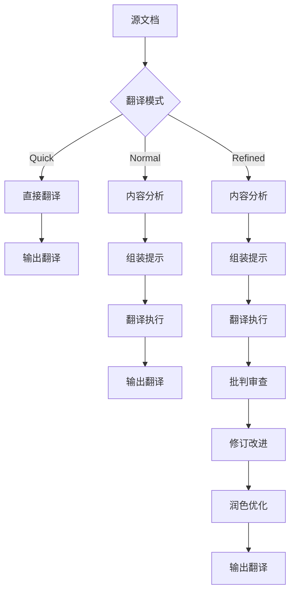
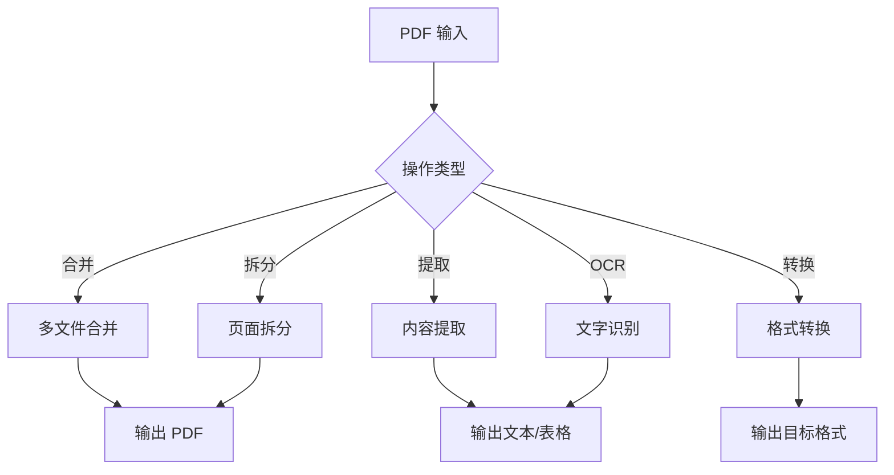

## 流程图

### 文档生成流程

```mermaid
flowchart TB
    A[内容输入] --> B{文档类型}
    B -->|报告| C[/docx]
    B -->|演示| D[/pptx]
    B -->|交付| E[/pdf]
    
    C --> F[应用模板]
    D --> F
    E --> F
    
    F --> G[格式处理]
    G --> H[质量检查]
    H --> I{是否通过}
    
    I -->|是| J[输出文档]
    I -->|否| K[修复问题]
    K --> G
```

### 翻译流程



### PDF 处理流程



## 关键分支与异常

### Agent 协作流程

**文档生成协作**：
```
报告生成:
  product-agent -> docs-agent -> /docx -> marketing-agent

演示文稿:
  product-agent -> docs-agent -> /pptx -> marketing-agent

翻译项目:
  docs-agent -> /baoyu-translate -> marketing-agent
```

### 交接协议

**docs-agent 交接**：
- **接收自**：product-agent（内容需求）、design-agent（视觉样式）
- **交付给**：marketing-agent（最终文档）、devops-agent（文档部署）

### 错误处理

| 错误类型 | 处理方式 |
|----------|----------|
| 格式不支持 | 提示支持的格式列表 |
| 文件损坏 | 尝试修复或提示重新上传 |
| 翻译失败 | 回退到前一模式 |
| 模板缺失 | 使用默认模板 |

## 典型使用场景

### 场景 1：创建业务报告

```markdown
1. 收集报告内容和数据
2. 使用 /docx 创建文档
3. 应用公司模板样式
4. 添加表格、图表
5. 设置页眉页脚
6. 质量检查
7. 输出 DOCX 和 PDF 版本
```

### 场景 2：创建演示文稿

```markdown
1. 确定演示主题和大纲
2. 使用 /pptx 创建 PPT
3. 选择配色方案和字体
4. 添加视觉元素（图片、图表）
5. 设计每张幻灯片布局
6. 视觉 QA 检查
7. 输出 PPTX 文件
```

### 场景 3：翻译文档

```markdown
1. 确定源文档和目标语言
2. 选择翻译模式（Quick/Normal/Refined）
3. 配置术语表（如有）
4. 执行翻译
5. （Refined 模式）审查和润色
6. 输出翻译文档
7. 提示图片本地化需求
```

### 场景 4：内容转换

```markdown
1. 使用 /baoyu-url-to-markdown 抓取网页
2. 使用 /baoyu-format-markdown 格式化
3. 使用 /baoyu-markdown-to-html 转 HTML
4. 或使用 /docx 转 Word 文档
5. 使用 /pdf 输出 PDF 版本
```

## 工作流模板

### 文档创建流程

| 步骤 | 操作 | 工具 |
|------|------|------|
| 1 | 内容准备 | - |
| 2 | 创建文档 | /docx 或 /pptx |
| 3 | 应用模板 | 模板样式 |
| 4 | 添加内容 | 格式化 |
| 5 | 质量检查 | QA |
| 6 | 输出文件 | 导出 |

### 翻译项目流程

| 步骤 | Quick | Normal | Refined |
|------|-------|--------|---------|
| 1 | 翻译 | 分析 | 分析 |
| 2 | 输出 | 翻译 | 翻译 |
| 3 | - | 输出 | 审查 |
| 4 | - | - | 修订 |
| 5 | - | - | 润色 |
| 6 | - | - | 输出 |

### PDF 处理流程

| 操作 | 命令示例 |
|------|----------|
| 合并 | `pypdf.PdfWriter` |
| 拆分 | 按页提取 |
| 提取文本 | `pdfplumber.extract_text()` |
| 提取表格 | `pdfplumber.extract_tables()` |
| OCR | `pytesseract.image_to_string()` |
| 加水印 | `page.merge_page(watermark)` |