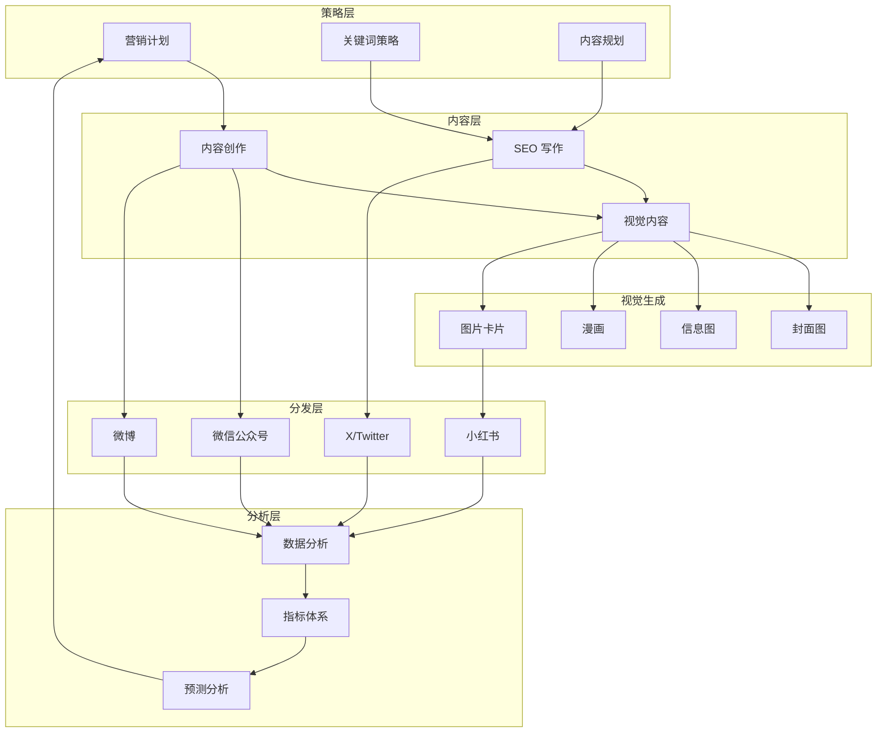

## 架构图

## 关键模块与职责

### marketing-agent
- **策略制定**：创建营销计划，定义目标受众和渠道
- **内容创作**：撰写博客、社媒、邮件、案例等内容
- **渠道分发**：规划内容日历，优化平台适配
- **效果追踪**：设置追踪和分析，监控表现

### data-analyst
- **数据分析**：探索性分析、趋势识别、异常检测
- **报告仪表板**：可视化设计、报告撰写、仪表板构建
- **指标标准化**：指标定义、数据字典、计算公式
- **预测分析**：时间序列预测、风险评估、场景分析

### seo-keyword-strategist
- **关键词分析**：密度计算、实体分析、语义优化
- **LSI 关键词**：语义变体生成、相关概念映射
- **搜索意图**：意图识别、PAA 优化、语音搜索
- **过度优化检测**：关键词堆砌警告、自然度评估

### seo-content-planner
- **话题集群**：支柱页面、支撑文章、FAQ 内容
- **内容日历**：30-60 天规划、发布优先级
- **内容大纲**：详细结构、关键词定位
- **内部链接**：链接蓝图、话题权威构建

### seo-content-writer
- **内容撰写**：全面覆盖、自然关键词整合
- **E-E-A-T 信号**：经验展示、专业知识、可信度
- **格式优化**：可扫描结构、清晰标题
- **行动号召**：CTA 整合、转化优化

## 技术选型与约束

### 内容类型矩阵

| 类型 | 用途 | Agent | Skill |
|------|------|-------|-------|
| 博客文章 | SEO 流量 | seo-content-writer | `/content-create` |
| 社媒帖子 | 品牌曝光 | marketing-agent | `/content-create` |
| 邮件通讯 | 用户留存 | marketing-agent | `/content-create` |
| 案例研究 | 转化证明 | marketing-agent | `/content-create` |
| 产品文案 | 发布推广 | marketing-agent | `/content-create` |

### 视觉内容类型

| 类型 | Skill | 风格数 | 布局数 |
|------|-------|--------|--------|
| 封面图 | `/baoyu-cover-image` | 7 渲染风格 | 11 色板 |
| 信息图 | `/baoyu-infographic` | 21 风格 | 21 布局 |
| 图片卡片 | `/baoyu-image-cards` | 21 风格 | 多布局 |
| 漫画 | `/baoyu-comic` | 多艺术风格 | - |
| 小红书 | `/baoyu-xhs-images` | 12 风格 | 6 布局 |

### 发布平台

| 平台 | Skill | 内容格式 | 特点 |
|------|-------|----------|------|
| 微信公众号 | `/baoyu-post-to-wechat` | 富文本 | 私域流量 |
| 微博 | `/baoyu-post-to-weibo` | 短文本+图 | 公域曝光 |
| X/Twitter | `/baoyu-post-to-x` | 短文本 | 国际受众 |
| 小红书 | `/baoyu-xhs-images` | 图片卡片 | 视觉驱动 |

### 约束条件
- 内容需符合各平台规范和审核要求
- 视觉内容需考虑版权和品牌一致性
- SEO 内容需遵循搜索引擎最佳实践
- 数据分析需保证数据隐私合规