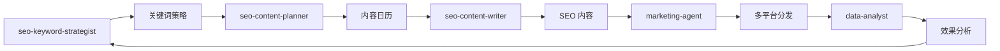
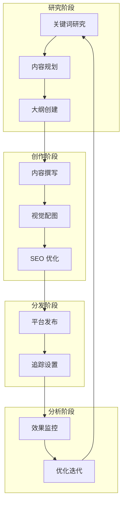

## 流程图

### 增长冲刺流程



### 内容创作流程



### 视觉内容创作

```mermaid
flowchart TB
    A[内容主题] --> B{视觉类型}
    B -->|封面| C[/baoyu-cover-image]
    B -->|信息图| D[/baoyu-infographic]
    B -->|漫画| E[/baoyu-comic]
    B -->|卡片| F[/baoyu-image-cards]
    B -->|小红书| G[/baoyu-xhs-images]
    
    C --> H[选择色板]
    D --> I[选择布局]
    E --> J[选择风格]
    F --> K[选择样式]
    G --> L[选择模板]
    
    H --> M[生成图像]
    I --> M
    J --> M
    K --> M
    L --> M
    
    M --> N[质量检查]
    N --> O[发布使用]
```

## 关键分支与异常

### Agent 协作流程

**营销活动协作**：
```
产品发布营销:
  product-agent -> marketing-agent -> seo-keyword-strategist -> seo-content-planner -> seo-content-writer -> data-analyst

日常内容运营:
  seo-keyword-strategist -> seo-content-planner -> seo-content-writer -> marketing-agent -> data-analyst

数据驱动优化:
  data-analyst -> marketing-agent -> seo-content-planner -> seo-content-writer
```

### 交接协议

**marketing-agent 交接**：
- **接收自**：product-agent（产品定位）、devops-agent（功能上线）
- **交付给**：product-agent（市场信号）、devops-agent（流量预期）

**data-analyst 交接**：
- **接收自**：marketing-agent（营销数据）、各平台（用户数据）
- **交付给**：marketing-agent（洞察建议）、product-agent（用户反馈）

**SEO agents 交接**：
- **seo-keyword-strategist** -> seo-content-planner（关键词策略）
- **seo-content-planner** -> seo-content-writer（内容大纲）
- **seo-content-writer** -> marketing-agent（完成内容）

## 典型使用场景

### 场景 1：新产品发布

```markdown
1. marketing-agent 创建发布营销计划
2. seo-keyword-strategist 分析目标关键词
3. seo-content-planner 规划发布内容日历
4. seo-content-writer 撰写 SEO 博客文章
5. marketing-agent 创建社媒发布内容
6. 使用 /baoyu-cover-image 生成封面图
7. 使用 /baoyu-infographic 生成产品信息图
8. /baoyu-post-to-wechat 发布到微信
9. /baoyu-post-to-x 发布到 X
10. data-analyst 监控发布效果
```

### 场景 2：SEO 内容矩阵

```markdown
1. seo-keyword-strategist 分析关键词机会
2. seo-content-planner 创建话题集群
3. 规划支柱页面 + 支撑文章
4. seo-content-writer 撰写内容
5. 使用 /baoyu-article-illustrator 配图
6. 内部链接优化
7. 定期更新维护
8. data-analyst 监控排名和流量
```

### 场景 3：社媒内容批量创作

```markdown
1. marketing-agent 确定内容主题
2. /content-create 创建内容
3. /baoyu-image-cards 生成社媒卡片
4. /baoyu-xhs-images 生成小红书图片
5. /baoyu-post-to-weibo 发布微博
6. /baoyu-post-to-x 发布 X
7. data-analyst 分析互动数据
```

## 工作流模板

### 周度内容计划

| 周一 | 呂二 | 周三 | 周四 | 周五 |
|------|------|------|------|------|
| 关键词研究 | 内容大纲 | 内容撰写 | 视觉配图 | 发布分发 |
| 数据回顾 | 内容规划 | SEO 优化 | 质量检查 | 效果追踪 |

### 内容日历模板

```markdown
## 第 1-4 周

| 周 | 主题 | 关键词 | 类型 | 字数 | 发布平台 |
|----|------|--------|------|------|----------|
| W1 | 主题A | keyword1 | 博客 | 2000 | 微信、X |
| W2 | 主题B | keyword2 | 教程 | 1500 | 微信 |
| W3 | 主题C | keyword3 | 案例 | 1000 | 微信、微博 |
| W4 | 主题D | keyword4 | 信息图 | - | 小红书、X |
```