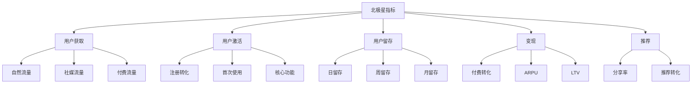
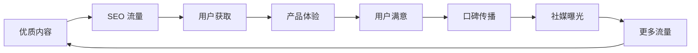

## 目标与假设

### 增长目标框架

一人公司的增长目标应聚焦、可衡量：

| 目标类型 | 描述 | 时间线 | 示例 |
|----------|------|--------|------|
| 用户获取 | 新用户增长 | 月度 | 月增 1000 注册 |
| 用户激活 | 首次价值体验 | 周度 | 7 日激活率 40% |
| 用户留存 | 持续使用 | 月度 | 月留存率 60% |
| 收入增长 | 营收提升 | 季度 | 季度收入增 20% |
| 品牌曝光 | 市场认知 | 月度 | 社媒粉丝增 500 |

### 增长假设模板

```markdown
## 假设陈述
我们相信 [为谁] 实施 [什么策略] 将实现 [什么结果]。

## 验证方法
我们将在 [时间线] 内通过 [什么指标] 验证这一点。

## 成功标准
如果 [指标] 达到 [目标值]，我们将继续/扩展。

## 失败标准
如果 [指标] 低于 [阈值]，我们将停止/调整。
```

## 指标（Metrics）

### 北极星指标

一人公司应选择一个核心指标作为北极星：

| 产品类型 | 北极星指标示例 |
|----------|----------------|
| SaaS 产品 | 活跃付费用户数 |
| 内容产品 | 日活跃阅读用户 |
| 工具产品 | 每周使用次数 |
| 电商产品 | 月度 GMV |

### 指标分解



### 关键指标定义

| 指标 | 定义 | 计算公式 | 目标范围 |
|------|------|----------|----------|
| DAU | 日活跃用户 | 当日登录用户数 | - |
| MAU | 月活跃用户 | 月内登录用户数 | DAU/MAU > 20% |
| CAC | 用户获取成本 | 营销支出/新用户数 | < LTV/3 |
| LTV | 用户生命周期价值 | ARPU x 平均生命周期 | > 3xCAC |
| NRR | 净收入留存 | (续费+扩展-流失)/上期收入 | > 100% |
| MRR | 月度经常性收入 | 付费用户 x ARPU | 持续增长 |

### 渠道指标

| 渠道 | 核心指标 | 辅助指标 |
|------|----------|----------|
| SEO | 自然流量、排名 | 点击率、跳出率 |
| 社媒 | 粉丝增长、互动率 | 分享数、评论数 |
| 邵件 | 打开率、CTR | 退订率、转化率 |
| 内容 | 页面浏览、停留时间 | 分享数、回访率 |

## 实验与迭代

### A/B 测试框架

```markdown
## 实验设计
1. **假设**：我们相信 X 改变将带来 Y 结果
2. **变量**：对照组（A）vs 实验组（B）
3. **样本**：所需样本量计算
4. **时长**：测试持续时间
5. **指标**：主要指标 + 辅助指标

## 实验执行
- 随机分配用户
- 同时运行避免时间偏差
- 监控异常情况

## 结果分析
- 统计显著性检验
- 效果大小评估
- 分群分析
```

### 增长实验优先级

使用 ICE 模型评估实验优先级：

| 因素 | 权重 | 评分标准 |
|------|------|----------|
| Impact（影响） | 40% | 对目标指标的影响程度 |
| Confidence（信心） | 30% | 假设的可信程度 |
| Ease（难度） | 30% | 实施的难易程度 |

**ICE 评分示例**：
| 实验 | Impact | Confidence | Ease | 总分 |
|------|--------|------------|------|------|
| 优化注册流程 | 8 | 7 | 6 | 7.1 |
| 新社媒渠道 | 6 | 4 | 8 | 5.8 |
| SEO 内容增加 | 7 | 8 | 5 | 6.9 |

### 迭代节奏

```markdown
## 周度迭代
- 分析上周数据
- 调整内容策略
- 快速实验验证

## 月度迭代
- 深度数据分析
- 策略方向调整
- 预算重新分配

## 季度迭代
- 目标重新设定
- 渠道策略评估
- 产品-市场匹配检查
```

### 数据埋点规划

**核心事件埋点**：
| 事件类别 | 关键事件 | 埋点位置 |
|----------|----------|----------|
| 获取 | 页面访问、来源追踪 | 落地页、社媒链接 |
| 激活 | 注册、首次使用 | 注册页、核心功能 |
| 留存 | 登录、功能使用 | 应用内各功能 |
| 变现 | 付费、续费 | 支付流程 |
| 推荐 | 分享、邀请 | 分享按钮 |

**UTM 参数规范**：
```
utm_source: 来源平台（wechat、twitter、google）
utm_medium: 渠道类型（social、organic、paid）
utm_campaign: 活动名称（launch_2024、seo_blog）
utm_content: 内容标识（blog_post_1、video_2）
utm_term: 关键词（可选）
```

## 增长策略矩阵

### 渠道选择策略

| 阶段 | 优先渠道 | 原因 |
|------|----------|------|
| 早期验证 | SEO、社媒 | 低成本、快速反馈 |
| 增长期 | SEO+内容、付费 | 规模化、可预测 |
| 成熟期 | 多渠道组合 | 最大化覆盖 |

### 内容策略矩阵

| 内容类型 | SEO 价值 | 社媒价值 | 转化价值 |
|----------|----------|----------|----------|
| 教程文章 | 高 | 中 | 高 |
| 案例研究 | 中 | 高 | 高 |
| 行业分析 | 高 | 高 | 中 |
| 产品更新 | 低 | 高 | 中 |
| 视觉内容 | 低 | 高 | 低 |

### 增长飞轮

