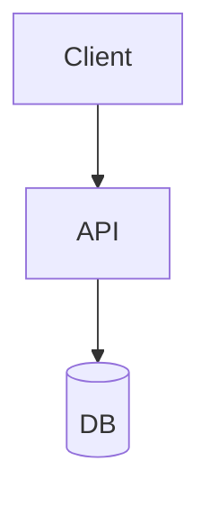

```mermaid
flowchart TB
    subgraph MCP["MCP 工具层"]
        KNOW_INIT["opc_knowledge_init"]
        KNOW_READ["opc_knowledge_read"]
        KNOW_WRITE["opc_knowledge_write"]
        KNOW_EXISTS["opc_knowledge_exists"]
        KNOW_LIST["opc_knowledge_list"]
        KNOW_DOCS["opc_knowledge_docs"]
    end

    subgraph Core["核心逻辑"]
        INIT_MGR["初始化管理器<br/>Init Manager"]
        READ_MGR["读取管理器<br/>Read Manager"]
        WRITE_MGR["写入管理器<br/>Write Manager"]
        MATCH_MGR["匹配管理器<br/>Match Manager"]
        META_MGR["元数据管理器<br/>Metadata Manager"]
    end

    subgraph Storage["存储层"]
        KNOWLEDGE_DIR["knowledge/{feature_name}/"]
        CATEGORY_DIR["{category}/"]
        DOC_FILE["{doc}.md"]
    end

    subgraph Templates["模板层"]
        REQ_TPL["requirement/main.md"]
        ARCH_TPL["architecture/main.md"]
        TECH_TPL["tech_guide/main.md"]
        API_TPL["api_guide/main.md"]
    end

    KNOW_INIT --> INIT_MGR
    KNOW_READ --> READ_MGR
    KNOW_WRITE --> WRITE_MGR
    KNOW_EXISTS --> READ_MGR
    KNOW_LIST --> META_MGR
    KNOW_DOCS --> META_MGR

    INIT_MGR --> MATCH_MGR
    INIT_MGR --> KNOWLEDGE_DIR
    READ_MGR --> CATEGORY_DIR
    READ_MGR --> DOC_FILE
    WRITE_MGR --> CATEGORY_DIR
    WRITE_MGR --> DOC_FILE
    WRITE_MGR --> META_MGR

    INIT_MGR --> REQ_TPL
    INIT_MGR --> ARCH_TPL
    INIT_MGR --> TECH_TPL
    INIT_MGR --> API_TPL
```

## 架构图



## 关键模块与职责

### 1. MCP 工具层

**知识管理工具**

| 工具 | 输入 | 输出 | 描述 |
|------|------|------|------|
| `opc_knowledge_init` | title, feature_name | feature_name | 初始化知识域 |
| `opc_knowledge_read` | feature_name, category, doc | content | 读取知识文档 |
| `opc_knowledge_write` | feature_name, category, doc, content | success | 写入知识文档 |
| `opc_knowledge_exists` | feature_name, category, doc | exists | 检查知识存在 |
| `opc_knowledge_list` | - | features[] | 列出所有特征 |
| `opc_knowledge_docs` | feature_name, category | docs[] | 列出文档 |

### 2. 核心逻辑层

**初始化管理器 (Init Manager)**
- 职责：创建知识域目录和初始文档
- 流程：
  1. 检查特征是否已存在
  2. 匹配相似特征
  3. 创建目录结构
  4. 初始化主文档

**读取管理器 (Read Manager)**
- 职责：读取知识文档内容
- 功能：
  - 按路径读取文档
  - 解析 YAML frontmatter
  - 支持多类别合并读取

**写入管理器 (Write Manager)**
- 职责：写入知识文档
- 功能：
  - 创建或更新文档
  - 自动添加 frontmatter
  - 支持追加模式

**匹配管理器 (Match Manager)**
- 职责：匹配相似知识特征
- 算法：
  - 特征名相似度计算
  - 关键词匹配
  - 语义相似度（可选）

**元数据管理器 (Metadata Manager)**
- 职责：管理文档元数据
- 功能：
  - 解析 frontmatter
  - 生成 frontmatter
  - 列出特征和文档

### 3. 存储层

**目录结构**
```
.opc/knowledge/
├── user-auth/                    # 功能特征
│   ├── requirement/
│   │   └── main.md              # 需求文档
│   ├── design/
│   │   ├── main.md              # 设计主文档
│   │   └── ui/
│   │       └── components.md    # UI 组件设计
│   ├── architecture/
│   │   └── main.md              # 架构设计
│   ├── tech_guide/
│   │   └── main.md              # 技术指南
│   ├── api_guide/
│   │   └── main.md              # API 文档
│   └── qa_test/
│       └── main.md              # 测试文档
├── payment-integration/          # 另一个功能特征
│   └── ...
└── ios-localization/             # iOS 多语言功能
    └── ...
```

**文档结构**
```markdown
---
name: 用户认证需求说明
description: 定义用户认证功能的核心需求，包括登录、注册、密码重置等。
category: requirement
feature_name: user-auth
created_at: 2026-05-12T10:00:00.000Z
updated_at: 2026-05-12T10:00:00.000Z
tags: [requirement, authentication, user]
---

# WHAT（要做什么）

[需求内容...]

# WHY（为什么要做）

[原因说明...]

## 功能性需求

[功能列表...]

## 非功能性需求

[非功能需求...]

## 验收标准

[验收标准...]
```

### 4. 模板层

**需求文档模板**
```markdown
---
name: {title}需求说明
description: {description}
category: requirement
feature_name: {feature_name}
created_at: {timestamp}
updated_at: {timestamp}
tags: [requirement]
---
# WHAT（要做什么）

- 

# WHY（为什么要做）

- 

## 功能性需求

- 

## 非功能性需求

- 性能：
- 安全性：
- 可靠性：
- 可用性：

## 不做什么（Non-goals）

- 

## 验收标准（Done Definition）

- 
```

**架构文档模板**
```markdown
---
name: {title}架构设计
description: {description}
category: architecture
feature_name: {feature_name}
created_at: {timestamp}
updated_at: {timestamp}
tags: [architecture]
---
## 架构图



## 关键模块与职责

- 

## 技术选型与约束

- 
```

## 数据流

### 知识初始化流程

```
1. opc_knowledge_init(title, feature_name)
2. 检查特征是否存在
   - 存在: 返回现有特征
   - 不存在: 继续
3. 匹配相似特征
   - >50%: 自动复用
   - 30-50%: 询问用户
   - <30%: 创建新特征
4. 创建目录结构
   - .opc/knowledge/{feature_name}/
   - .opc/knowledge/{feature_name}/requirement/
5. 初始化主文档
   - 应用模板
   - 添加 frontmatter
6. 返回 feature_name
```

### 知识读取流程

```
1. opc_knowledge_read(feature_name, category, doc)
2. 构建文档路径
   - .opc/knowledge/{feature_name}/{category}/{doc}.md
3. 检查文件存在
4. 读取文件内容
5. 解析 YAML frontmatter
6. 返回内容和元数据
```

### 知识写入流程

```
1. opc_knowledge_write(feature_name, category, doc, content)
2. 构建文档路径
3. 创建目录（如不存在）
4. 生成/更新 frontmatter
   - name: 从内容提取或使用默认
   - description: 从内容提取或使用默认
   - updated_at: 当前时间
5. 合并 frontmatter 和内容
6. 写入文件
```

### 特征匹配流程

```
1. 提取输入特征的关键词
2. 遍历现有特征
3. 计算相似度
   - 名称相似度（编辑距离）
   - 关键词匹配度
   - 语义相似度（可选）
4. 排序并返回匹配结果
```

## 技术选型与约束

| 技术 | 用途 | 原因 |
|------|------|------|
| MCP Protocol | 工具接口 | 标准协议，跨会话可用 |
| Markdown | 文档格式 | 人类可读，版本控制友好 |
| YAML | 元数据格式 | 标准格式，易解析 |
| File System | 持久化 | 简单可靠，Git 友好 |

### 设计约束

1. **目录即特征** - 每个特征对应一个目录
2. **类别即子目录** - 每个类别对应一个子目录
3. **文档自描述** - frontmatter 包含完整元数据
4. **Git 友好** - 知识可提交到版本控制

## 扩展性设计

1. **自定义类别** - 支持添加新的知识类别
2. **自定义模板** - 支持自定义文档模板
3. **子目录组织** - 支持深层目录结构
4. **渐进加载** - 先加载元数据，按需加载内容