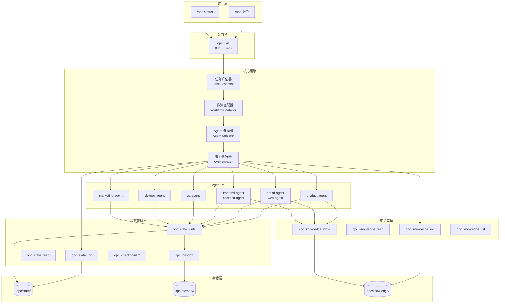

## 架构图



## 关键模块与职责

### 1. 入口层 (Entry Layer)

**opc Skill (SKILL.md)**
- 职责：接收用户命令，解析参数，调用核心引擎
- 输入：`/opc <任务描述>` 或 `/opc status`
- 输出：任务执行结果或状态报告

### 2. 核心引擎 (Core Engine)

**任务评估器 (Task Assessor)**
- 职责：分析任务描述，判断复杂度和领域
- 评估维度：
  - 领域识别：产品/设计/开发/测试/运维/增长
  - 复杂度判断：简单(单Agent)/中等(2-3个Agent)/复杂(Team模式)
  - 依赖分析：串行依赖/并行独立/混合

**工作流匹配器 (Workflow Matcher)**
- 职责：匹配预定义工作流规范
- 匹配逻辑：
  1. 关键词匹配：检查 `triggers.keywords`
  2. 正则匹配：检查 `triggers.patterns`
  3. 多候选处理：相似度排序，询问用户

**Agent 选择器 (Agent Selector)**
- 职责：根据工作流或评估结果选择 Agent
- 选择策略：
  - 工作流定义优先
  - 无匹配时按领域映射
  - 考虑模型选择（opus/sonnet/haiku）

**编排执行器 (Orchestrator)**
- 职责：执行 Agent 编排
- 编排模式：
  - Mode 1: Single Agent - 直接调用 Agent tool
  - Mode 2: Pipeline - 串行多次调用，输出传递
  - Mode 3: Parallel - 单消息多次调用 Agent tool
  - Mode 4: Team - TeamCreate + TaskCreate + SendMessage

### 3. 状态管理层 (State Management)

**状态初始化 (opc_state_init)**
- 创建任务会话，生成 lock_id
- 设置初始阶段状态
- 自动匹配知识特征名

**状态读取 (opc_state_read)**
- 读取当前任务进度
- 获取知识特征名
- 查看阶段状态

**状态写入 (opc_state_write)**
- 更新阶段状态
- 记录产物文件
- 更新进度信息

**Agent 交接 (opc_handoff)**
- 记录 Agent 间上下文传递
- 保留决策和约束
- 支持跨会话恢复

**检查点管理 (opc_checkpoint_*)**
- 创建检查点：`opc_checkpoint_create`
- 列出检查点：`opc_checkpoint_list`
- 回滚检查点：`opc_checkpoint_rollback`

### 4. 知识库层 (Knowledge Library)

**知识初始化 (opc_knowledge_init)**
- 创建知识域目录结构
- 设置元数据
- 初始化主文档

**知识读取 (opc_knowledge_read)**
- 按类别读取知识
- 支持多类别合并
- 渐进加载元数据

**知识写入 (opc_knowledge_write)**
- 更新知识文档
- 自动添加 frontmatter
- 支持追加模式

### 5. Agent 层 (Agent Layer)

| Agent | 模型 | 职责 |
|-------|------|------|
| product-agent | sonnet | 需求调研、用户故事、验收标准 |
| brand-agent | sonnet | 品牌策略、视觉识别 |
| web-agent | sonnet | Web 设计、响应式布局 |
| frontend-agent | sonnet | 前端实现、组件架构 |
| backend-agent | sonnet | 后端 API、数据层 |
| qa-agent | sonnet | 测试计划、缺陷管理 |
| devops-agent | sonnet | 部署、CI/CD |
| marketing-agent | sonnet | 营销策略、内容分发 |

### 6. 存储层 (Storage Layer)

```
.opc/
├── state/
│   ├── {lock-id}/
│   │   └── project-state.json    # 任务状态
│   ├── locks/
│   │   └── {lock-id}.lock        # 窗口锁
│   └── checkpoints/
│       └── {checkpoint-id}.json  # 检查点
├── memory/
│   └── project-memory.json      # 项目记忆
└── knowledge/
    └── {feature-name}/
        └── {category}/
            └── main.md           # 知识文档
```

## 数据流

### 任务执行流程

```
1. 用户输入 → opc Skill
2. 初始化状态 → opc_state_init
3. 初始化知识 → opc_knowledge_init
4. 匹配工作流 → Workflow Matcher
5. 选择 Agent → Agent Selector
6. 读取前置知识 → opc_knowledge_read
7. 调度 Agent → Orchestrator
8. Agent 执行 → Agent Layer
9. 写入知识 → opc_knowledge_write
10. 更新状态 → opc_state_write
11. Agent 交接 → opc_handoff
12. 下一阶段 → 循环 6-11
```

### 知识流转模式

```
┌─────────────────────────────────────────────────────────────────┐
│                    KNOWLEDGE FLOW PATTERN                        │
├─────────────────────────────────────────────────────────────────┤
│                                                                  │
│  BEFORE STAGE:                                                   │
│  ┌─────────────────────────────────────────────────────────┐    │
│  │ 1. Get knowledge_feature_name from opc_state_read()     │    │
│  │ 2. Parse stage's knowledge config from workflow         │    │
│  │ 3. For each category in read_before:                    │    │
│  │    - Call opc_knowledge_read(feature_name, category)    │    │
│  │ 4. Combine all knowledge into context                   │    │
│  │ 5. Inject knowledge context into agent dispatch         │    │
│  └─────────────────────────────────────────────────────────┘    │
│                              ↓                                   │
│  STAGE EXECUTION: Agent performs work with full context          │
│                              ↓                                   │
│  AFTER STAGE:                                                    │
│  ┌─────────────────────────────────────────────────────────┐    │
│  │ 6. Extract knowledge update from agent output           │    │
│  │ 7. Call opc_knowledge_write(feature_name, category, doc,│    │
│  │    content)                                             │    │
│  │ 8. Knowledge is now available for next stage            │    │
│  └─────────────────────────────────────────────────────────┘    │
│                                                                  │
└─────────────────────────────────────────────────────────────────┘
```

## 技术选型与约束

| 技术 | 用途 | 原因 |
|------|------|------|
| Claude Code Skill | 入口实现 | 原生支持，无缝集成 |
| MCP Tools | 状态/知识管理 | 跨会话持久化，标准接口 |
| JSON | 工作流规范 | 易读易写，支持复杂结构 |
| Markdown | 知识文档 | 人类可读，版本控制友好 |
| YAML Frontmatter | 文档元数据 | 自描述，渐进加载 |
| Mermaid | 架构图 | 文本定义，自动渲染 |

### 设计约束

1. **单窗口单任务** - 避免状态混乱，专注高效
2. **知识库优先** - 所有任务必须初始化知识库
3. **工作流可选** - 无匹配时使用默认评估逻辑
4. **状态持久化** - 支持跨会话恢复
5. **Git 友好** - 知识和工作流可提交，状态文件排除

### 扩展性设计

1. **插件化 Agent** - 新增 Agent 无需修改核心
2. **自定义工作流** - 用户可创建专属工作流
3. **知识模板** - 支持自定义知识文档模板
4. **模型选择** - Agent 可指定不同模型