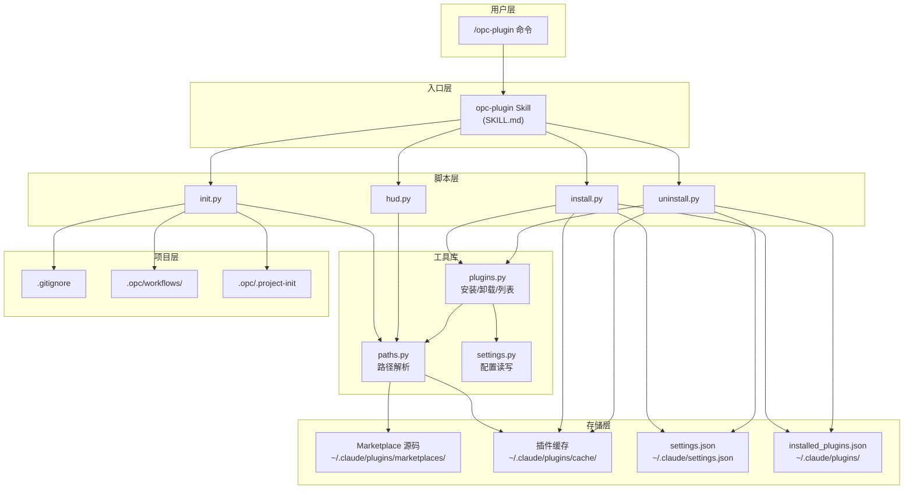

## 架构图



## 关键模块与职责

### 1. 入口层 (Entry Layer)

**opc-plugin Skill (SKILL.md)**
- 职责：解析命令参数，调用对应脚本
- 命令映射：
  - `init` → init.py
  - `install` → install.py
  - `update` → install.py (更新模式)
  - `uninstall` → uninstall.py
  - `list/status` → 直接输出
  - `hud` → hud.py

### 2. 脚本层 (Scripts Layer)

**install.py**
- 职责：安装插件到缓存目录
- 流程：
  1. 检测市场路径
  2. 读取插件版本
  3. 创建缓存目录
  4. 复制插件文件
  5. 更新 installed_plugins.json
  6. 更新 settings.json enabledPlugins
  7. 运行首次安装设置

**uninstall.py**
- 职责：从缓存移除插件
- 流程：
  1. 解析参数 (--all, marketplace, plugin-name)
  2. 移除缓存目录
  3. 更新 installed_plugins.json
  4. 更新 settings.json
  5. 可选移除 HUD 和市场

**init.py**
- 职责：初始化项目配置
- 流程：
  1. 检测 git toplevel
  2. 配置 .gitignore
  3. 复制内置工作流
  4. 创建标记文件
  5. 安装 HUD

**hud.py**
- 职责：管理 HUD 状态栏
- 命令：
  - `install` - 安装 HUD
  - `uninstall` - 卸载 HUD
  - `status` - 查看状态

### 3. 工具库 (Library Layer)

**plugins.py**
- 函数：
  - `get_plugin_version(plugin_path)` - 获取版本
  - `install_plugin(plugin_name, marketplace_path)` - 安装插件
  - `uninstall_plugin(plugin_name)` - 卸载插件
  - `uninstall_all_plugins()` - 卸载全部
  - `list_installed_plugins()` - 列出已安装

**paths.py**
- 函数：
  - `get_home()` - 获取用户目录
  - `get_claude_dir()` - 获取 Claude 配置目录
  - `get_marketplace_path()` - 检测市场路径
  - `get_cache_dir()` - 获取缓存目录
  - `get_installed_plugins_path()` - 获取已安装列表路径
  - `get_settings_path()` - 获取设置文件路径
  - `get_git_toplevel()` - 获取 git 根目录
  - `get_project_root()` - 获取项目根目录

**settings.py**
- 函数：
  - `read_json(path)` - 读取 JSON 文件
  - `write_json(path, data)` - 写入 JSON 文件
  - `update_settings(key, value)` - 更新设置
  - `update_installed_plugins(plugin, version)` - 更新已安装列表

### 4. 存储层 (Storage Layer)

**Marketplace 源码**
```
~/.claude/plugins/marketplaces/opc-marketplace/
├── marketplace.json          # 市场清单
├── build-in/
│   └── workflows/            # 内置工作流
└── plugins/
    ├── opc-founder/
    ├── product-kit/
    ├── design-kit/
    ├── dev-kit/
    ├── qa-kit/
    ├── ship-kit/
    ├── growth-kit/
    └── docs-kit/
```

**插件缓存**
```
~/.claude/plugins/cache/opc-marketplace/
├── opc-founder/
│   └── 1.0.0/
│       ├── .claude-plugin/
│       ├── agents/
│       ├── skills/
│       └── references/
├── product-kit/
│   └── 1.0.0/
├── ...
└── hud/
    └── statusline.sh
```

**settings.json 结构**
```json
{
  "enabledPlugins": [
    "opc-marketplace:opc-founder",
    "opc-marketplace:product-kit"
  ],
  "statusLine": "~/.claude/plugins/cache/opc-marketplace/hud/statusline.sh",
  "extraKnownMarketplaces": [
    "CaffeineOddity/opc-marketplace"
  ]
}
```

**installed_plugins.json 结构**
```json
{
  "plugins": {
    "opc-marketplace:opc-founder": {
      "version": "1.0.0",
      "installed_at": "2026-05-12T10:00:00Z",
      "marketplace": "opc-marketplace"
    }
  }
}
```

### 5. 项目层 (Project Layer)

**初始化后的项目结构**
```
project/
├── .gitignore                # 添加 .opc/state/
├── .opc/
│   ├── .project-init         # 初始化标记
│   └── workflows/            # 工作流规范
│       ├── feature-development.json
│       ├── bug-fix.json
│       ├── security-fix.json
│       ├── api-development.json
│       ├── refactor.json
│       ├── documentation.json
│       ├── product-design.json
│       └── feature-page.json
```

## 数据流

### 插件安装流程

```
1. 解析参数 → 获取插件列表
2. 检测市场路径 → get_marketplace_path()
3. 遍历插件:
   a. 读取版本 → get_plugin_version()
   b. 创建缓存目录 → cache/{plugin}/{version}/
   c. 复制文件 → .claude-plugin/, agents/, skills/, references/
   d. 更新 installed_plugins.json
   e. 更新 settings.json enabledPlugins
4. 运行首次安装设置 → init.py
5. 提示用户 → /reload-plugins
```

### 项目初始化流程

```
1. 检测 git toplevel → get_git_toplevel()
2. 检查标记文件 → .opc/.project-init
3. 如果存在且非强制 → 跳过
4. 配置 .gitignore → 添加 .opc/state/
5. 复制工作流 → build-in/workflows/ → .opc/workflows/
6. 创建标记文件 → .opc/.project-init
7. 安装 HUD → hud.py install
```

### 完整卸载流程

```
1. 移除缓存目录 → ~/.claude/plugins/cache/opc-marketplace/
2. 更新 installed_plugins.json → 移除所有 OPC 条目
3. 更新 settings.json:
   - 移除 enabledPlugins 中的 OPC 条目
   - 移除 statusLine (如果是 OPC HUD)
   - 移除 extraKnownMarketplaces 中的 opc-marketplace
4. 移除市场目录 → ~/.claude/plugins/marketplaces/opc-marketplace/
5. 提示用户 → /reload-plugins
```

## 技术选型与约束

| 技术 | 用途 | 原因 |
|------|------|------|
| Python | 脚本实现 | 跨平台、易维护 |
| JSON | 配置存储 | 标准格式、易读写 |
| Shell | HUD 脚本 | 轻量、快速执行 |
| Git | 项目检测 | 标准版本控制 |

### 插件目录结构

每个插件必须包含：
```
plugin-name/
├── .claude-plugin/
│   └── plugin.json          # 必需：插件清单
├── agents/                   # 可选：Agent 定义
├── skills/                   # 可选：Skill 定义
├── references/               # 可选：参考文档
└── hooks/                    # 可选：Hook 定义
```

### 复制的目录

```python
PLUGIN_DIRS = [".claude-plugin", "agents", "skills", "references"]
PLUGIN_OPTIONAL_DIRS = ["hooks", "workflows"]
```

### 预设组合定义

```javascript
const PLUGIN_SETS = {
  all: ['product-kit', 'design-kit', 'dev-kit', 'qa-kit', 'ship-kit', 'growth-kit', 'docs-kit'],
  web: ['product-kit', 'design-kit', 'dev-kit', 'qa-kit', 'ship-kit', 'growth-kit'],
  mobile: ['product-kit', 'design-kit', 'dev-kit', 'qa-kit', 'ship-kit'],
  designer: ['product-kit', 'design-kit', 'docs-kit'],
  content: ['product-kit', 'growth-kit', 'docs-kit'],
  minimal: ['product-kit', 'dev-kit']
};
```

## 设计约束

1. **单市场源** - 仅支持 opc-marketplace
2. **版本按目录** - 缓存按版本组织，支持多版本共存
3. **标记文件** - 防止重复初始化
4. **Git 友好** - 工作流可提交，状态文件排除

## 扩展性设计

1. **预设组合** - 可添加新预设
2. **插件独立** - 无依赖关系，灵活组合
3. **脚本模块化** - 工具库可复用
4. **路径自动检测** - 支持开发模式