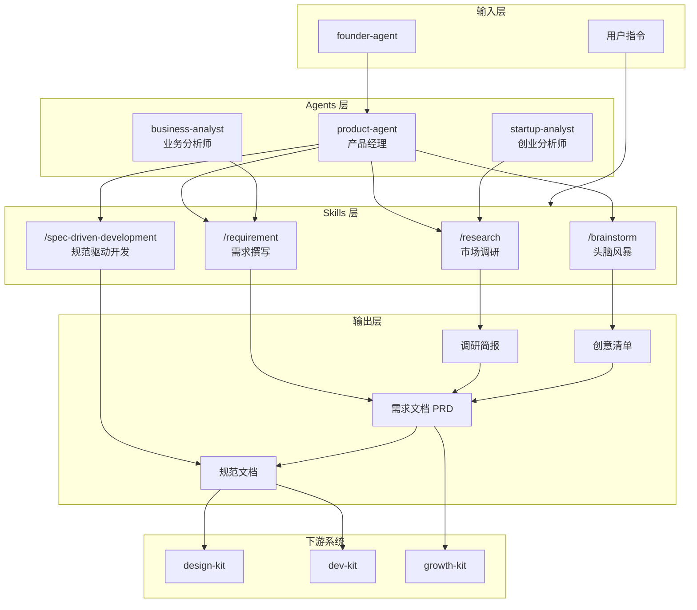

## 架构图



## 关键模块与职责

### 1. Skills 层

#### /research skill
- **职责**：执行结构化市场与用户调研
- **输入**：调研主题或问题领域
- **输出**：结构化调研简报
- **核心流程**：
  1. 定义调研问题
  2. 市场格局分析
  3. 用户洞察提取
  4. 综合输出

#### /requirement skill
- **职责**：将想法或调研结果转化为结构化需求文档
- **输入**：想法描述或调研简报
- **输出**：完整 PRD（产品需求文档）
- **核心流程**：
  1. 概述定义（问题陈述、目标用户、成功指标）
  2. 用户故事编写
  3. 功能/非功能需求定义
  4. 范围与优先级划分

#### /brainstorm skill
- **职责**：结构化创意生成与评估
- **输入**：挑战或问题陈述
- **输出**：优先级排序的创意清单
- **核心方法**：
  - SCAMPER（替代、组合、调整、修改、其他用途、消除、逆向）
  - 第一性原理（拆解到基础，重新构建）
  - 逆向思维（什么会导致失败？反转它）
  - 类比法（其他领域如何解决）

#### /spec-driven-development skill
- **职责**：实现前定义清晰规范
- **输入**：需求文档
- **输出**：规范文档（接口契约、数据模型、行为规则、边界条件）
- **核心流程**：
  1. 规范定义
  2. 规范评审
  3. 测试推导
  4. 实现指导
  5. 验证检查

### 2. Agents 层

#### product-agent（sonnet 模型）
- **职责**：产品经理智能体，负责调研、需求、创意全流程
- **能力**：
  - 市场调研与分析
  - 用户故事编写
  - 功能优先级排序
  - 产品路线图规划
- **工具**：Bash, Read, Write, Edit, Glob, Grep, Agent
- **交接协议**：
  - 输出：需求文档 → design-agent, dev-agents, marketing-agent
  - 输入：战略方向 ← founder-agent, 用户反馈 ← qa-agent, 市场信号 ← marketing-agent

#### startup-analyst（inherit 模型）
- **职责**：创业分析师，专注于早期创业公司分析
- **能力**：
  - 市场规模分析（TAM/SAM/SOM）
  - 财务建模（3-5年预测、单位经济）
  - 竞争分析（波特五力、蓝海战略）
  - 团队规划（按阶段招聘、薪酬基准、股权分配）
- **适用场景**：pre-seed 到 Series A 创业公司
- **输出格式**：结构化分析报告，包含数据来源和假设文档

#### business-analyst（sonnet 模型）
- **职责**：业务分析师，负责业务流程分析和需求获取
- **能力**：
  - 需求获取（访谈、研讨会、文档分析）
  - 业务流程建模（BPMN、价值流映射）
  - 数据分析（SQL、统计分析、KPI 开发）
  - 干系人管理
- **工具**：Read, Write, Edit, Glob, Grep, WebFetch, WebSearch
- **输出格式**：BRD、功能规格、流程图、用例图

### 3. 数据流

```
用户输入 → /research → 调研简报
                    ↓
              /requirement → PRD
                    ↓
              /brainstorm → 创意清单（可选）
                    ↓
              /spec-driven-development → 规范文档
                    ↓
              交接给 design-kit / dev-kit
```

### 4. 与其他系统集成

#### 上游系统
| 系统 | 输入内容 | 触发条件 |
|------|----------|----------|
| opc-founder | 战略方向、优先级 | `/opc` 命令调度 |
| qa-kit | 用户反馈、bug 报告 | 需求迭代 |
| growth-kit | 市场信号、竞争情报 | 调研补充 |

#### 下游系统
| 系统 | 输出内容 | 交接格式 |
|------|----------|----------|
| design-kit | 需求文档、用户故事、验收标准 | PRD 文档 |
| dev-kit | 技术需求、数据模型、API 规范 | 规范文档 |
| growth-kit | 产品定位、价值主张 | 定位文档 |

## 技术选型与约束

### 技术栈
- **Agent 框架**：Claude Code Agent SDK
- **模型选择**：
  - product-agent: sonnet（平衡性能与成本）
  - startup-analyst: inherit（继承调用者模型）
  - business-analyst: sonnet
- **工具集**：Bash, Read, Write, Edit, Glob, Grep, Agent, WebFetch, WebSearch

### 设计约束
1. **一人公司模式**：所有工具设计为单人使用，无需团队协作功能
2. **精简原则**：需求文档保持精简，避免过度文档化
3. **可测试性**：所有需求必须可测试，规范必须无歧义
4. **交接友好**：输出格式结构化，便于下游系统解析

### 扩展性设计
- Skills 可独立使用，也可组合使用
- Agents 可单独调用，也可通过 founder-agent 编排
- 输出格式标准化，支持后续工具链集成

### 质量保障
- 调研结果必须标注数据来源
- 需求文档必须包含验收标准
- 规范文档必须通过评审检查清单
- 所有输出必须区分假设与已验证发现