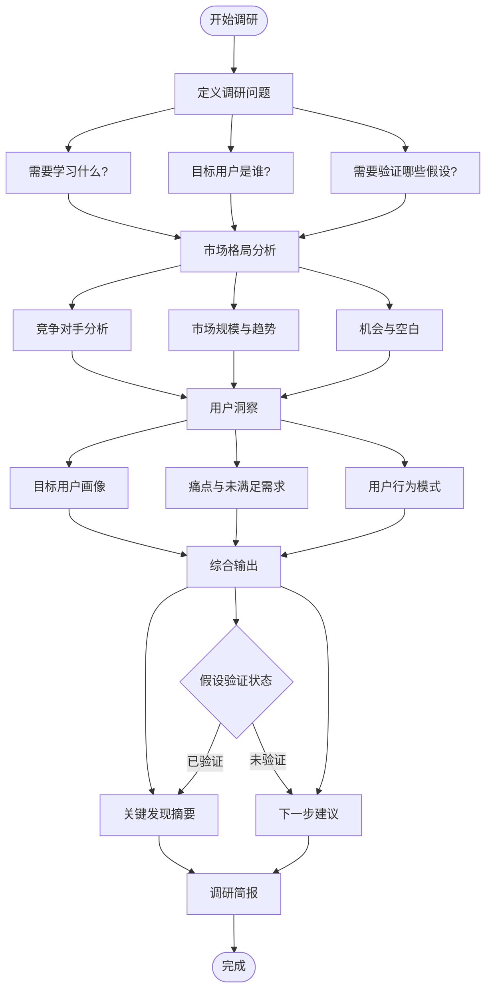
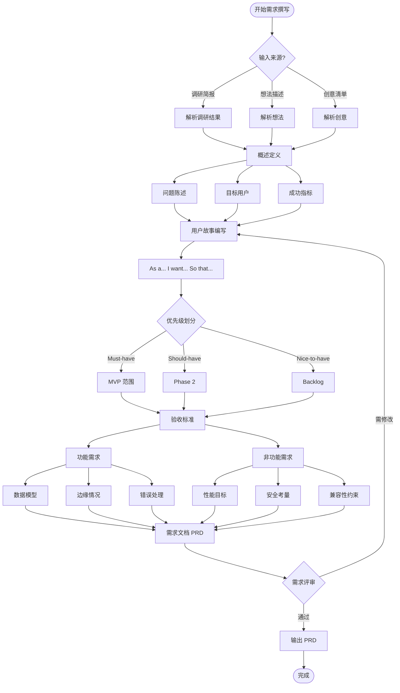
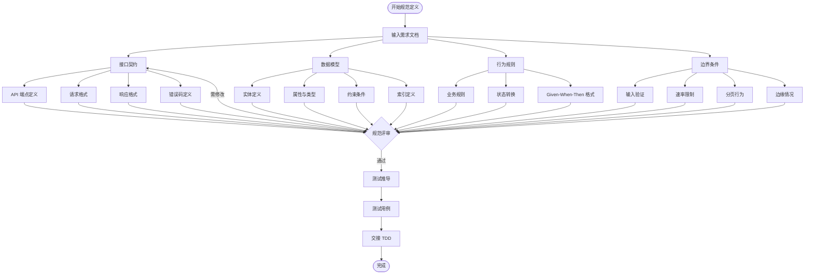

## 流程图

### 完整产品调研流程

```mermaid
flowchart TD
    Start([开始调研]) --> Input{输入类型?}
    
    Input -->|主题/问题| Research[/research skill]
    Input -->|想法/功能| Requirement[/requirement skill]
    Input -->|挑战/问题| Brainstorm[/brainstorm skill]
    
    Research --> ResearchBrief[调研简报]
    ResearchBrief --> Validate{假设验证?}
    
    Validate -->|已验证| Requirement
    Validate -->|未验证| Research
    
    Brainstorm --> Ideas[创意清单]
    Ideas --> Evaluate{评估结果?}
    Evaluate -->|Top 3| Requirement
    Evaluate -->|需更多创意| Brainstorm
    
    Requirement --> PRD[需求文档 PRD]
    PRD --> Review{需求评审?}
    
    Review -->|通过| SDD[/spec-driven-development]
    Review -->|需修改| Requirement
    
    SDD --> Specs[规范文档]
    Specs --> SpecReview{规范评审?}
    
    SpecReview -->|通过| Handoff[交接下游]
    SpecReview -->|需修改| SDD
    
    Handoff --> DesignKit[design-kit]
    Handoff --> DevKit[dev-kit]
    Handoff --> GrowthKit[growth-kit]
    
    DesignKit --> End([结束])
    DevKit --> End
    GrowthKit --> End
```

### Agent 调度流程

```mermaid
flowchart TD
    Start([用户请求]) --> Founder{founder-agent}
    
    Founder -->|调研任务| ProductAgent[product-agent]
    Founder -->|市场规模| StartupAnalyst[startup-analyst]
    Founder -->|业务分析| BusinessAnalyst[business-analyst]
    
    ProductAgent --> SkillSelect{选择 Skill}
    SkillSelect -->|市场调研| Research[/research]
    SkillSelect -->|需求撰写| Requirement[/requirement]
    SkillSelect -->|头脑风暴| Brainstorm[/brainstorm]
    SkillSelect -->|规范定义| SDD[/spec-driven-development]
    
    StartupAnalyst --> MarketSizing[市场规模分析]
    StartupAnalyst --> FinancialModel[财务建模]
    StartupAnalyst --> CompetitiveAnalysis[竞争分析]
    
    BusinessAnalyst --> ProcessMapping[流程映射]
    BusinessAnalyst --> RequirementsGathering[需求获取]
    BusinessAnalyst --> StakeholderAnalysis[干系人分析]
    
    Research --> Output[输出文档]
    Requirement --> Output
    Brainstorm --> Output
    SDD --> Output
    MarketSizing --> Output
    FinancialModel --> Output
    CompetitiveAnalysis --> Output
    ProcessMapping --> Output
    RequirementsGathering --> Output
    StakeholderAnalysis --> Output
    
    Output --> End([完成])
```

### /research Skill 流程



### /requirement Skill 流程



### /brainstorm Skill 流程

```mermaid
flowchart TD
    Start([开始头脑风暴]) --> Frame[定义挑战]
    
    Frame --> Challenge[清晰陈述问题]
    Frame --> Constraints[定义约束与边界]
    Frame --> Goal[设定明确目标]
    
    Challenge --> Diverge[发散阶段]
    Constraints --> Diverge
    Goal --> Diverge
    
    Diverge --> Generate[生成 10+ 创意]
    Generate --> Method{选择方法}
    
    Method -->|SCAMPER| SCAMPER[替代/组合/调整/修改/其他用途/消除/逆向]
    Method -->|第一性原理| FirstPrinciples[拆解到基础/重新构建]
    Method -->|类比法| Analogy[其他领域如何解决]
    Method -->|逆向思维| Inversion[什么会导致失败/反转它]
    
    SCAMPER --> Ideas[创意清单]
    FirstPrinciples --> Ideas
    Analogy --> Ideas
    Inversion --> Ideas
    
    Ideas --> Converge[收敛阶段]
    
    Converge --> Rate[评分: Impact x Feasibility x Alignment]
    Rate --> Group[归类相似创意]
    Group --> Top3[选出 Top 3]
    
    Top3 --> NextSteps[下一步]
    
    NextSteps --> Action[每个创意的验证行动]
    NextSteps --> Done[定义"完成"标准]
    NextSteps --> Agent[建议后续负责 agent]
    
    Action --> Output[创意清单]
    Done --> Output
    Agent --> Output
    
    Output --> End([完成])
```

### /spec-driven-development Skill 流程



## 关键分支与异常

### 调研阶段异常处理

| 异常场景 | 处理方式 |
|----------|----------|
| 调研问题不明确 | 引导用户澄清问题范围 |
| 数据源不可用 | 标注不确定性，建议替代数据源 |
| 假设无法验证 | 标记为"需进一步验证"，继续流程 |
| 调研范围过大 | 建议缩小范围，分阶段调研 |

### 需求阶段异常处理

| 异常场景 | 处理方式 |
|----------|----------|
| 需求冲突 | 标记冲突，建议优先级排序 |
| 需求模糊 | 引导用户澄清，提供示例 |
| 范围蔓延 | 提醒用户，建议明确排除项 |
| 验收标准不可测试 | 引导用户重写，提供可测试示例 |

### 头脑风暴阶段异常处理

| 异常场景 | 处理方式 |
|----------|----------|
| 创意不足 | 使用多种方法激发，延长发散阶段 |
| 创意质量低 | 引导用户深入思考，提供参考案例 |
| 无法收敛 | 增加评分维度，引入外部评估 |
| Top 创意不可行 | 标记风险，建议替代方案 |

### 规范阶段异常处理

| 异常场景 | 处理方式 |
|----------|----------|
| 规范不完整 | 使用评审检查清单，补充缺失项 |
| 规范有歧义 | 提供示例，明确唯一解释 |
| 规范不可测试 | 重写规范，确保可验证 |
| 边界条件未定义 | 引导用户思考边缘情况 |

### Agent 调度异常处理

| 异常场景 | 处理方式 |
|----------|----------|
| Agent 选择错误 | founder-agent 重新评估，选择正确 agent |
| Skill 调用失败 | 回退到 agent 直接处理 |
| 输出格式错误 | 自动修复格式，重新生成 |
| 交接失败 | 记录错误，重试交接 |