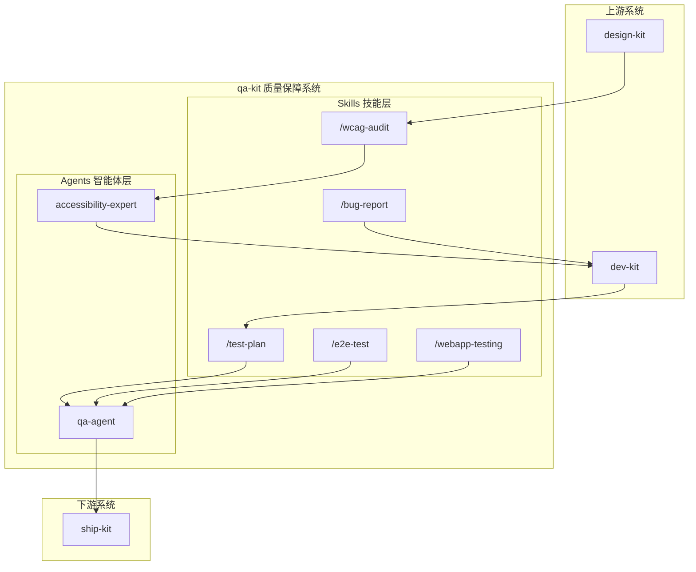

## 架构图



## 关键模块与职责

### Skills 技能层

| Skill | 职责 | 输入 | 输出 |
|-------|------|------|------|
| `/test-plan` | 测试计划生成 | 需求文档、设计规范 | 测试计划（范围、用例、优先级） |
| `/bug-report` | 缺陷报告生成 | Bug 描述、复现步骤 | 结构化缺陷报告 |
| `/e2e-test` | E2E 测试生成 | 测试场景描述 | Playwright/Cypress 测试代码 |
| `/wcag-audit` | 无障碍审计 | URL 或组件 | WCAG 合规报告、修复建议 |
| `/webapp-testing` | Web 应用测试 | 测试需求 | Playwright 测试工具包 |

### Agents 智能体层

| Agent | 模型 | 职责 | 协作关系 |
|-------|------|------|----------|
| qa-agent | sonnet | 测试计划、缺陷管理、质量门禁 | 接收 dev-kit，交付 ship-kit |
| accessibility-expert | inherit | WCAG 合规、辅助技术、无障碍测试 | 与 frontend-agent 协作 |

### 工作流集成

```
测试优先流程（与 TDD 配合）:
/test-plan -> /test-driven-development (dev-kit) -> /verification-before-completion

缺陷修复流程:
/bug-report -> /systematic-debugging (dev-kit) -> /e2e-test -> /verification-before-completion

无障碍流程:
/wcag-audit -> accessibility-expert -> frontend-agent (修复) -> /wcag-audit (验证)
```

## 技术选型与约束

### 测试框架支持

| 框架 | 类型 | 适用场景 |
|------|------|----------|
| Playwright | E2E 测试 | 现代 Web 应用（推荐） |
| Cypress | E2E 测试 | 前端应用测试 |
| jest-axe | 无障碍测试 | React 组件测试 |
| axe-core | 无障碍测试 | 通用无障碍检测 |

### WCAG 合规级别

| 级别 | 描述 | 适用场景 |
|------|------|----------|
| Level A | 最低无障碍 | 法律基线要求 |
| Level AA | 标准合规 | 大多数法规要求 |
| Level AAA | 增强无障碍 | 特殊需求场景 |

### 协作约束

1. **测试先行**：/test-plan 在实现前生成测试用例
2. **缺陷闭环**：/bug-report 必须跟踪到修复验证
3. **无障碍验证**：关键功能需通过 WCAG 审计
4. **质量门禁**：qa-agent 决定是否可以部署

### 测试分类

```
测试类型:
├── 功能测试
│   ├── 正向场景（Happy Path）
│   ├── 边界值测试
│   ├── 输入验证测试
│   └── 状态转换测试
├── 集成测试
│   ├── API 契约测试
│   ├── 组件交互测试
│   └── 第三方集成测试
└── 非功能测试
    ├── 性能基准测试
    ├── 安全测试
    ├── 无障碍测试
    └── 兼容性测试
```
