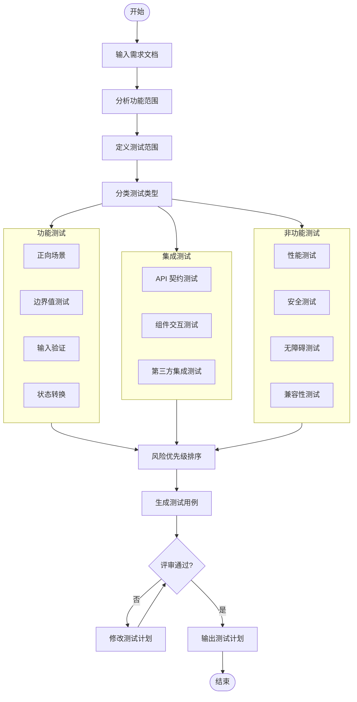

## 流程图

### 测试计划生成流程



### 缺陷报告流程

```mermaid
flowchart TD
    Start([发现缺陷]) --> Report[/bug-report]
    
    subgraph Details["缺陷详情"]
        Steps[复现步骤]
        Expected[预期结果]
        Actual[实际结果]
        Env[环境信息]
    end
    
    Report --> Details
    
    Details --> Severity[评估严重程度]
    Severity --> Priority[确定优先级]
    Priority --> Evidence[添加证据]
    
    subgraph Evidence["证据收集"]
        Screenshot[截图]
        Logs[日志]
        Video[录屏]
    end
    
    Evidence --> Submit[提交报告]
    Submit --> Triage[缺陷分类]
    
    Triage --> Decision{处理决策}
    Decision -->|Critical| Immediate[立即修复]
    Decision -->|High| Schedule[排期修复]
    Decision -->|Medium| Backlog[加入待办]
    Decision -->|Low| Future[后续版本]
    
    Immediate --> Fix[开发修复]
    Schedule --> Fix
    Backlog --> Fix
    Future --> End([关闭])
    
    Fix --> Verify[验证修复]
    Verify --> Fixed{问题解决?}
    Fixed -->|否| Reopen[重新打开]
    Reopen --> Fix
    Fixed -->|是| Close[关闭缺陷]
    Close --> End([结束])
```

### E2E 测试流程

```mermaid
flowchart TD
    Start([开始]) --> Scenario[测试场景分析]
    Scenario --> POM[设计 Page Object Model]
    
    subgraph Setup["测试准备"]
        Env[环境配置]
        Data[测试数据准备]
        Mock[Mock 服务配置]
    end
    
    POM --> Setup
    Setup --> Generate[/e2e-test 生成测试代码]
    
    subgraph TestCode["测试代码"]
        Locators[元素定位器]
        Actions[用户操作]
        Assertions[断言验证]
        Cleanup[清理逻辑]
    end
    
    Generate --> TestCode
    TestCode --> Review{代码审查}
    Review -->|需要修改| Generate
    Review -->|通过| Execute[执行测试]
    
    Execute --> Result{测试结果}
    Result -->|通过| Pass[测试通过]
    Result -->|失败| Debug[调试失败原因]
    
    Debug --> FixTest{测试问题?}
    FixTest -->|是| FixCode[修复测试代码]
    FixCode --> Execute
    FixTest -->|否| ReportBug[报告缺陷]
    ReportBug --> End([结束])
    
    Pass --> CI[集成到 CI/CD]
    CI --> End([结束])
```

### WCAG 无障碍审计流程

```mermaid
flowchart TD
    Start([开始审计]) --> Audit[/wcag-audit]
    
    subgraph Auto["自动化检测"]
        Axe[axe-core 扫描]
        Lighthouse[Lighthouse 审计]
        Pa11y[Pa11y 扫描]
    end
    
    Audit --> Auto
    
    Auto --> AutoResults[自动化结果]
    AutoResults --> Manual{需要手动验证?}
    
    subgraph ManualTests["手动测试"]
        Keyboard[键盘导航测试]
        ScreenReader[屏幕阅读器测试]
        ColorContrast[颜色对比度验证]
        Zoom[缩放测试]
    end
    
    Manual -->|是| ManualTests
    Manual -->|否| Report
    ManualTests --> ManualResults[手动测试结果]
    
    AutoResults --> Combine[合并结果]
    ManualResults --> Combine
    
    Combine --> Classify[问题分类]
    
    subgraph WCAG["WCAG 级别"]
        LevelA[Level A 违规]
        LevelAA[Level AA 违规]
        LevelAAA[Level AAA 违规]
    end
    
    Classify --> WCAG
    
    LevelA --> Critical[Critical 问题]
    LevelAA --> Serious[Serious 问题]
    LevelAAA --> Moderate[Moderate 问题]
    
    Critical --> Report[审计报告]
    Serious --> Report
    Moderate --> Report
    
    Report --> Remediation[修复建议]
    Remediation --> Fix{需要修复?}
    Fix -->|是| DevFix[开发修复]
    DevFix --> Reaudit[重新审计]
    Reaudit --> Audit
    Fix -->|否| End([结束])
```

## 关键分支与异常

### 分支 1: 测试优先开发

**触发条件**: 新功能开发

**流程**:
1. /test-plan 生成测试计划
2. dev-kit /test-driven-development 编写失败测试
3. 实现代码使测试通过
4. /verification-before-completion 验证

**异常处理**:
- 测试无法通过: 使用 /systematic-debugging 调试
- 需求变更: 更新测试计划，重新执行

### 分支 2: 缺陷修复验证

**触发条件**: 缺陷修复后

**流程**:
1. 验证修复是否解决原问题
2. 回归测试相关功能
3. 更新缺陷状态
4. 关闭或重新打开

**异常处理**:
- 修复无效: 重新打开，附加验证信息
- 引入新问题: 创建新缺陷报告

### 分支 3: 无障碍合规

**触发条件**: 面向公众的应用

**流程**:
1. /wcag-audit 进行审计
2. accessibility-expert 分析问题
3. frontend-agent 实施修复
4. 重新审计验证

**异常处理**:
- 无法修复: 提供替代方案
- 合规争议: 咨询法律专家

### 分支 4: 回归测试

**触发条件**: 代码变更后

**流程**:
1. 识别受影响的测试范围
2. 执行相关测试用例
3. 分析失败原因
4. 修复或更新测试

**异常处理**:
- 测试不稳定: 优化测试代码
- 环境问题: 修复测试环境

### 分支 5: 质量门禁

**触发条件**: 发布前

**流程**:
1. 执行烟雾测试
2. 检查关键指标
3. 确认无阻塞问题
4. 批准或拒绝发布

**异常处理**:
- 指标不达标: 推迟发布，修复问题
- 阻塞问题: 立即修复，重新验证
