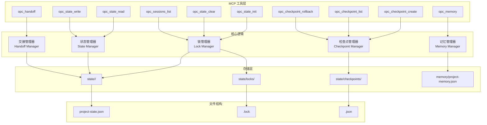

## 架构图



## 关键模块与职责

### 1. MCP 工具层

**状态管理工具**

| 工具 | 输入 | 输出 | 描述 |
|------|------|------|------|
| `opc_state_init` | project_name, project_description | lock_id | 初始化新任务 |
| `opc_state_read` | - | state object | 读取当前状态 |
| `opc_state_write` | stage, status, agent, artifact | success | 更新状态 |
| `opc_state_clear` | - | success | 清除当前任务 |

**检查点工具**

| 工具 | 输入 | 输出 | 描述 |
|------|------|------|------|
| `opc_checkpoint_create` | description | checkpoint_id | 创建检查点 |
| `opc_checkpoint_list` | - | checkpoint[] | 列出检查点 |
| `opc_checkpoint_rollback` | checkpoint_id | success | 回滚到检查点 |

**交接和记忆工具**

| 工具 | 输入 | 输出 | 描述 |
|------|------|------|------|
| `opc_handoff` | from_agent, to_agent, context | success | 记录交接 |
| `opc_memory` | action, category, content | memory | 读写记忆 |
| `opc_sessions_list` | - | session[] | 列出会话 |

### 2. 核心逻辑层

**锁管理器 (Lock Manager)**
- 职责：管理窗口锁和会话生命周期
- 功能：
  - 创建锁：生成 lock_id (PID + timestamp)
  - 验证锁：检查当前窗口是否有活跃任务
  - 释放锁：清除任务时释放

**状态管理器 (State Manager)**
- 职责：管理任务状态
- 状态结构：
  ```json
  {
    "lock_id": "12345_1700000000",
    "project": {
      "name": "用户登录功能",
      "description": "实现用户登录...",
      "knowledge_feature_name": "user-auth"
    },
    "pipeline": {
      "product": {"status": "completed", "agent": "product-agent"},
      "design": {"status": "in_progress", "agent": "web-agent"},
      "dev": {"status": "pending"},
      "qa": {"status": "pending"}
    },
    "artifacts": ["spec.md", "design/ui.md"],
    "created_at": "2026-05-12T10:00:00Z",
    "updated_at": "2026-05-12T11:00:00Z"
  }
  ```

**检查点管理器 (Checkpoint Manager)**
- 职责：管理状态快照
- 功能：
  - 创建：复制当前状态到检查点文件
  - 列出：扫描检查点目录
  - 回滚：用检查点覆盖当前状态

**交接管理器 (Handoff Manager)**
- 职责：管理 Agent 间上下文传递
- 交接结构：
  ```json
  {
    "from_agent": "product-agent",
    "to_agent": "web-agent",
    "timestamp": "2026-05-12T10:30:00Z",
    "context": {
      "decisions": ["使用邮箱登录"],
      "constraints": ["必须支持移动端"],
      "artifacts": ["spec.md"],
      "questions": ["是否需要第三方登录?"]
    }
  }
  ```

**记忆管理器 (Memory Manager)**
- 职责：管理项目级记忆
- 分类：
  - `decision` - 重要决策
  - `pattern` - 设计模式
  - `lesson` - 经验教训
  - `constraint` - 约束条件

### 3. 存储层

**目录结构**
```
.opc/
├── state/
│   ├── {lock-id}/
│   │   ├── project-state.json      # 任务状态
│   │   └── handoffs/               # 交接记录
│   │       └── {timestamp}.json
│   ├── locks/
│   │   └── {lock-id}.lock          # 窗口锁
│   └── checkpoints/
│       └── {checkpoint-id}.json    # 检查点
├── memory/
│   └── project-memory.json         # 项目记忆
└── .gitignore                      # 排除 state/
```

**锁文件结构**
```json
{
  "lock_id": "12345_1700000000",
  "pid": 12345,
  "created_at": "2026-05-12T10:00:00Z",
  "project_name": "用户登录功能"
}
```

**检查点文件结构**
```json
{
  "checkpoint_id": "cp_1700000300",
  "description": "设计阶段完成",
  "created_at": "2026-05-12T10:30:00Z",
  "state": {
    // 完整状态快照
  }
}
```

**项目记忆结构**
```json
{
  "entries": [
    {
      "id": "mem_001",
      "category": "decision",
      "content": "使用 PostgreSQL 作为主数据库",
      "rationale": "支持复杂查询和事务",
      "created_at": "2026-05-10T10:00:00Z"
    },
    {
      "id": "mem_002",
      "category": "pattern",
      "content": "Repository 模式处理数据访问",
      "created_at": "2026-05-11T10:00:00Z"
    }
  ]
}
```

## 数据流

### 任务初始化流程

```
1. 用户调用 /opc <任务>
2. opc_state_init(project_name, project_description)
3. 生成 lock_id = PID + timestamp
4. 检查是否存在活跃锁
   - 有: 提示先完成或清除当前任务
   - 无: 继续
5. 创建锁文件: locks/{lock_id}.lock
6. 创建状态目录: state/{lock_id}/
7. 初始化状态文件: project-state.json
8. 返回 lock_id
```

### 状态更新流程

```
1. Agent 完成阶段工作
2. opc_state_write(stage, status, agent, artifact)
3. 读取当前状态
4. 更新 pipeline[stage]
5. 添加 artifacts
6. 更新 updated_at
7. 写入状态文件
```

### 检查点流程

```
创建:
1. opc_checkpoint_create(description)
2. 读取当前状态
3. 生成 checkpoint_id
4. 复制状态到 checkpoints/{checkpoint_id}.json
5. 返回 checkpoint_id

回滚:
1. opc_checkpoint_rollback(checkpoint_id)
2. 读取检查点文件
3. 覆盖当前状态文件
4. 返回成功
```

### Agent 交接流程

```
1. 阶段完成，准备交接
2. opc_handoff(from_agent, to_agent, context)
3. 创建交接记录
4. 保存到 handoffs/{timestamp}.json
5. 更新状态中的交接引用
```

## 技术选型与约束

| 技术 | 用途 | 原因 |
|------|------|------|
| MCP Protocol | 工具接口 | 标准协议，跨会话可用 |
| JSON | 存储格式 | 易读易写，标准格式 |
| File System | 持久化 | 简单可靠，无需数据库 |
| PID + Timestamp | 锁标识 | 唯一且可追溯 |

### 设计约束

1. **单窗口单任务** - 每个窗口只能有一个活跃任务
2. **本地存储** - 状态文件不离开用户机器
3. **Git 排除** - `.opc/state/` 不提交到版本控制
4. **原子写入** - 避免写入中断导致损坏

## 扩展性设计

1. **多检查点** - 支持多个检查点，可回滚到任意一个
2. **记忆分类** - 支持多种记忆类型
3. **交接链** - 完整的 Agent 交接历史
4. **状态恢复** - 支持从检查点恢复