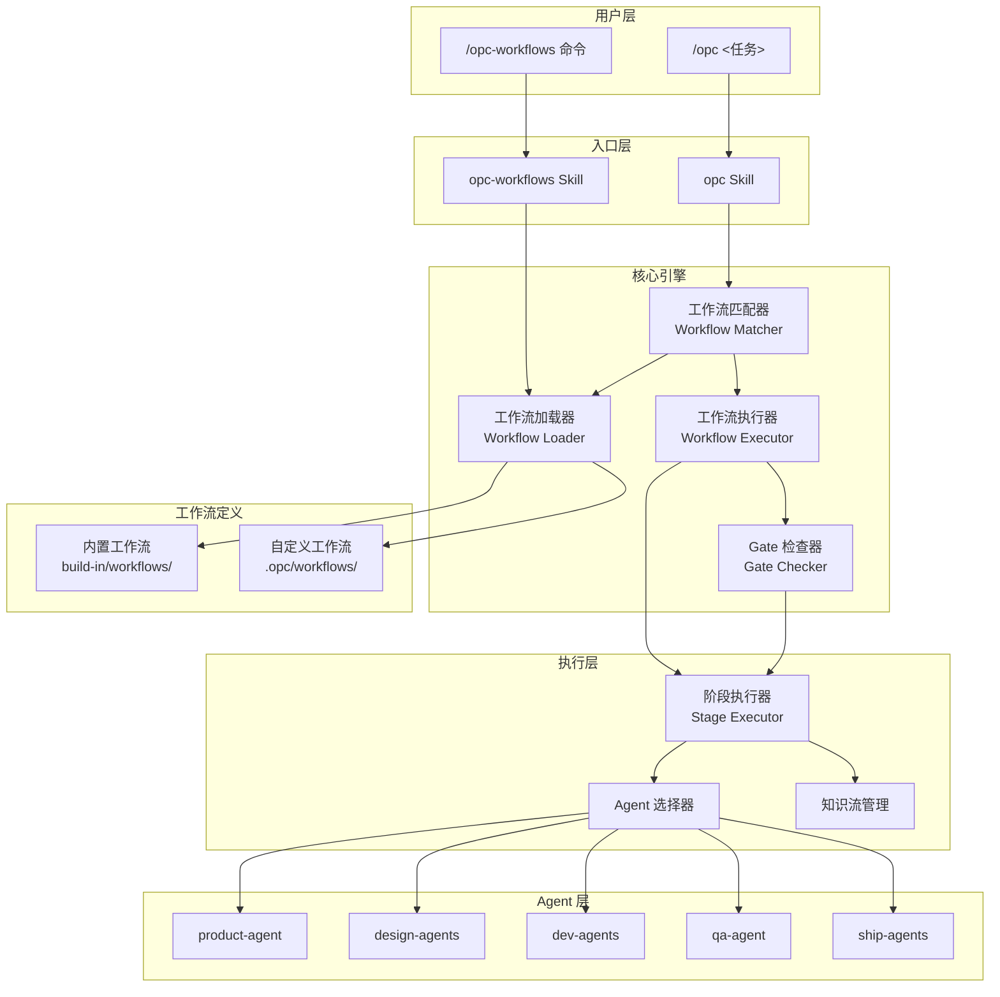

## 架构图



## 关键模块与职责

### 1. 入口层 (Entry Layer)

**opc-workflows Skill**
- 职责：管理工作流定义
- 命令：
  - `init` - 初始化工作流目录
  - `list` - 列出工作流
  - `show` - 显示详情
  - `create` - 创建自定义
  - `update` - 更新工作流
  - `delete` - 删除工作流

**opc Skill**
- 职责：执行时匹配和使用工作流
- 流程：任务描述 → 匹配工作流 → 执行

### 2. 核心引擎 (Core Engine)

**工作流加载器 (Workflow Loader)**
- 职责：加载所有工作流定义
- 来源：
  - 内置：`build-in/workflows/*.json`
  - 自定义：`.opc/workflows/*.json`
- 合并：自定义覆盖同名内置

**工作流匹配器 (Workflow Matcher)**
- 职责：根据任务描述匹配工作流
- 匹配逻辑：
  ```python
  def match_workflow(task, workflows):
      for wf in workflows:
          # 关键词匹配
          for kw in wf.triggers.keywords:
              if kw.lower() in task.lower():
                  return wf
          # 正则匹配
          for pattern in wf.triggers.patterns:
              if re.search(pattern, task):
                  return wf
      return None
  ```

**工作流执行器 (Workflow Executor)**
- 职责：按工作流定义执行阶段
- 流程：
  1. 解析 pipeline 定义
  2. 按顺序执行阶段
  3. 检查 Gate 约束
  4. 管理知识流

**Gate 检查器 (Gate Checker)**
- 职责：执行约束检查
- 检查时机：
  - 阶段开始前
  - 阶段完成后
- 失败处理：阻塞并提示原因

### 3. 工作流定义 (Workflow Definition)

**工作流 JSON 结构**
```json
{
  "name": "workflow-name",
  "description": "使用场景描述",
  "triggers": {
    "keywords": ["关键词1", "关键词2"],
    "patterns": ["正则模式"]
  },
  "pipeline": [
    {
      "stage": "product",
      "required": true,
      "outputs": ["spec.md"],
      "agents": ["product-agent"],
      "agent_mode": "sequential",
      "skills": ["spec-driven-development"],
      "constraints": ["sdd_spec_required"],
      "knowledge": {
        "domain": "requirement",
        "doc": "main",
        "read_before": false,
        "write_after": true
      }
    }
  ],
  "gates": [
    {
      "name": "sdd_spec_required",
      "description": "Product 必须产出 Spec",
      "check": "stages.product.artifacts.includes('spec.md')",
      "blocker": "Dev 阻止：缺少 Spec"
    }
  ],
  "rules": {
    "tdd": true,
    "sdd": true,
    "parallel_allowed": true,
    "knowledge_enabled": true
  },
  "execution_flow": {
    "product": {
      "sequence": 1,
      "next": ["design", "dev"],
      "knowledge_flow": {
        "init": "opc_knowledge_init",
        "write": "requirement/main"
      }
    }
  }
}
```

### 4. 执行层 (Execution Layer)

**阶段执行器 (Stage Executor)**
- 职责：执行单个阶段
- 流程：
  1. 检查 Gate 约束
  2. 读取前置知识
  3. 选择 Agent
  4. 执行 Agent
  5. 写入知识
  6. 检查产物

**Agent 选择器**
- 职责：根据阶段定义选择 Agent
- 考虑：
  - 工作流定义的 agents 列表
  - agent_mode (sequential/parallel)
  - 模型选择 (opus/sonnet/haiku)

**知识流管理**
- 职责：管理阶段间知识传递
- 操作：
  - `read_before`: 执行前读取
  - `write_after`: 执行后写入

## 工作流定义详解

### 触发条件 (Triggers)

```json
"triggers": {
  "keywords": ["实现", "开发", "添加", "新增", "功能"],
  "patterns": ["^build\\s+.*feature$"]
}
```

| 字段 | 类型 | 描述 |
|------|------|------|
| keywords | string[] | 关键词列表，包含匹配 |
| patterns | string[] | 正则模式，精确匹配 |

### 阶段定义 (Pipeline Stage)

```json
{
  "stage": "dev",
  "required": true,
  "outputs": ["tests/", "implementation"],
  "agents": ["frontend-agent", "backend-agent"],
  "agent_mode": "parallel",
  "skills": ["test-driven-development"],
  "constraints": ["tdd_red_first"],
  "skip_conditions": [],
  "knowledge": {
    "frontend": {
      "domain": "platforms",
      "platform": "web",
      "doc": "tech",
      "read_before": ["requirement", "design"],
      "write_after": true
    },
    "backend": {
      "domain": "backend",
      "doc": "api",
      "read_before": ["requirement"],
      "write_after": true
    }
  }
}
```

| 字段 | 类型 | 描述 |
|------|------|------|
| stage | string | 阶段名称 |
| required | boolean | 是否必需 |
| outputs | string[] | 必需产物 |
| agents | string[] | 执行 Agent |
| agent_mode | string | sequential/parallel |
| skills | string[] | 调用的 Skill |
| constraints | string[] | 阶段约束 |
| skip_conditions | string[] | 跳过条件 |
| knowledge | object | 知识流配置 |

### Gate 定义

```json
{
  "name": "sdd_spec_required",
  "description": "Product 必须产出 Spec，否则 Dev 无法开始",
  "check": "stages.product.artifacts.includes('spec.md')",
  "blocker": "Dev 阻止：缺少 Spec。请先在 Product 阶段完成规格定义。"
}
```

| 字段 | 类型 | 描述 |
|------|------|------|
| name | string | Gate 名称 |
| description | string | 描述 |
| check | string | 检查表达式 |
| blocker | string | 阻塞提示信息 |

### 执行规则 (Rules)

```json
"rules": {
  "tdd": true,           // 强制 TDD 流程
  "sdd": true,           // 强制 SDD 流程
  "parallel_allowed": true,  // 允许并行
  "knowledge_enabled": true  // 启用知识流
}
```

## 内置工作流列表

| 工作流 | 阶段 | TDD | SDD | 描述 |
|--------|------|-----|-----|------|
| feature-development | product → design → dev → qa → ship | Y | Y | 新功能开发 |
| bug-fix | dev → qa | Y | N | Bug 修复 |
| security-fix | security → dev → qa | Y | N | 安全修复 |
| api-development | product → dev → qa | Y | Y | API 开发 |
| refactor | dev → qa | Y | N | 重构 |
| documentation | docs | N | N | 文档更新 |
| product-design | product → design | N | N | 产品设计 |
| feature-page | product → design → dev(parallel) → qa | Y | Y | 独立页面 |

## 数据流

### 工作流匹配流程

```
1. 用户输入任务描述
2. 加载所有工作流定义
3. 遍历工作流:
   a. 检查关键词匹配
   b. 检查正则匹配
4. 如果匹配:
   - 单匹配: 使用该工作流
   - 多匹配: 询问用户选择
5. 如果无匹配:
   - 使用默认评估逻辑
```

### 工作流执行流程

```
1. 解析 pipeline 定义
2. 遍历阶段:
   a. 检查 skip_conditions
   b. 检查 Gate 约束
   c. 读取前置知识
   d. 选择 Agent
   e. 执行 Agent (sequential/parallel)
   f. 写入知识
   g. 检查产物
   h. 更新状态
3. 完成报告
```

## 技术选型与约束

| 技术 | 用途 | 原因 |
|------|------|------|
| JSON | 工作流定义 | 易读易写，标准格式 |
| RegExp | 模式匹配 | 灵活的触发条件 |
| MCP Tools | 状态/知识管理 | 标准接口 |

### 设计约束

1. **线性流程** - 无条件分支，按顺序执行
2. **Gate 不可绕过** - 约束检查必须通过
3. **知识流必须** - 每个阶段都有知识配置
4. **版本统一** - 不支持多版本共存

## 扩展性设计

1. **自定义工作流** - 用户可创建专属工作流
2. **Gate 可扩展** - 可添加新的约束检查
3. **知识模板** - 支持自定义知识内容模板
4. **跳过条件** - 可选阶段可动态跳过