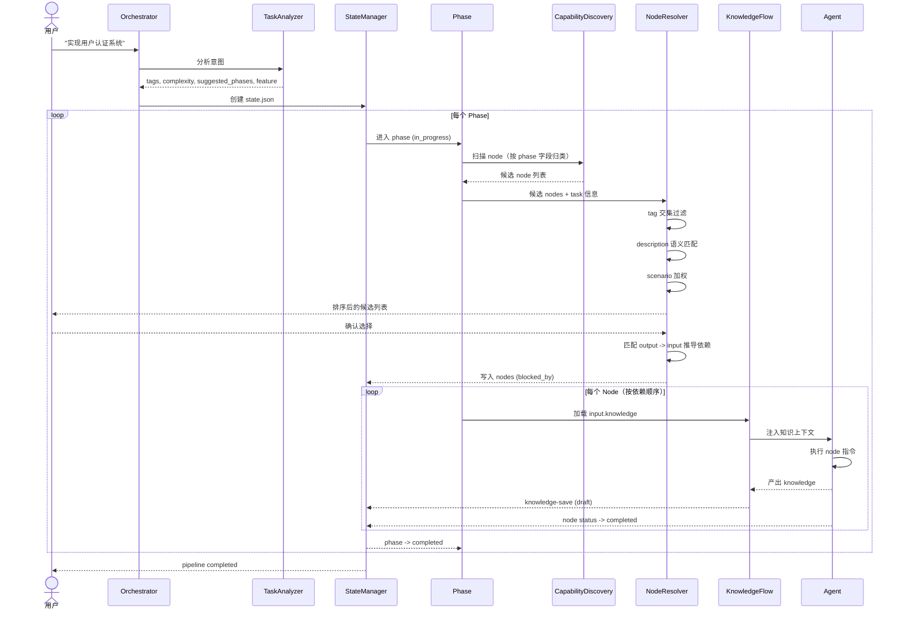
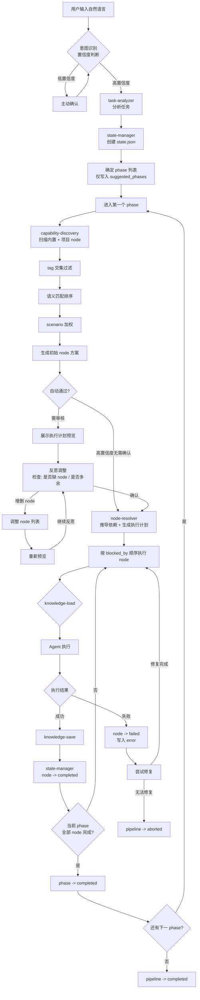

# OPC 概览

## 一、Marketplace 目录结构

```
opc-marketplace/
│
├── marketplace.json
├── README.md
├── CLAUDE.md
│
├── platform/
│   │
│   ├── opc-core/
│   │   ├── .claude-plugin/plugin.json
│   │   ├── mcp/
│   │   │   ├── index.ts
│   │   │   ├── server.ts
│   │   │   ├── tools/
│   │   │   │   ├── state.ts
│   │   │   │   ├── knowledge.ts
│   │   │   │   ├── session.ts
│   │   │   │   ├── phase.ts
│   │   │   │   ├── node.ts
│   │   │   │   └── guidance.ts
│   │   │   ├── engine/
│   │   │   │   ├── state-manager.ts
│   │   │   │   ├── phase-validator.ts
│   │   │   │   ├── task-analyzer.ts
│   │   │   │   ├── node-resolver.ts
│   │   │   │   └── knowledge-flow.ts
│   │   │   ├── state.ts
│   │   │   ├── session.ts
│   │   │   ├── lock.ts
│   │   │   └── paths.ts
│   │   ├── hooks/
│   │   │   ├── knowledge-load.json
│   │   │   ├── knowledge-save.json
│   │   │   └── phase-transition.json
│   │   └── references/
│   │       └── platform-protocol.md
│   │
│   └── opc-orchestrator/
│       ├── .claude-plugin/plugin.json
│       ├── agents/
│       │   ├── orchestrator.md
│       │   ├── task-classifier.md
│       │   └── phase-guide.md
│       ├── skills/
│       │   ├── opc-status/SKILL.md
│       │   ├── opc-phase/SKILL.md
│       │   └── opc-nodes/SKILL.md
│       ├── hooks/
│       │   └── capability-discovery.json
│       └── references/
│           ├── orchestration-guide.md
│           └── phase-protocol.md
│
├── phases/
│   ├── 00-ideation/
│   │   ├── phase.md
│   │   ├── nodes.md
│   ├── 01-validation/
│   ├── 02-planning/
│   ├── 03-design/
│   ├── 04-implementation/
│   ├── 05-testing/
│   ├── 06-release/
│   ├── 07-growth/
│   └── 08-scale/
│
├── scenarios/
│   ├── build-saas.md
│   ├── build-mobile-app.md
│   ├── add-feature.md
│   ├── fix-bug.md
│   ├── security-audit.md
│   ├── redesign-product.md
│   ├── performance-optimize.md
│   ├── launch-product.md
│   └── incident-response.md
│
├── kits/
│   │
│   ├── product-kit/
│   │   ├── .claude-plugin/plugin.json
│   │   ├── agents/
│   │   │   ├── product-manager.md
│   │   │   ├── market-analyst.md
│   │   │   ├── startup-advisor.md
│   │   │   └── ux-researcher.md
│   │   ├── skills/
│   │   │   ├── write-prd/
│   │   │   │   ├── SKILL.md
│   │   │   │   ├── checklist.md
│   │   │   │   └── examples.md
│   │   │   ├── competitor-analysis/
│   │   │   ├── market-sizing/
│   │   │   ├── startup-brainstorm/
│   │   │   └── pricing-strategy/
│   │   ├── nodes/
│   │   │   ├── market-research.md
│   │   │   ├── competitive-analysis.md
│   │   │   ├── user-persona.md
│   │   │   ├── prd-writing.md
│   │   │   └── opportunity-sizing.md
│   │   ├── knowledge/
│   │   │   ├── jobs-to-be-done.md
│   │   │   ├── lean-startup.md
│   │   │   └── product-playbooks.md
│   │   ├── templates/
│   │   │   ├── prd-template.md
│   │   │   └── persona-template.md
│   │   ├── hooks/
│   │   │   └── spec-validation.json
│   │   └── mcp/.mcp.json
│   │
│   ├── design-kit/
│   │   ├── .claude-plugin/plugin.json
│   │   ├── agents/
│   │   │   ├── ui-designer.md
│   │   │   ├── ux-designer.md
│   │   │   └── design-reviewer.md
│   │   ├── skills/
│   │   │   ├── generate-wireframe/
│   │   │   ├── create-design-system/
│   │   │   ├── generate-ui/
│   │   │   ├── accessibility-audit/
│   │   │   └── mobile-ux-review/
│   │   ├── nodes/
│   │   │   ├── wireframe.md
│   │   │   ├── design-system.md
│   │   │   ├── web-ui.md
│   │   │   ├── mobile-ui.md
│   │   │   ├── brand-identity.md
│   │   │   ├── interaction-design.md
│   │   │   └── accessibility-review.md
│   │   ├── knowledge/
│   │   │   ├── ios-hig.md
│   │   │   ├── material-design.md
│   │   │   └── interaction-patterns.md
│   │   ├── templates/
│   │   │   ├── design-spec-template.md
│   │   │   └── design-system-template.md
│   │   ├── hooks/
│   │   └── mcp/.mcp.json
│   │
│   ├── dev-kit/
│   │   ├── .claude-plugin/plugin.json
│   │   ├── agents/
│   │   │   ├── frontend-engineer.md
│   │   │   ├── backend-engineer.md
│   │   │   ├── database-engineer.md
│   │   │   ├── security-engineer.md
│   │   │   └── architect.md
│   │   ├── skills/
│   │   │   ├── scaffold-nextjs/
│   │   │   ├── build-api/
│   │   │   ├── auth-system/
│   │   │   ├── code-review/
│   │   │   └── security-audit/
│   │   ├── nodes/
│   │   │   ├── scaffold.md
│   │   │   ├── api-design.md
│   │   │   ├── database-schema.md
│   │   │   ├── tdd-implementation.md
│   │   │   ├── frontend-component.md
│   │   │   ├── backend-endpoint.md
│   │   │   ├── auth-integration.md
│   │   │   ├── security-review.md
│   │   │   ├── performance-optimize.md
│   │   │   └── dependency-update.md
│   │   ├── knowledge/
│   │   │   ├── clean-architecture.md
│   │   │   ├── react-patterns.md
│   │   │   └── database-patterns.md
│   │   ├── templates/
│   │   │   ├── architecture-template.md
│   │   │   └── api-spec-template.md
│   │   ├── hooks/
│   │   │   ├── tdd-gate.json
│   │   │   └── verification-gate.json
│   │   └── mcp/.mcp.json
│   │
│   ├── qa-kit/
│   │   └── ...
│   │
│   ├── ship-kit/
│   │   └── ...
│   │
│   └── growth-kit/
│       └── ...
│
├── scripts/
├── .github/workflows/
└── .mcp.json
```

---

## 二、用户项目目录结构

```
my-project/                              # 用户工程目录（claude 执行目录）
│
├── .claude/
│   ├── settings.json
│   └── permissions.json
│
├── .opc/                                # 运行时状态（gitignore）
│   ├── state/
│   │   ├── pipelines/                  # 管线状态（每个 task 一个 json）
│   │   ├── locks/
│   │   └── sessions/
│   └── .project-init
│
├── opc-nodes/                           # 项目自定义节点（git 跟踪，覆盖内置）
│   └── ...
│
├── opc-knowledge/                       # 项目知识库（git 跟踪）
│   ├── index.json
│   ├── user-auth/
│   │   ├── requirement/main.md
│   │   ├── planning/
│   │   │   ├── api-design.md
│   │   │   └── architecture.md
│   │   ├── implementation/
│   │   │   ├── tech.md
│   │   │   └── backend-api.md
│   │   └── testing/
│   │       └── test-plan.md
│   └── payment/
│       └── ...
│
├── opc-memory/                          # 项目持久记忆（git 跟踪）
│   ├── architecture.md
│   ├── api-contracts.md
│   ├── coding-conventions.md
│   ├── design-system.md
│   └── decisions.md
│
├── opc-deliverables/                    # 阶段产出物（git 跟踪）
│   ├── 02-planning/
│   │   ├── api-design.md
│   │   └── database-schema.md
│   └── 04-implementation/
│       └── ...
│
├── opc-logs/                            # 运行日志（gitignore）
│   ├── phases/
│   ├── agent-runs/
│   ├── failures/
│   └── telemetry/
│
├── src/                                 # 项目实际代码
├── tests/
├── package.json
└── ...
```

---

## 三、架构分层

```
┌──────────────────────────────────────────────────┐
│  kits/ (业务层)                                    │
│  领域 Agent + Skill + Node + Knowledge + Template  │
│  每个 kit 通过 plugin.json 声明式暴露能力            │
├──────────────────────────────────────────────────┤
│  platform/opc-orchestrator (编排层)                 │
│  意图识别 -> 任务分析 -> 阶段推荐 -> 节点解析 -> 调度    │
├──────────────────────────────────────────────────┤
│  platform/opc-core (基础设施层)                      │
│  MCP 工具 + Gate 引擎 + 节点解析器 + 知识流引擎       │
│  所有引擎都是 TypeScript 代码，不是 prompt           │
└──────────────────────────────────────────────────┘
```

---

## 四、时序图



## 五、流程图



### 节点来源

节点有两个来源，capability-discovery 统一扫描：

| 来源 | 位置 | 维护者 | 说明 |
|------|------|--------|------|
| 内置节点 | `kits/*/nodes/` | 插件开发者 | 随 kit 分发，定义通用工作流 |
| 项目节点 | `opc-nodes/` | 项目用户 | 针对具体项目定制，可覆盖内置节点 |

项目节点优先级高于内置节点（同名覆盖），用户可按项目需求增加或调整节点。

### 节点选择：反思调整

节点选择不是一次性确认，而是迭代收敛的过程。反思的核心问题是：**选中的 node 是否合理？有没有遗漏？有没有多余？**

```
初始方案 → 预览执行计划 → 反思调整 → 重新预览 → ... → 确认
```

| 概念 | 说明 |
|------|------|
| 反思轮次 | 由 `nodes.md` 的 `max_reflection_rounds` 配置（默认 3），达到上限后强制确认 |
| 反思内容 | 检查 node 是否缺漏、是否多余、是否可以合并/拆分 |
| 调整方式 | 增删 node、调整顺序，系统重新生成依赖图和预览 |
| 最终 | 用户确认，resolver 锁定执行计划 |

高置信度场景（如 `fix-bug` scenario 命中 + 语义相似度 > 0.9）可跳过审核直接执行，减少人工介入。

## 六、设计原则

1. **意图触发，置信度兜底** —— 用户直接说话；低置信度时主动确认
2. **代码引擎 > Prompt 引擎** —— Gate、依赖解析、知识流用 TypeScript 实现；意图分析和语义匹配用 LLM
3. **节点组装** —— 阶段自主选择节点，resolver 自动处理依赖和文件域冲突
4. **Marketplace 只分发，不存数据** —— 知识、记忆、产出物都在用户项目里
5. **知识属于项目** —— 切换目录 = 切换知识上下文
6. **Hook 驱动自动化** —— gate、knowledge load/save 全自动，但 knowledge-save 只保存 draft 状态
7. **声明式发现** —— plugin.json capabilities 让编排器动态发现能力
8. **阶段是强约束** —— input 依赖不满足则阻止，但允许受控回退
9. **语义匹配优先于关键词** —— node 选择以语义相似度为主，关键词只做初筛
10. **失败可恢复** —— 管线状态持久化，失败后尝试修复，支持暂停/恢复、重试/中止
