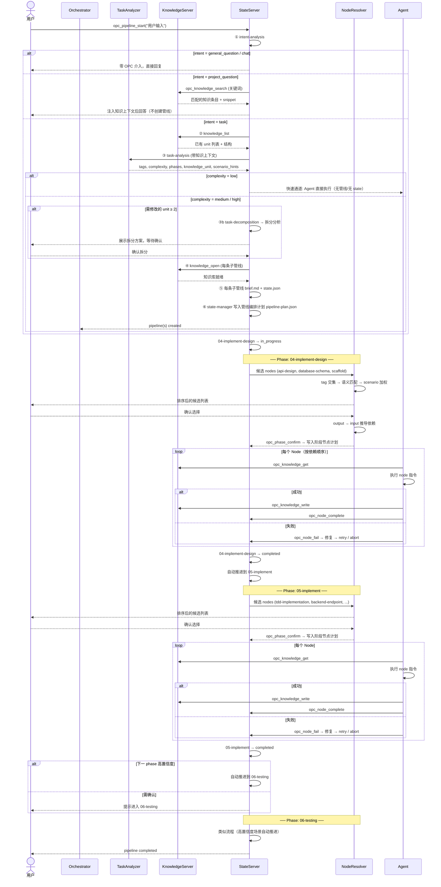
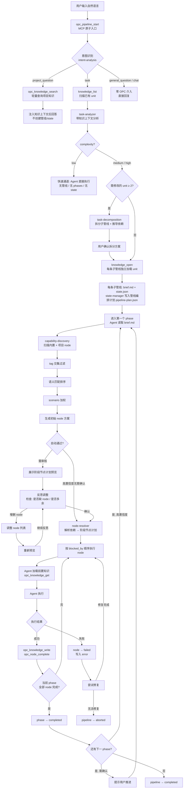

# OPC 概览

## 一、Marketplace 目录结构

```
opc-marketplace/
│
├── marketplace.json
├── README.md
├── CLAUDE.md
│
├── platform/
│   │
│   ├── mcp/
│   │   ├── opc-state-server/
│   │   │   ├── server.ts
│   │   │   ├── tools/
│   │   │   ├── pipeline.ts      # pipeline_start, pipeline_status
│   │   │   ├── phase.ts         # phase_start, phase_confirm, phase_complete, phase_reset
│   │   │   └── node.ts          # node_start, node_complete, node_fail
│   │   │   └── engine/
│   │   │       ├── state-manager.ts
│   │   │       ├── phase-validator.ts
│   │   │       ├── task-analyzer.ts
│   │   │       └── node-resolver.ts
│   │   └── opc-knowledge-server/
│   │       ├── server.ts
│   │       └── tools/
│   │           ├── open.ts
│   │           ├── get.ts
│   │           ├── write.ts
│   │           ├── delete.ts
│   │           ├── list.ts
│   │           └── search.ts
│   │
│   └── opc-orchestrator/
│       ├── .claude-plugin/plugin.json
│       ├── pipeline/
│       │   ├── intent-analysis.md
│       │   ├── task-analysis.md
│       │   ├── task-decomposition.md
│       │   ├── brief-generation.md
│       │   ├── knowledge-operation.md
│       │   └── phase-execution.md
│       ├── scenarios/
│       │   ├── add-feature.md
│       │   ├── fix-bug.md
│       │   └── ...
│
├── phases/                                       # 阶段 = 定义 + 节点 + 模板
│   ├── 00-ideation/
│   │   ├── phase.md + nodes.md
│   │   ├── nodes/
│   │   └── templates/
│   ├── 01-validation/
│   │   ├── phase.md + nodes.md
│   │   ├── nodes/
│   │   │   ├── user-persona.md
│   │   │   └── prd-writing.md
│   │   └── templates/
│   │       ├── prd-template.md
│   │       └── persona-template.md
│   ├── 03-design/
│   ├── 04-implement-design/
│   ├── 05-implement/
│   ├── 06-testing/
│   ├── 07-release/
│   ├── 08-growth/
│   └── 09-scale/
│
├── kits/
│   │
│   ├── product-kit/
│   │   ├── .claude-plugin/plugin.json
│   │   ├── agents/
│   │   │   ├── product-manager.md
│   │   │   ├── market-analyst.md
│   │   │   ├── startup-advisor.md
│   │   │   └── ux-researcher.md
│   │   ├── skills/
│   │   │   ├── write-prd/
│   │   │   ├── competitor-analysis/
│   │   │   ├── market-sizing/
│   │   │   ├── startup-brainstorm/
│   │   │   └── pricing-strategy/
│   │   └── mcp/.mcp.json
│   │
│   ├── design-kit/
│   │   ├── .claude-plugin/plugin.json
│   │   ├── agents/
│   │   │   ├── ui-designer.md
│   │   │   ├── ux-designer.md
│   │   │   └── design-reviewer.md
│   │   ├── skills/
│   │   │   ├── generate-wireframe/
│   │   │   ├── create-design-system/
│   │   │   ├── generate-ui/
│   │   │   ├── accessibility-audit/
│   │   │   └── mobile-ux-review/
│   │   └── mcp/.mcp.json
│   │
│   ├── dev-kit/
│   │   ├── .claude-plugin/plugin.json
│   │   ├── agents/
│   │   │   ├── frontend-engineer.md
│   │   │   ├── backend-engineer.md
│   │   │   ├── database-engineer.md
│   │   │   ├── security-engineer.md
│   │   │   └── architect.md
│   │   ├── skills/
│   │   │   ├── scaffold-nextjs/
│   │   │   ├── build-api/
│   │   │   ├── auth-system/
│   │   │   ├── code-review/
│   │   │   └── security-audit/
│   │   └── mcp/.mcp.json
│   │
│   ├── qa-kit/
│   │   └── ...
│   │
│   ├── ship-kit/
│   │   └── ...
│   │
│   └── growth-kit/
│       └── ...
│
├── scripts/
├── .github/workflows/
└── .mcp.json
```

---

## 二、用户项目目录结构

```
my-project/                              # 用户工程目录（claude 执行目录）
│
├── .claude/
│   ├── settings.json
│   └── permissions.json
│
├── .opc/                                # 运行时状态（gitignore）
│   ├── pipelines/
│   │   ├── pipeline-xxx/                # 单管线 = 1 条子管线
│   │   │   ├── pipeline-plan.json       # 管线编排计划（始终存在）
│   │   │   ├── manifest.md
│   │   │   └── sub-pipelines/
│   │   │       └── sub-1/  (state.json + brief.md + phases/)
│   │   │
│   │   └── pipeline-ecommerce-xxx/      # 拆分管线 = N 条子管线
│   │       ├── pipeline-plan.json
│   │       ├── manifest.md
│   │       └── sub-pipelines/
│   │           ├── sub-1/  (state.json + brief.md + phases/)
│   │           ├── sub-2/
│   │           └── sub-3/
│   ├── sessions/
│   └── .project-init
│
├── opc-nodes/                           # 覆盖内置节点（同 phases/ 目录结构）
│   ├── 04-implement-design/nodes/api-design.md
│   └── 05-implement/nodes/tdd-implementation.md
│
├── opc-knowledge/                       # 项目知识库（git 跟踪）
│   ├── index.json
│   ├── user-auth/                       # ← unit
│   │   ├── login/                       # ← section
│   │   │   ├── api.md                   # ← subsection
│   │   │   ├── ui.md
│   │   │   └── architecture.md
│   │   ├── register/
│   │   │   ├── api.md
│   │   │   └── ui.md
│   │   └── session/
│   │       ├── api.md
│   │       ├── model.md
│   │       └── architecture.md
│   ├── authorization/
│   │   └── role-management/
│   │       ├── api.md
│   │       └── model.md
│   └── subscription/
│       └── ...
│
├── opc-memory/                          # 项目持久记忆（git 跟踪）
│   ├── architecture.md
│   ├── api-contracts.md
│   ├── coding-conventions.md
│   ├── design-system.md
│   └── decisions.md
│
├── opc-logs/                            # 运行日志（gitignore）
│   ├── phases/
│   ├── agent-runs/
│   ├── failures/
│   └── telemetry/
│
├── src/                                 # 项目实际代码
├── tests/
├── package.json
└── ...
```

---

## 三、架构分层

```
┌──────────────────────────────────────────────────┐
│  kits/ (业务层)                                    │
│  领域 Agent + Skill，通过 plugin.json 暴露能力      │
│  Node + Template 按阶段组织在 phases/                │
├──────────────────────────────────────────────────┤
│  platform/opc-orchestrator (编排层)                 │
│  pipeline + scenarios                              │
│  意图识别 → 任务分析 → 阶段推荐 → 节点解析 → 调度    │
├──────────────────────────────────────────────────┤
│  platform/mcp (基础设施层)                           │
│  opc-state-server:     任务跟进 MCP 服务             │
│  opc-knowledge-server: 知识库 MCP 服务               │
│  所有引擎都是 TypeScript 代码，不是 prompt           │
└──────────────────────────────────────────────────┘
```

---

## 四、时序图


```mermaid
sequenceDiagram
    actor U as 用户
    participant O as Orchestrator
    participant TA as TaskAnalyzer
    participant KS as KnowledgeServer
    participant SS as StateServer
    participant NR as NodeResolver
    participant A as Agent

    U->>SS: opc_pipeline_start("用户输入")
    SS->>SS: ① intent-analysis

    alt intent = general_question / chat
        SS-->>U: 零 OPC 介入，直接回复
    else intent = project_question
        SS->>KS: opc_knowledge_search (关键词)
        KS-->>SS: 匹配的知识条目 + snippet
        SS-->>U: 注入知识上下文后回答（不创建管线）
    else intent = task
        SS->>KS: ② knowledge_list
        KS-->>SS: 已有 unit 列表 + 结构
        SS->>TA: ③ task-analysis (带知识上下文)
        TA-->>SS: tags, complexity, phases, knowledge_unit, scenario_hints
        alt complexity = low
            SS-->>A: 快速通道: Agent 直接执行（无管线/无 state）
        else complexity = medium / high
            alt 需修改的 unit ≥ 2
                SS->>SS: ③b task-decomposition → 拆分分析
                SS-->>U: 展示拆分方案，等待确认
                U-->>SS: 确认拆分
            end
            SS->>KS: ④ knowledge_open (每条子管线)
            KS-->>SS: 知识库就绪
            SS->>SS: ⑤ 每条子管线 brief.md + state.json
            SS->>SS: ⑥ state-manager 写入管线编排计划 pipeline-plan.json
            SS-->>O: pipeline(s) created
        end
    end

    SS->>SS: 04-implement-design → in_progress

    Note over SS,NR: ── Phase: 04-implement-design ──
    SS->>NR: 候选 nodes (api-design, database-schema, scaffold)
    NR->>NR: tag 交集 → 语义匹配 → scenario 加权
    NR-->>U: 排序后的候选列表
    U-->>NR: 确认选择
    NR->>NR: output → input 推导依赖
    NR-->>SS: opc_phase_confirm → 写入阶段节点计划

    loop 每个 Node（按依赖顺序）
        A->>KS: opc_knowledge_get
        A->>A: 执行 node 指令
        alt 成功
            A->>KS: opc_knowledge_write
            A->>SS: opc_node_complete
        else 失败
            A->>SS: opc_node_fail → 修复 → retry / abort
        end
    end
    SS->>SS: 04-implement-design → completed
    SS->>SS: 自动推进到 05-implement

    Note over SS,NR: ── Phase: 05-implement ──
    SS->>NR: 候选 nodes (tdd-implementation, backend-endpoint, ...)
    NR-->>U: 排序后的候选列表
    U-->>NR: 确认选择
    NR-->>SS: opc_phase_confirm → 写入阶段节点计划

    loop 每个 Node
        A->>KS: opc_knowledge_get
        A->>A: 执行 node 指令
        alt 成功
            A->>KS: opc_knowledge_write
            A->>SS: opc_node_complete
        else 失败
            A->>SS: opc_node_fail → 修复 → retry / abort
        end
    end
    SS->>SS: 05-implement → completed

    alt 下一 phase 高置信度
        SS->>SS: 自动推进到 06-testing
    else 需确认
        SS-->>U: 提示进入 06-testing
    end

    Note over SS,NR: ── Phase: 06-testing ──
    SS->>SS: 类似流程（高置信度场景自动推进）

    SS-->>U: pipeline completed
```

## 五、流程图


```mermaid
flowchart TD
    A[用户输入自然语言] --> B[opc_pipeline_start<br/>MCP 原子入口]
    B --> B1{意图识别<br/>intent-analysis}
    B1 -->|task| B3[knowledge_list<br/>扫描已有 unit]
    B1 -->|project_question| PQ[opc_knowledge_search<br/>轻量查询项目知识]
    PQ --> PQ1[注入知识上下文后回答<br/>不创建管线/state]
    B1 -->|general_question / chat| NC[零 OPC 介入<br/>直接回复]
    B3 --> B4[task-analyzer<br/>带知识上下文分析]
    B4 --> B4a{complexity?}
    B4a -->|low| FAST[快速通道: Agent 直接执行<br/>无管线 / 无 phases / 无 state]
    B4a -->|medium / high| DEC{需修改的 unit ≥ 2?}
    DEC -->|是| DEC1[task-decomposition<br/>拆分子管线 + 推导依赖]
    DEC1 --> DEC2[用户确认拆分方案]
    DEC2 --> B5[knowledge_open<br/>每条子管线独立加载 unit]
    DEC -->|否| B5
    B5 --> B6[每条子管线: brief.md + state.json<br/>state-manager 写入管线编排计划 pipeline-plan.json]
    B6 --> G[进入第一个 phase<br/>Agent 读取 brief.md]

    G --> H[capability-discovery<br/>扫描内置 + 项目 node]
    H --> I[tag 交集过滤]
    I --> J[语义匹配排序]
    J --> K[scenario 加权]
    K --> L[生成初始 node 方案]

    L --> M{自动通过?}
    M -->|高置信度无需确认| R[node-resolver<br/>解析依赖 → 阶段节点计划]
    M -->|需审核| N[展示阶段节点计划预览]

    N --> O[反思调整<br/>检查: 是否缺 node / 是否多余]
    O -->|增删 node| P[调整 node 列表]
    P --> Q[重新预览]
    Q -->|继续反思| O
    O -->|确认| R

    R --> S[按 blocked_by 顺序执行 node]
    S --> T[Agent 加载前置知识<br/>opc_knowledge_get]
    T --> U[Agent 执行]
    U --> V{执行结果}
    V -->|成功| W[opc_knowledge_write<br/>opc_node_complete]
    W --> X{当前 phase<br/>全部 node 完成?}
    X -->|否| S
    X -->|是| Y[phase → completed]
    Y --> Z{还有下一 phase?}
    Z -->|是, 高置信度| G
    Z -->|是, 需确认| ZA[提示用户推进] --> G
    Z -->|否| ZB[pipeline → completed]

    V -->|失败| ZC[node → failed<br/>写入 error]
    ZC --> ZD[尝试修复]
    ZD -->|修复完成| S
    ZD -->|无法修复| ZE[pipeline → aborted]
```

### 节点来源

节点按阶段组织在 `phases/<phase>/nodes/`，模板在 `phases/<phase>/templates/`。项目通过 `opc-nodes/` 覆盖。

| 来源 | 位置 | 维护者 | 说明 |
|------|------|--------|------|
| 内置节点 | `platform/opc-orchestrator/pipeline/` + `phases/<phase>/nodes/` | 插件开发者 | 随 marketplace 分发 |
| 项目节点 | `opc-nodes/` | 项目用户 | 同目录结构，同名覆盖 |

### 节点选择：反思调整

节点选择不是一次性确认，而是迭代收敛的过程。反思的核心问题是：**选中的 node 是否合理？有没有遗漏？有没有多余？**

```
初始方案 → 预览执行计划 → 反思调整 → 重新预览 → ... → 确认
```

| 概念 | 说明 |
|------|------|
| 反思轮次 | 由 `nodes.md` 的 `max_reflection_rounds` 配置（默认 3），达到上限后强制确认 |
| 反思内容 | 检查 node 是否缺漏、是否多余、是否可以合并/拆分 |
| 调整方式 | 增删 node、调整顺序，系统重新生成依赖图和预览 |
| 最终 | 用户确认，resolver 锁定执行计划 |

高置信度场景（如 `fix-bug` scenario 命中 + 语义相似度 > 0.9）可跳过审核直接执行，减少人工介入。

## 六、设计原则

1. **意图触发，置信度兜底** —— 用户直接说话；低置信度时主动确认
2. **代码引擎 > Prompt 引擎** —— 核心逻辑用 TypeScript 实现；意图分析和语义匹配用 LLM
3. **节点组装** —— 阶段自主选择节点，resolver 自动处理依赖和文件域冲突
4. **Marketplace 只分发，不存数据** —— 知识、记忆、产出物都在用户项目里
5. **知识属于项目** —— 切换目录 = 切换知识上下文
6. **双 MCP 服务** —— opc-state-server 管任务跟进，opc-knowledge-server 管知识库，一切走 MCP 协议
7. **知识先于状态** —— 知识库在 state.json 创建前初始化，供所有 phase 参考
8. **声明式发现** —— plugin.json capabilities 让编排器动态发现能力
9. **阶段是强约束** —— input 依赖不满足则阻止，但允许受控回退
10. **语义匹配优先于关键词** —— node 选择以语义相似度为主，关键词只做初筛
11. **失败可恢复** —— 管线状态持久化，失败后尝试修复，支持暂停/恢复、重试/中止
12. **阶段自包含** —— 节点、模板、阶段定义同目录（`phases/<phase>/`），一目了然
