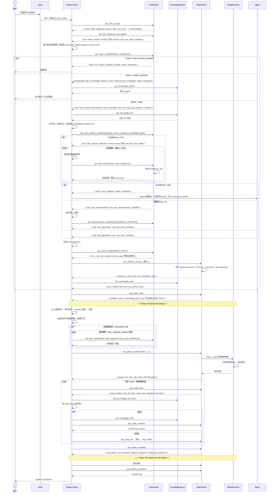

# 03 架构分层 + 时序 + 流程

> 本文档是 [OPC 概览](00_index.md) 的子文档。其他子文档：
> [Marketplace 目录](01_marketplace-directory.md) · [用户项目目录](02_user-project.md)

---

## 一、架构分层

```
┌──────────────────────────────────────────────────┐
│  Claude Code (MCP Host)                            │
│  按 MCP 工具返回的 next 字段逐步推进                  │
│  必读 step_instruction + schema                    │
│  选读 methodology.docs 中的方法论文档                │
│  所有需要 LLM 的工作都在这一层完成                     │
├──────────────────────────────────────────────────┤
│  kits/ (业务层)                                    │
│  领域 Agent + Skill，通过 plugin.json 暴露能力      │
│  Node + Template 按阶段组织在 phases/                │
├──────────────────────────────────────────────────┤
│  opc-state-server (流程状态机 + 任务跟进)            │
│  ├── flow/    流程路由：流程工具按 confidence/intent 路由 │
│  ├── prompts/ 方法论文档（被工具返回引用，按需 Read）       │
│  ├── tools/   pipeline/phase/node 工具（含 flow_next 字段） │
│  └── engine/  state-manager / phase-validator / node-resolver │
│  纯 TypeScript 确定性逻辑，零 LLM 依赖                 │
├──────────────────────────────────────────────────┤
│  opc-knowledge-server (基础设施层)                   │
│  知识库 CRUD + 版本管理 + 全文搜索                     │
│  纯 TypeScript 确定性逻辑，零 LLM 依赖                 │
└──────────────────────────────────────────────────┘
```

---

## 二、时序图（端到端）



---

## 三、流程图（决策分叉全景）

```mermaid
flowchart TD
    A[用户输入自然语言] --> HOOK[UserPromptSubmit hook<br/>注入一行指令：先调 opc_flow_query]
    HOOK --> FQ[Claude 调 opc_flow_query<br/>返回 active 状态 + suggested_actions + methodology]
    FQ --> FQDEC{active 状态?}
    FQDEC -->|active=false| opc_flow_query[Claude 调 opc_flow_start<br/>opc_flow_start 返回 intent_analysis 指令]
    FQDEC -->|active=true + 延续| CONT[按已有 flow_next 推进]
    FQDEC -->|active=true + 纠正| REVISE[opc_flow_revise / opc_flow_restart]
    FQDEC -->|active=true + 管线内调整| REPLAN[opc_pipeline_replan / opc_phase_reset]
    FQDEC -->|active=true + 放弃| ABORT[opc_flow_abort 后 opc_flow_start]
    FQDEC -->|active=true + orphan| RECOVER[opc_flow_recover]
    FQDEC -->|流程外问答/暂停| NOOP[直接回答 / 等待]
    opc_flow_query --> C1{Claude 意图识别<br/>按 step_instruction 或选读方法论文档}
    C1 -->|task| F2T[Claude 调 opc_intent_complete<br/>opc_intent_complete 路由 task 分支<br/>返回 task_analysis 指令]
    C1 -->|project_question| F2P[Claude 调 opc_intent_complete<br/>opc_intent_complete 返回 knowledge_search 指令<br/>+ 自动标记 status=completed]
    F2P --> PQ1[Claude 调 opc_knowledge_search<br/>注入知识上下文后回答<br/>不创建管线/state]
    C1 -->|general_question / chat| F2C[Claude 调 opc_intent_complete<br/>opc_intent_complete 返回 done: true<br/>+ 自动标记 status=completed]
    F2C --> NC[零 OPC 介入，直接回复]
    F2T --> C2[Claude 调 opc_knowledge_list 后<br/>7 步分析 + 自省打分]
    C2 --> opc_intent_complete[Claude 调 opc_task_analysis_complete<br/>opc_task_analysis_complete 按 confidence + complexity + modify_count 路由]
    opc_intent_complete --> C2_SR_DEC{opc_task_analysis_complete 路由判定}
    C2_SR_DEC -->|≥ 0.8| C2a
    C2_SR_DEC -->|< 0.8| C2_SR_LOOP[反思循环<br/>Claude 调 opc_flow_reflect<br/>opc_flow_reflect 持久化 reflection_log<br/>0.5-0.8: 最多2轮<br/><0.5: 最多3轮]
    C2_SR_LOOP --> C2_SR_RECHECK{反思后置信度?}
    C2_SR_RECHECK -->|≥ 0.8| C2a
    C2_SR_RECHECK -->|≥ 0.5| C2_QC[快速确认<br/>opc_flow_reflect 路由 ask_user]
    C2_SR_RECHECK -->|< 0.5| C2_DC[详细确认<br/>opc_flow_reflect 路由 ask_user 附低分原因]
    C2_QC -->|用户确认/修正| C2a
    C2_DC -->|用户逐项确认/修正| C2a
    C2a{opc_task_analysis_complete 复杂度路由}
    C2a -->|low| FAST[opc_task_analysis_complete 路由 opc_quick_dispatch opc_quick_dispatch<br/>Agent 直接执行<br/>+ 自动标记 status=completed]
    C2a -->|medium / high| DEC{需修改的 unit ≥ 2?}
    DEC -->|是| DEC1[opc_task_analysis_complete 路由 task_decomposition<br/>Claude 拆分分析 + 自省]
    DEC1 --> DEC2[Claude 调 opc_decomposition_complete]
    DEC2 --> DEC3{opc_decomposition_complete 路由判定}
    DEC3 -->|≥ 0.8| DEC5[opc_decomposition_complete 路由 brief_generation]
    DEC3 -->|0.5-0.8| DEC4[opc_decomposition_complete 路由 brief_generation<br/>step_instruction 提示快速确认]
    DEC3 -->|< 0.5| DEC4
    DEC4 -->|用户确认| DEC5
    DEC5 --> B6[Claude 生成 brief markdown]
    DEC -->|否| B6
    B6 --> opc_decomposition_complete[Claude 调 opc_brief_complete<br/>opc_brief_complete 返回 next: opc_pipeline_create 预填全部参数]
    opc_decomposition_complete --> B7[Claude 调 opc_pipeline_create]
    B7 --> B7B[opc_pipeline_create 返回 flow_next: opc_knowledge_open]
    B7B --> B7C[Claude 调 opc_knowledge_open]
    B7C --> G[opc_knowledge_open 返回 flow_next: opc_phase_start<br/>进入阶段执行循环]

    G --> H[opc_phase_start<br/>扫描内置 + 项目 node<br/>返回原始候选列表 + methodology]
    H --> I[Claude: tag 交集过滤]
    I --> J[Claude: 语义匹配排序]
    J --> K[Claude: scenario 加权]
    K --> L[生成初始 node 方案 + 自省打分]

    L --> M{选择置信度 vs<br/>min_confidence_for_auto?}
    M -->|≥ threshold 高| R[opc_phase_confirm<br/>node-resolver 解析依赖<br/>→ 阶段节点计划]
    M -->|≥ threshold×0.75 中| L2[快速确认<br/>展示方案 + 分数]
    L2 -->|用户确认| R
    M -->|< threshold×0.75 低| L3[Claude 调 opc_flow_reflect<br/>opc_flow_reflect 持久化 + 路由]
    L3 --> L4[每轮重新自省打分]
    L4 --> L5{opc_brief_complete 判定:达上限或达标?}
    L5 -->|继续| L3
    L5 -->|确认| R

    R --> S[按 blocked_by 顺序执行 node]
    S --> T[opc_node_start 返回 node_body + dispatch_instruction]
    T --> T2[Claude 加载前置知识<br/>opc_knowledge_get_batch]
    T2 --> U[按 node_body 指令执行]
    U --> V{执行结果}
    V -->|成功| W[opc_knowledge_write<br/>opc_node_complete<br/>返回 unblocked_nodes]
    W --> X{当前 phase<br/>全部 node 完成?}
    X -->|否| S
    X -->|是| Y[opc_phase_complete<br/>返回 pipeline_progress + next_phase]
    Y --> Z{还有下一 phase?}
    Z -->|是, auto_advance=true| G
    Z -->|是, 需确认| ZA[提示用户推进] --> G
    Z -->|否| ZA2{ready_sub_pipelines 非空?}
    ZA2 -->|是| G
    ZA2 -->|否| ZB[opc_pipeline_complete]

    V -->|失败| ZC[opc_node_fail<br/>写入 error]
    ZC --> ZD[尝试修复 / retry]
    ZD -->|修复完成| S
    ZD -->|无法修复| ZE[pipeline → aborted]
```



---

## 四、节点选择补充

### 节点来源

节点按阶段组织在 `phases/<phase>/nodes/`，模板在 `phases/<phase>/templates/`。项目通过 `opc-nodes/` 覆盖。

| 来源 | 位置 | 维护者 | 说明 |
|------|------|--------|------|
| 内置节点 | `phases/<phase>/nodes/` | 插件开发者 | 随 marketplace 分发 |
| 项目节点 | `opc-nodes/` | 项目用户 | 同目录结构，同名覆盖 |

### 节点选择：自省评估 + 置信度推进

节点选择不是一次性确认，而是 Claude **自省评估**后按置信度推进的过程。核心理念与意图识别一致：**高置信度直接推进，低置信度才需要用户介入**。反思循环通过 `opc_flow_reflect`（opc_brief_complete）持久化每轮日志，crash 可恢复。

评估维度：语义匹配强度(0.30)、Scenario对齐度(0.25)、覆盖完整性(0.30)、节点冗余度(0.15)。

```
初始方案 → 自省打分 → 分叉:
  ├── 高置信度(≥ threshold)          → 自动确认，通知用户
  ├── 中置信度(≥ threshold×0.75)     → 快速确认，展示方案 + 分数
  └── 低置信度(< threshold×0.75)     → Claude 调 opc_flow_reflect 进入反思循环
                                      opc_flow_reflect 持久化每轮 reflection_log，max_reflection_rounds 上限兜底
```

| 概念 | 说明 |
|------|------|
| 自省维度 | 4 维度加权打分：语义匹配(0.30) + Scenario对齐(0.25) + 覆盖完整(0.30) + 冗余度(0.15) |
| 反思轮次 | 由 phase 的 `max_reflection_rounds` 配置，仅低置信度时触发，达到上限后强制确认 |
| 反思内容 | Claude 自行检查 node 是否缺漏、是否多余、是否可以合并/拆分 |
| 调整方式 | Claude 自行增删 node、调整顺序，每轮重新自省打分 + opc_flow_reflect 上报 |
| 最终 | 高/中置信度自动确认；低置信度由用户确认，resolver 锁定执行计划 |

高置信度场景（如 `fix-bug` scenario 命中 + 语义相似度 > 0.9 + 覆盖完整性高）可跳过用户审核直接执行，减少人工介入。

---

## 相关文档

- [01_marketplace-directory.md](01_marketplace-directory.md) — Marketplace 自身结构
- [02_user-project.md](02_user-project.md) — 用户项目目录
- [../02-opc-state-server/01_intent-analysis-overview.md](../02-opc-state-server/01_intent-analysis-overview.md) — 意图识别完整方法论
- [../02-opc-state-server/phase/02_node-selection.md](../02-opc-state-server/phase/02_node-selection.md) — 节点选择详细算法
