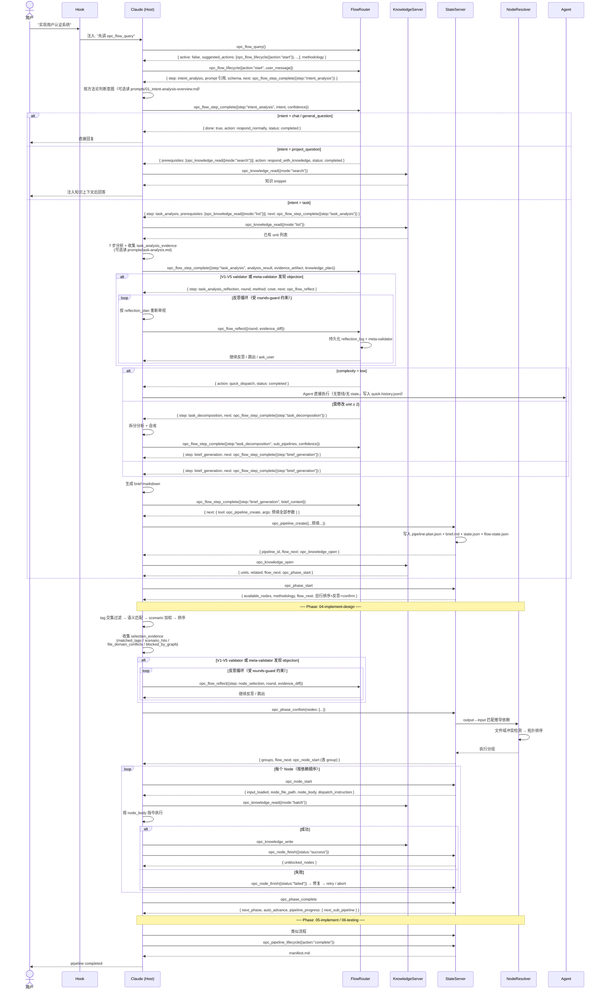

# 03 架构分层 + 时序 + 流程

> 本文档是 [OPC 概览](00_index.md) 的子文档。其他子文档：
> [Marketplace 目录](01_marketplace-directory.md) · [用户项目目录](02_user-project.md)

---

## 一、架构分层

```
┌──────────────────────────────────────────────────┐
│  Claude Code (MCP Host)                            │
│  按 MCP 工具返回的 next 字段逐步推进                  │
│  必读 step_instruction + schema                    │
│  选读 methodology.docs 中的方法论文档                │
│  所有需要 LLM 的工作（含反思 sub-agent）都在这一层完成   │
├──────────────────────────────────────────────────┤
│  kits/ (业务层)                                    │
│  领域 Agent + Skill，通过 plugin.json 暴露能力      │
│  Node + Template 按阶段组织在 phases/                │
├──────────────────────────────────────────────────┤
│  opc-state-server (流程状态机 + 任务跟进)            │
│  ├── flow/    流程路由：流程工具按 intent + evidence 路由 │
│  ├── prompts/ 方法论文档（被工具返回引用，按需 Read）       │
│  ├── tools/   pipeline/phase/node 工具（含 flow_next 字段） │
│  └── engine/  state-manager / phase-validator / node-resolver │
│  纯 TypeScript 确定性逻辑，零 LLM 依赖                 │
├──────────────────────────────────────────────────┤
│  opc-reflection-server (反思方法学 + 用户纠正归档)     │
│  ├── methods/   5 种反思方法标准库（CoVe/Critique/Debate/Reflexion/ToT) │
│  ├── validators/ V1-V5 deterministic validator + meta-validator │
│  ├── tools/     17 个反思 / 纠正 / 元工具                │
│  └── corrections/ L1→L2→L3 三层归档 + seed 冷启动        │
│  纯 TypeScript，sub-agent 由 Host 派发，永不阻塞主流程    │
├──────────────────────────────────────────────────┤
│  opc-knowledge-server (基础设施层)                   │
│  知识库 CRUD + 版本管理 + 全文搜索                     │
│  纯 TypeScript 确定性逻辑，零 LLM 依赖                 │
├──────────────────────────────────────────────────┤
│  shared/memory-store (共享存储引擎)                  │
│  三层模型（unit→section→sub）+ 原子写 + 索引            │
│  被 knowledge / corrections / lessons 共用            │
└──────────────────────────────────────────────────┘
```

---

## 二、时序图（端到端）



---

## 三、流程图（决策分叉全景）

```mermaid
flowchart TD
    A[用户输入自然语言] --> HOOK[UserPromptSubmit hook<br/>注入一行指令：先调 opc_flow_query]
    HOOK --> FQ[Claude 调 opc_flow_query<br/>返回 active 状态 + suggested_actions + methodology]
    FQ --> FQDEC{active 状态?}
    FQDEC -->|active=false| opc_flow_query[Claude 调 opc_flow_lifecycle({action:"start"})<br/>opc_flow_lifecycle 返回 intent_analysis 指令]
    FQDEC -->|active=true + 延续| CONT[按已有 flow_next 推进]
    FQDEC -->|active=true + 纠正| REVISE[opc_flow_correct({action:"revise"}) / opc_flow_correct({action:"restart"})]
    FQDEC -->|active=true + 流程内调整| REPLAN[opc_pipeline_lifecycle({action:"replan"}) / opc_flow_correct({action:"phase_reset"})]
    FQDEC -->|active=true + 题外话/无关问答| OUTSIDE[respond_outside_flow<br/>不动 flow-state / pipeline<br/>必要时只读 opc_knowledge_read({mode:"search"})]
    FQDEC -->|active=true + 放弃| ABORT[opc_flow_lifecycle({action:"abort"}) 后 opc_flow_lifecycle({action:"start"})]
    FQDEC -->|active=true + orphan| RECOVER[opc_flow_lifecycle({action:"recover"})]
    FQDEC -->|流程外问答/暂停| NOOP[直接回答 / 等待]
    opc_flow_query --> C1{Claude 意图识别<br/>按 step_instruction 或选读方法论文档}
    C1 -->|task| F2T[Claude 调 opc_flow_step_complete({step:"intent_analysis"})<br/>路由 task 分支<br/>返回 task_analysis 指令]
    C1 -->|project_question| F2P[Claude 调 opc_flow_step_complete({step:"intent_analysis"})<br/>返回 knowledge_search 指令<br/>+ 自动标记 status=completed]
    F2P --> PQ1[Claude 调 opc_knowledge_read({mode:"search"})<br/>注入知识上下文后回答<br/>不创建管线/state]
    C1 -->|general_question / chat| F2C[Claude 调 opc_flow_step_complete({step:"intent_analysis"})<br/>返回 done: true<br/>+ 自动标记 status=completed]
    F2C --> NC[零 OPC 介入，直接回复]
    F2T --> C2[Claude 调 opc_knowledge_read({mode:"list"}) 后<br/>7 步分析 + 收集 task_analysis_evidence]
    C2 --> opc_flow_step_complete({step:"intent_analysis"})[Claude 调 opc_flow_step_complete({step:"task_analysis"})<br/>按 V1-V5 validator + meta-validator + complexity + modify_count 路由]
    opc_flow_step_complete({step:"intent_analysis"}) --> C2_SR_DEC{opc_flow_step_complete({step:"task_analysis"}) 路由判定}
    C2_SR_DEC -->|validator pass + 无严重 objection| C2a
    C2_SR_DEC -->|validator fail 或 objection 严重| C2_SR_LOOP[反思循环<br/>Claude 调 opc_flow_reflect<br/>opc_flow_reflect 持久化 evidence_diff<br/>受 rounds-guard 约束]
    C2_SR_LOOP --> C2_SR_RECHECK{反思后 evidence 状态?}
    C2_SR_RECHECK -->|validator pass| C2a
    C2_SR_RECHECK -->|rounds 耗尽 / 仍有 objection| C2_QC[ask_user<br/>opc_flow_reflect 路由 ask_user<br/>附 reasoning_trace]
    C2_QC -->|用户确认/修正| C2a
    C2a{opc_flow_step_complete({step:"task_analysis"}) 复杂度路由}
    C2a -->|low| FAST[opc_flow_step_complete 路由 opc_quick_dispatch<br/>Agent 直接执行<br/>+ 自动标记 status=completed]
    C2a -->|medium / high| DEC{需修改的 unit ≥ 2?}
    DEC -->|是| DEC1[opc_flow_step_complete({step:"task_analysis"}) 路由 task_decomposition<br/>Claude 拆分分析 + 收集 decomposition_evidence]
    DEC1 --> DEC2[Claude 调 opc_flow_step_complete({step:"task_decomposition"})]
    DEC2 --> DEC3{opc_flow_step_complete({step:"task_decomposition"}) 路由判定}
    DEC3 -->|validator pass + 无严重 objection| DEC5[opc_flow_step_complete 路由 brief_generation]
    DEC3 -->|否| DEC4[opc_flow_step_complete 路由 brief_generation<br/>step_instruction 提示确认 + 附 reasoning_trace]
    DEC4 -->|用户确认| DEC5
    DEC5 --> B6[Claude 生成 brief markdown]
    DEC -->|否| B6
    B6 --> opc_flow_step_complete({step:"task_decomposition"})[Claude 调 opc_flow_step_complete({step:"brief_generation"})<br/>返回 next: opc_pipeline_create 预填全部参数]
    opc_flow_step_complete({step:"task_decomposition"}) --> B7[Claude 调 opc_pipeline_create]
    B7 --> B7B[opc_pipeline_create 返回 flow_next: opc_knowledge_open]
    B7B --> B7C[Claude 调 opc_knowledge_open]
    B7C --> G[opc_knowledge_open 返回 flow_next: opc_phase_start<br/>进入阶段执行循环]

    G --> H[opc_phase_start<br/>扫描内置 + 项目 node<br/>返回原始候选列表 + methodology]
    H --> I[Claude: tag 交集过滤]
    I --> J[Claude: 语义匹配排序]
    J --> K[Claude: scenario 加权]
    K --> L[生成初始 node 方案 + 收集 selection_evidence]

    L --> M{selection_evidence<br/>V1-V5 validator?}
    M -->|pass + 无严重 objection| R[opc_phase_confirm<br/>node-resolver 解析依赖<br/>→ 阶段节点计划]
    M -->|pass + 中等 objection| L2[快速确认<br/>展示方案 + reasoning_trace]
    L2 -->|用户确认| R
    M -->|fail 或 严重 objection| L3[Claude 调 opc_flow_reflect<br/>opc_flow_reflect 持久化 + 路由 M4 Critique]
    L3 --> L4[每轮重新收集 evidence + meta-validator]
    L4 --> L5{opc_flow_reflect 判定:rounds 耗尽或 validator 通过?}
    L5 -->|继续| L3
    L5 -->|确认| R

    R --> S[按 blocked_by 顺序执行 node]
    S --> T[opc_node_start 返回 node_body + dispatch_instruction]
    T --> T2[Claude 加载前置知识<br/>opc_knowledge_read({mode:"batch"})]
    T2 --> U[按 node_body 指令执行]
    U --> V{执行结果}
    V -->|成功| W[opc_knowledge_write<br/>opc_node_finish({status:"success"})<br/>返回 unblocked_nodes]
    W --> X{当前 phase<br/>全部 node 完成?}
    X -->|否| S
    X -->|是| Y[opc_phase_complete<br/>返回 pipeline_progress + next_phase]
    Y --> Z{还有下一 phase?}
    Z -->|是, auto_advance=true| G
    Z -->|是, 需确认| ZA[提示用户推进] --> G
    Z -->|否| ZA2{next_sub_pipeline 非空?}
    ZA2 -->|是| G
    ZA2 -->|否| ZB[opc_pipeline_lifecycle({action:"complete"})]

    V -->|失败| ZC[opc_node_finish({status:"failed"})<br/>写入 error]
    ZC --> ZD[尝试修复 / retry]
    ZD -->|修复完成| S
    ZD -->|无法修复| ZE[pipeline → aborted]
```

---

## 四、节点选择补充

### 节点来源

节点按阶段组织在 `phases/<phase>/nodes/`，模板在 `phases/<phase>/templates/`。项目通过 `opc-nodes/` 覆盖。

| 来源 | 位置 | 维护者 | 说明 |
|------|------|--------|------|
| 内置节点 | `phases/<phase>/nodes/` | 插件开发者 | 随 marketplace 分发 |
| 项目节点 | `opc-nodes/` | 项目用户 | 同目录结构，同名覆盖 |

### 节点选择：evidence + V1-V5 validator + 反思

节点选择不是一次性确认，而是 Claude **收集 selection_evidence**后由 reflection-server 的 V1-V5 validator + meta-validator 判定的过程。核心理念与意图识别一致：**evidence 通过即推进，validator 失败或保留严重 objection 才反思 / 用户介入**。反思循环通过 `opc_flow_reflect`（持久化 evidence_diff + meta-validator 结果），受 rounds-guard 约束。

`selection_evidence` 字段：`matched_tags` / `scenario_hits` / `file_domain_conflicts` / `blocked_by_graph`。完整 schema 与 V1-V5 规则见 [05-opc-reflection-server/02-server-design/00_overview.md 二/三](../05-opc-reflection-server/02-server-design/00_overview.md#二evidence-schema)。

```
初始方案 → 收集 selection_evidence → 分叉:
  ├── V1-V5 pass + 无严重 objection      → 自动确认，通知用户
  ├── V1-V5 pass + 中等 objection        → 快速确认，展示方案 + reasoning_trace
  └── V1-V5 fail 或 严重 objection       → Claude 调 opc_flow_reflect 进入反思循环
                                          primary=M4 Critique，secondary=M5 Debate（medium+）
                                          受 rounds-guard 约束，超限降级 ask_user
```

| 概念 | 说明 |
|------|------|
| Evidence 字段 | `matched_tags` / `scenario_hits` / `file_domain_conflicts` / `blocked_by_graph`（详见 reflection-server 二） |
| Validator | V1 schema / V2 referential / V3 evidence-presence / V4 coverage / V5 discrimination + 3 兜底 |
| 反思方法 | primary M4 Critique（critic sub-agent，只读）；secondary M5 Debate（complexity ≥ medium） |
| 反思预算 | rounds-guard 约束每 step 反思**轮数**上限（token 不再追踪）；达上限 → `verdict: rounds_exceeded` → `ask_user` |
| 调整方式 | Claude 自行增删 node、调整顺序，每轮重新收集 evidence + opc_flow_reflect 上报 |
| 最终 | validator pass + 无严重 objection → 自动确认；否则由用户确认，resolver 锁定执行计划 |

高 evidence 场景（如 `fix-bug` scenario 命中 + matched_tags ≥ N + 无 file_domain_conflicts）可跳过用户审核直接执行，减少人工介入。

---

## 五、流程外问答（`respond_outside_flow`）

Hook 极简化的代价：用户每次输入都会被注入"先调 `opc_flow_query`"。当管线正在跑（`active=true`），但用户随口问"现在几点了 / 刚才设计了几个端点 / 当前在哪一步"，需要一条**不动流程**的出口。

`opc_flow_query` 形态 B 的第 9 个 suggested_action 就是为此设计：

| 字段 | 值 |
|---|---|
| `intent` | 流程外问答 |
| `signals` | 时间/天气/进度查询 / "顺便问一下" / 与 `current_step` 无语义关联的新话题 |
| `next.action` | `respond_outside_flow` |
| `preserve_state` | `true`（明确禁止动 flow-state.json / pipeline-plan.json） |

**Claude 的判定流程**：

```
opc_flow_query 返回 active=true
  → 把新消息与 snapshot.user_message_history / current_step 做语义关联
      ├── 关联度高（延续 / 纠正 / 补充 / 回退）   → 走对应推进 / 纠错 action
      ├── 关联度低（题外话 / 打断 / 无关问答）    → respond_outside_flow
      └── 完全无法判断                          → "暂停等待"，反问用户
```

**`respond_outside_flow` 内允许的工具**：

| 工具 | 允许？ | 说明 |
|---|---|---|
| `opc_knowledge_read({mode:"search"\|"single"\|"list"})` | ✅ | 只读，回答项目相关问题 |
| `Read` / `Grep` / `Bash`（只读命令） | ✅ | 回答代码相关问题 |
| `opc_flow_*` 推进类 / `opc_pipeline_*` 写类 / `opc_node_*` | ❌ | 任何会改 state 的工具一律禁止 |
| `opc_knowledge_write` / `opc_corrections({action:"record"})` | ❌ | 写类禁止 |

完整 schema 与设计原则详见 [02-opc-state-server/01-intent-analysis/02_flow-tools-entry-lifecycle.md opc_flow_query](../02-opc-state-server/01-intent-analysis/02_flow-tools-entry-lifecycle.md#opc_flow_query)。

---

## 六、拆分管线串行执行

`opc_pipeline_create` 一次创建 N 个 `sub_pipelines`，每个 sub 都要跑完整的 9 阶段循环。执行策略：**严格按 `execution_order` 串行，`blocked_by` 阻塞未就绪的 sub**。

### 调度规则

| 条件 | 策略 |
|---|---|
| 所有 sub 默认 | **严格串行**——按 `execution_order` 顺序依次启动，同一时刻只有一条 sub 在执行 |
| `sub.blocked_by = [...]` 非空 | 前置 sub 全部 `completed` 才进入下一条 |

### 时序

```
Host → opc_pipeline_status()
       ← next_sub_pipeline: { id: "sub-A", reason: "execution_order 顺序第一位" }

Host → opc_phase_start(sub-A) → ... → opc_phase_complete(sub-A 的最后 phase)
       ← pipeline_progress: { next_sub_pipeline: { id: "sub-B", reason: "..." } }

Host → opc_phase_start(sub-B) → ...
```

### 串行安全

| 资源 | 串行保障 |
|---|---|
| `state.json` | 同一时刻只有一条 sub 在写，无竞争 |
| `pipeline-plan.json` 聚合状态 | 单写者，无并发写问题 |
| knowledge 同 unit 跨 sub 写 | 串行执行天然保证顺序，version+1 仅做信息性记录 |
| 跨 sub 依赖未在 `blocked_by` 表达 | 由 `_refs + min_version` 在 `opc_node_start` 时拦截 |

### MCP 协议支持

MCP 协议是请求-响应模型，**天然适合串行调用**——`opc_phase_complete` 返回 `next_sub_pipeline` 后，Claude 在下一轮调 `opc_phase_start` 即可。无需 Host 并发能力假设，无需并发写保护，状态空间线性可预测。完整规约详见 [02-opc-state-server/02-pipeline/07_dependency-serial.md](../02-opc-state-server/02-pipeline/07_dependency-serial.md)。

---

## 相关文档

- [01_marketplace-directory.md](01_marketplace-directory.md) — Marketplace 自身结构
- [02_user-project.md](02_user-project.md) — 用户项目目录
- [../02-opc-state-server/01-intent-analysis/00_overview.md](../02-opc-state-server/01-intent-analysis/00_overview.md) — 意图识别完整方法论
- [../02-opc-state-server/03-phase/02_node-selection.md](../02-opc-state-server/03-phase/02_node-selection.md) — 节点选择详细算法
- [../05-opc-reflection-server/00_index.md](../05-opc-reflection-server/00_index.md) — 反思方法学 + 用户纠正归档（state-server 所有判断点的反思链路在此）
- [../06-host-contract/00_overview.md](../06-host-contract/00_overview.md) — Host 行为契约（session_id 派生 / sub-agent MCP 继承 / allowed_tools enforce / hook 优先级）
- [../07-tool-consolidation/00_overview.md](../07-tool-consolidation/00_overview.md) — 工具合并规范（discriminator 模式 + 内联反思 + 迁移策略）
