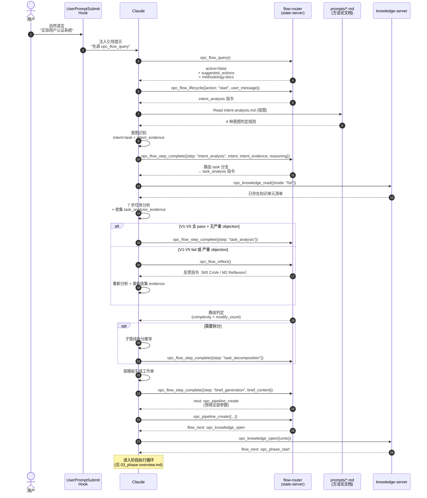
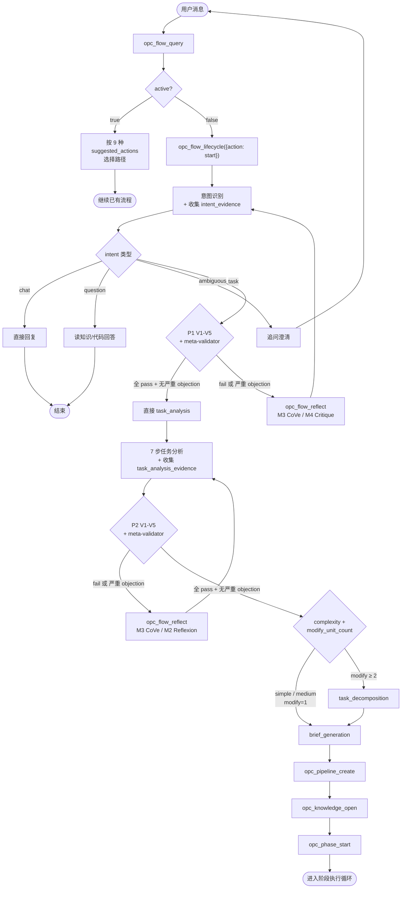

# 意图识别与任务分析

用户`输入消息`后, UserPromptSubmit hook 注入一条提示，引导 Claude 调用 `opc_flow_query` 查询流程状态。**在已 `/opc init` 的项目里，hook 对每一条非 slash 消息无条件注入**（不做关键词/语义判断），把消息引导进 `opc_flow_query` 生命周期；意图分流（task / question / chat）由 `opc_flow_query` 返回的 `suggested_actions` + Claude 判断，而不是 hook 提前过滤。后续每一步都由 MCP 工具返回的 `next` 字段驱动，pipeline 文档作为**方法论参考**按需读取。

本文档已按主题拆分为多个子文档，本文是**聚合索引**，按阅读顺序指向各子文档。

---

## 端到端时序图

从用户消息进入到管线创建完成的完整链路：Hook 注入提示 → Claude 调用 flow tool → 按需读方法论文档 → 工具返回 `next` 驱动下一步。

---

## 意图与 evidence 验证决策流

`opc_flow_query` 返回 `active=false` 后，Claude 按下图决策路由：

---

## 子文档导航

### 架构基础

| 子文档 | 内容 |
|------|------|
| [01_hook-architecture.md](01_hook-architecture.md) | Hook 触发机制、混合架构（MCP 状态机 + 方法论文档）、文档归属、Hook 脚本高级形态 |
| [02_flow-tools-entry-lifecycle.md](02_flow-tools-entry-lifecycle.md) | **流程工具 · 入口与生命周期**（`opc_flow_query` + `opc_flow_lifecycle`，含 7 工具总览表） |
| [03_flow-tools-step-routing.md](03_flow-tools-step-routing.md) | **流程工具 · 步骤路由**（`opc_flow_step_complete` 4 个 step / `opc_flow_reflect` / `opc_flow_user_reply` / `opc_quick_dispatch`） |
| [04_flow-tools-revise-restart.md](04_flow-tools-revise-restart.md) | **流程工具 · 纠错**（`opc_flow_correct` 3 个 action + 调用前置校验） |
| [10_flow-state-schema.md](10_flow-state-schema.md) | `flow-state.json` 完整 schema + 字段读写分配 |

### 流程步骤（按执行顺序）

| 子文档 | 内容 | 涉及工具 |
|------|------|------|
| [05_intent-recognition.md](05_intent-recognition.md) | 意图识别（4 种意图）+ 置信度阈值 + 纠错指令 | `opc_flow_query` / `opc_flow_lifecycle({action:"start"})` / `opc_flow_step_complete({step:"intent_analysis"})` |
| [06_task-analysis.md](06_task-analysis.md) | 7 步任务分析 + 5 维度自省评估 + 反思循环 | `opc_flow_step_complete({step:"task_analysis"})` / `opc_flow_reflect` |
| [07_task-decomposition.md](07_task-decomposition.md) | 子管线拆分原则、依赖推导、4 维度自省 | `opc_flow_step_complete({step:"task_decomposition"})` |
| [08_brief-generation.md](08_brief-generation.md) | 工作单模板与生成规则 | `opc_flow_step_complete({step:"brief_generation"})` |
| [09_pipeline-creation.md](09_pipeline-creation.md) | 管线创建、知识初始化、阶段执行循环入口 | `opc_pipeline_create` → `opc_knowledge_open` → `opc_phase_start` |

### 参考与示例

| 子文档 | 内容 |
|------|------|
| [11_complete-example.md](11_complete-example.md) | 完整流程示例（含流程中追加需求、管线内增节点）+ 精确命令清单 |

---

## 快速入口

**入口工具**：[`opc_flow_query`](02_flow-tools-entry-lifecycle.md#opc_flow_query) — 流程状态查询，返回快照 + methodology + 9 种 suggested_actions

**核心架构原则**：

- **Hook 引导化**：在已 `/opc init` 项目里对每条非 slash 消息无条件注入一行引导，不读文件、不拼快照、不做意图判断
- **事实查询统一入口**：`opc_flow_query` 是流程状态的唯一事实源，含 pid 存活校验
- **决策权归 Claude**：query 提供候选清单，最终走哪条路由由 LLM 判断
- **工具内部强制校验**：所有 `opc_flow_*` 都内置 pid + status 校验
- **方法论文档按需读**：MCP 工具返回 `methodology.docs` 指向 `prompts/*.md`，复杂边界场景才完整 Read

详见 [01_hook-architecture.md 1.1 设计原则](01_hook-architecture.md#11-设计原则)。

---

## 相关文档

- [管线](../02-pipeline/00_overview.md) — 管线创建与生命周期、`opc_pipeline_lifecycle({action:"replan"})` 细粒度规范
- [阶段](../03-phase/00_overview.md) — 阶段执行与节点选择、节点选择反思
- [节点](../04-node/00_overview.md) — 节点定义与执行、Agent 委派模式
- [03-1 知识模型](../../03-opc-knowledge-server/01-knowledge-model/00_overview.md) — 知识结构与存储
