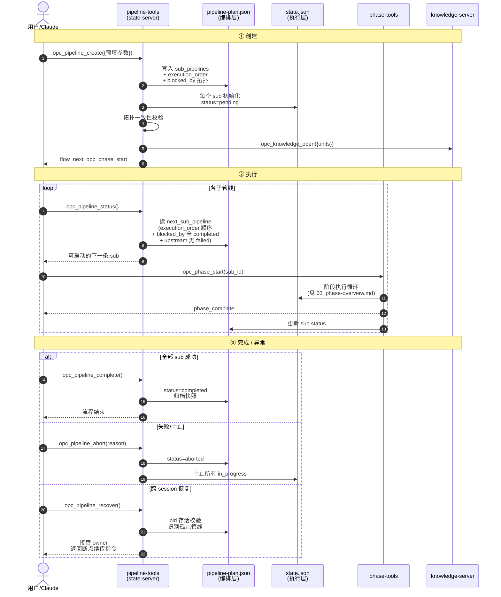
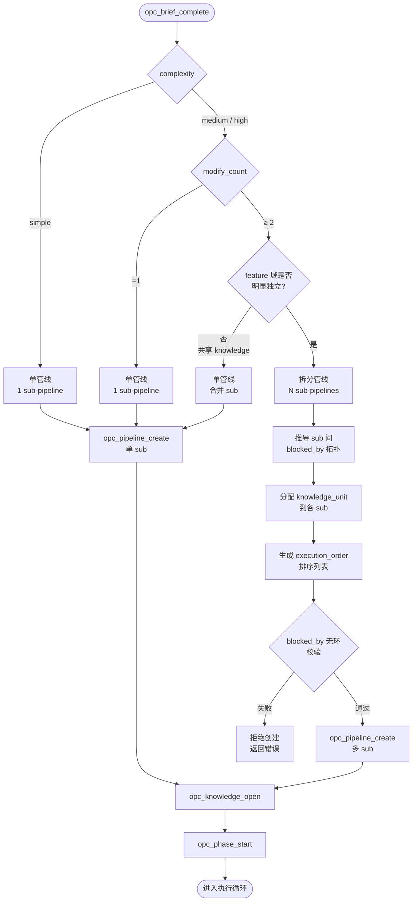

# 管线

管线的创建、编排、状态管理和生命周期。管线是 opc-state-server 的核心数据模型，所有管线工具直接操作 `pipeline-plan.json` 和 `state.json`。

本文档已按主题拆分为多个子文档，本文是**聚合索引**，按阅读顺序指向各子文档。

---

## 管线生命周期时序图

从 `opc_pipeline_create` 到 `opc_pipeline_complete` 的完整生命周期，含子管线就绪检测与跨 session 恢复：

---

## 单管线 vs 拆分管线决策流

`opc_brief_complete` 后，state-server 按下图决定生成单管线还是拆分多 sub：

---

## 子文档导航

### 数据模型

| 子文档 | 内容 |
|------|------|
| [01_plan-model.md](01_plan-model.md) | 两层 Plan 模型（编排层 vs 执行层） |
| [02_directory-structure.md](02_directory-structure.md) | `.opc/pipelines/<id>/` 目录布局与读写归属 |
| [03_pipeline-plan.md](03_pipeline-plan.md) | `pipeline-plan.json` schema、状态聚合、owner 进程隔离 |
| [04_state-json.md](04_state-json.md) | `state.json` schema、状态枚举、input/output 规则、error 类型 |

### 管线编排

| 子文档 | 内容 |
|------|------|
| [05_single-vs-split.md](05_single-vs-split.md) | 单管线 vs 拆分管线触发条件、`knowledge_unit` 分配 |
| [07_dependency-parallel.md](07_dependency-parallel.md) | `blocked_by` 语义、`execution_order` 排序、失败传播、多 Feature 独立管线 |

### 生命周期与工具

| 子文档 | 内容 | 涉及工具 |
|------|------|------|
| [06_lifecycle.md](06_lifecycle.md) | 创建、执行、完成、取消、恢复 5 个生命周期阶段 | `opc_pipeline_create` / `opc_pipeline_recover` 等 |
| [09_tools.md](09_tools.md) | 6 个 `opc_pipeline_*` 工具完整规范 | 全部 6 个管线级工具 |

### 状态展示与示例

| 子文档 | 内容 |
|------|------|
| [08_status-display.md](08_status-display.md) | 单/拆分管线状态渲染规范、状态符号 |
| [10_complete-example.md](10_complete-example.md) | 单管线 / 拆分管线 / 其他意图 / 异常路径 完整调用链路 |

---

## 快速入口

- **创建管线**：[`opc_pipeline_create`](09_tools.md#opc_pipeline_create) — 由 `opc_brief_complete` 路由预填参数触发
- **查看状态**：[`opc_pipeline_status`](09_tools.md#opc_pipeline_status) — 不带 sub_id 返回聚合视图 + `next_sub_pipeline`
- **细粒度修改**：[`opc_pipeline_replan`](09_tools.md#opc_pipeline_replan细粒度) — 增删节点/阶段/子管线，不影响 in_progress

---

## 核心设计原则

- **两层 Plan 分离**：编排层（`pipeline-plan.json`）与执行层（`state.json`）解耦，分别由不同工具维护
- **状态机驱动**：所有状态迁移仅通过 MCP 工具完成，禁止手工编辑 JSON
- **owner 进程隔离**：基于 pid 存活检测识别孤儿管线，支持跨 session 恢复
- **依赖无环**：`blocked_by` 引用的 sub_id 必须存在且无环，`opc_pipeline_create` 时强制校验
- **严格串行执行**：子管线按 `execution_order` 依次执行，`blocked_by` 阻塞未就绪的 sub。`opc_phase_complete` 返回 `next_sub_pipeline`，Claude 直接调下一条 `opc_phase_start`（详见 [07_dependency-parallel.md](07_dependency-parallel.md)）

---

## 相关文档

- [意图分析](../01-intent-analysis/00_overview.md) — 管线入口与任务分析
- [阶段](../03-phase/00_overview.md) — 阶段执行与节点选择
- [节点](../04-node/00_overview.md) — 节点执行与质量门
- [03-1 知识模型](../../03-opc-knowledge-server/01-knowledge-model/00_overview.md) — 知识快照机制
