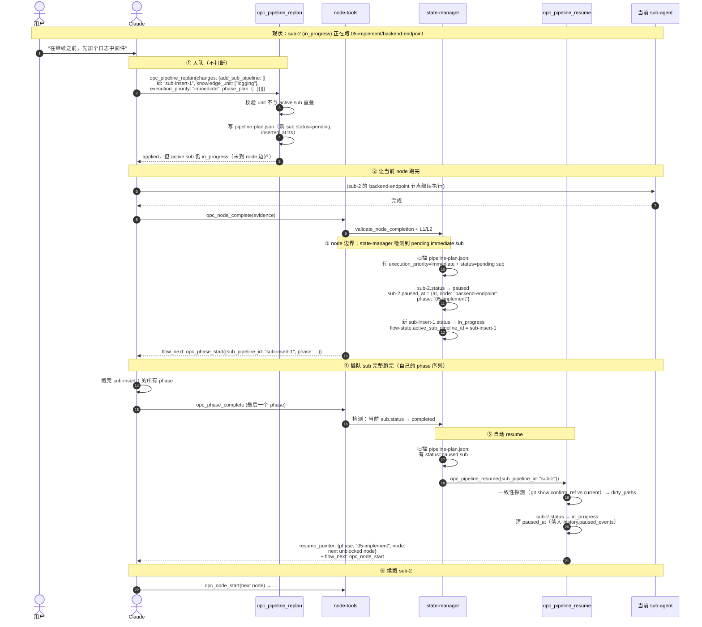

# 11 sub-pipeline 插队 / 挂起 / 恢复契约

长管线（≥6 phase）跑起来后，用户的"插队"诉求由 **add_sub_pipeline + execution_priority="immediate"** 表达。流程不是"打断当前 sub-agent"，而是**在 node 边界**把当前 sub 切到 `paused`，让新 sub 优先跑完后自动 resume。

> 配套字段：[03_pipeline-plan.md 三](03_pipeline-plan.md#三字段说明) sub.status 含 `paused`，sub.execution_priority、sub.paused_at、sub.inserted_at。配套工具：[09_tools.md opc_pipeline_replan](09_tools.md#opc_pipeline_replan) 与 [opc_pipeline_resume](09_tools.md#opc_pipeline_resume)。

---

## 一、为什么不打断 sub-agent

| 备选方案 | 问题 |
|---------|------|
| 直接 SIGTERM 当前 sub-agent，立刻让新 sub 占用 | sub-agent context 丢失；中途状态（部分写入的 knowledge）半成品；retry 无法续 |
| 当前 phase 跑完再切（phase 边界） | medium/high phase 时长不可控（30 min ~ 数小时），插队失去意义 |
| **node 边界切换（本方案）** | node 已是阶段最小单元（典型 1~10 min）；node 完成时 evidence 已落、knowledge 已 commit，挂起代价最小 |

**核心原则**：插队是"调度"而不是"中断"。`opc_pipeline_replan` 只是入队，真正的状态翻转由 `opc_node_complete` → state-manager 在 node 边界完成。

---

## 二、完整时序



---

## 三、状态机：sub_pipeline.status

```
pending ─── replan add_sub ──> in_progress（首次进入）
           │
           ├── execution_priority=immediate ─┐
           │                                  ↓
           │                              入队后等 node 边界
           │                                  ↓
in_progress ─── 同管线插入 immediate sub ───> paused
           │       (node 边界触发)
           │
paused ──── insert sub 完成 ─── auto opc_pipeline_resume ──> in_progress
           │
           ├── 用户主动 opc_pipeline_resume ─> in_progress
           │
           └── opc_pipeline_abort ──> aborted
```

**约束**：
- `paused` 视同活跃状态参与管线整体 status 聚合（owner 不释放，孤儿检测仍生效）
- 同一时刻只允许一条 sub 处于 `in_progress`；`paused` 不计数
- 多次插队按"栈式"叠加：sub-A(paused) → sub-B(paused) → sub-C(in_progress)，C 跑完 resume B，B 跑完 resume A

---

## 四、与 diff-and-merge 的集成

插队 sub 与被挂起 sub 在 `opc_pipeline_replan` 阶段已校验 `knowledge_unit` 不重叠，**正常路径下不会产生 knowledge 冲突**。

但用户在挂起期间可能手工编辑被挂起 sub 的 knowledge 文件（L3 用户 git 操作）。`opc_pipeline_resume` 的步骤 ④ 一致性探测会发现这种漂移：

| 探测结果 | 处理 | 后续 |
|---------|------|------|
| 全部 clean | 无 dirty_paths | 续跑 sub-2，knowledge 与挂起前一致 |
| 有 dirty_paths | 返回 hint，不阻断恢复 | 续跑 node 中 `opc_knowledge_write({base_version})` 命中冲突 → 走 [02_core-tools §2.10](../../03-opc-knowledge-server/02-knowledge-api/02_core-tools.md#210-版本冲突与-3-way-diff-and-merge-契约) 标准 3-way diff-and-merge |

**关键**：resume 不主动覆盖任何文件。base_version 探测器始终是冲突防线。

---

## 五、与其他工具的关系

| 关系 | 说明 |
|------|------|
| `opc_phase_reset` | 操作单个 sub 内的阶段回退；不触发 paused/resume |
| `opc_flow_revise` | 只改 accumulated 字段；不改 sub_pipelines |
| `opc_flow_restart(from_step)` | 回退到流程分析步骤；插队不通过此工具 |
| `opc_pipeline_abort` | 级联终止所有 sub（含 paused 和 in_progress）；放弃整管线 |
| **`opc_pipeline_replan + add_sub_pipeline(execution_priority: immediate)`** | 唯一插队入口 |
| **`opc_pipeline_resume`** | 唯一显式恢复入口；通常由 state-manager 自动触发 |

---

## 六、与 opc_flow_defer 的取舍

早期设计曾考虑独立的 `opc_flow_defer` / `opc_flow_resume` 流程级工具。最终归并到管线层 + `opc_pipeline_replan`，理由：

- 插队任务**必然**是新管线/新 sub 的语义（要走完整的 phase 循环）；不是流程级"暂停"
- 复用已有 `add_sub_pipeline` 字段，仅扩 `execution_priority` 一项；不新增流程级工具
- 流程层（`opc_flow_*`）保持纯路由职责，不持有挂起栈
- 工具总数：管线层 6→7（仅 resume 新增），流程层不变；可控

---

## 相关文档

- [03_pipeline-plan.md](03_pipeline-plan.md) — sub_pipelines 字段（paused / execution_priority / paused_at）
- [09_tools.md](09_tools.md) — `opc_pipeline_replan` 与 `opc_pipeline_resume` 完整规范
- [../../03-opc-knowledge-server/02-knowledge-api/02_core-tools.md#210](../../03-opc-knowledge-server/02-knowledge-api/02_core-tools.md#210-版本冲突与-3-way-diff-and-merge-契约) — 一致性探测之后的写入路径
- [06_lifecycle.md](06_lifecycle.md) — 管线生命周期（paused 视同活跃）
