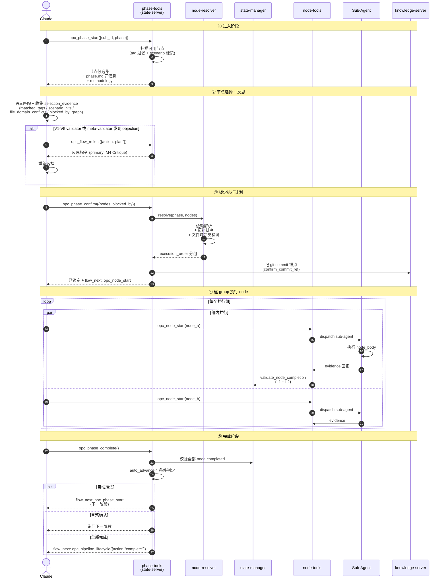
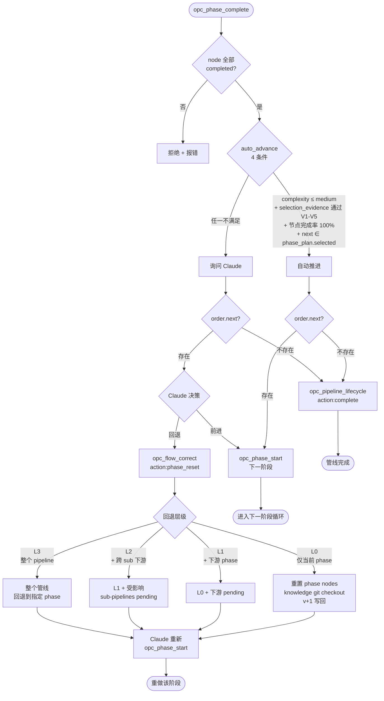

# 阶段

阶段根据任务信号自主选择节点，node-resolver 自动解析依赖、拓扑排序、生成执行计划。每个阶段目录自包含：`phase.md` + `nodes.md` + `nodes/` + `templates/`。

本文档已按主题拆分为多个子文档，本文是**聚合索引**，按阅读顺序指向各子文档。

---

## 阶段生命周期时序图

`opc_phase_start` → 节点选择反思 → `opc_phase_confirm` → 逐 node 执行 → `opc_phase_complete` 的完整链路：

---

## 阶段推进与回退决策流

`opc_phase_complete` 后 auto_advance 判定，以及 `opc_flow_correct({action:"phase_reset"})` 的分层回退：

---

## 子文档导航

### 阶段定义

| 子文档 | 内容 |
|------|------|
| [01_nine-phases.md](01_nine-phases.md) | 9 阶段总览 + `phase.md` 元信息文件 |
| [02_node-selection.md](02_node-selection.md) | 节点选择策略、selection_evidence schema、validator 路由 |
| [03_scenarios.md](03_scenarios.md) | Scenario 场景配方与加权机制 |

### 阶段生命周期（按执行顺序）

| 子文档 | 内容 | 涉及工具 |
|------|------|------|
| [04_phase-start.md](04_phase-start.md) | `opc_phase_start` + P5 selection_evidence 收集 + V1-V5 validator 路由 + 反思循环 | `opc_phase_start` / `opc_flow_reflect` |
| [05_phase-confirm-execute.md](05_phase-confirm-execute.md) | `opc_phase_confirm` 锁定执行 + 逐 node 执行 | `opc_phase_confirm` / `opc_node_start` |
| [06_phase-complete-reset.md](06_phase-complete-reset.md) | `opc_phase_complete` + auto_advance 规则 + `opc_flow_correct({action:"phase_reset"})` + 分层回退 L0–L3 | `opc_phase_complete` / `opc_flow_correct({action:"phase_reset"})` |
| [08_tools-and-automation.md](08_tools-and-automation.md) | 节点来源 + 6 个阶段工具汇总 + 自动机制 |

---

## 快速入口

- **进入阶段**：[`opc_phase_start`](04_phase-start.md#二opc_phase_start--扫描与返回) — 由 `opc_pipeline_create` / 上一 phase 的 `opc_phase_complete` 路由触发
- **锁定执行**：[`opc_phase_confirm`](05_phase-confirm-execute.md#一opc_phase_confirm--锁定执行计划) — selection_evidence 通过 V1-V5 后调用
- **回退**：[`opc_flow_correct({action:"phase_reset"})`](06_phase-complete-reset.md#三opc_flow_correctactionphase_reset--阶段重置) — git checkout 锚点写回 v+1，下游级联 pending

---

## 核心设计原则

- **节点选择由 Claude 完成**：state-server 只做 tag 过滤和 scenario 标记，**不调 LLM**；语义匹配和 selection_evidence 收集由 Claude 在主循环承担
- **Evidence 驱动确认**：V1-V5 validator + meta-validator 通过即自动确认；validator 失败或保留严重 objections → reflection 循环 → ask_user 兜底
- **git 锚点保证可回退**：每次 `opc_phase_confirm` 把当时 knowledge `git commit` 并把 hash 记入 `confirm_commit_ref`，`opc_flow_correct({action:"phase_reset"})` 据此 checkout 内容并以 v+1 写回（version 永远向前，乐观锁始终工作）
- **auto_advance 严格判定**：complexity + selection_evidence + 节点完成率 + phase_plan.selected 4 条件全满足才自动推进

---

## 相关文档

- [意图分析](../01-intent-analysis/00_overview.md) — 任务复杂度决定反思轮次和推进策略
- [管线](../02-pipeline/00_overview.md) — 管线状态管理
- [节点](../04-node/00_overview.md) — 节点定义与执行
