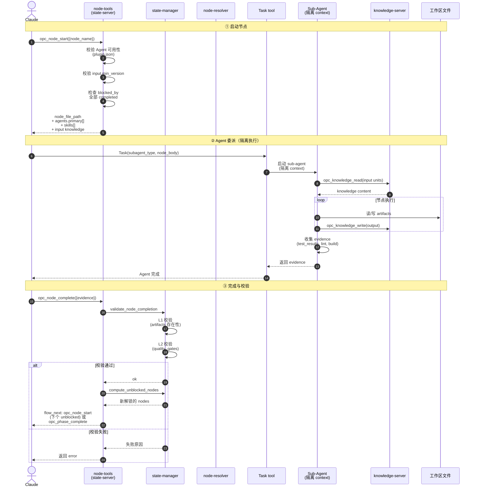
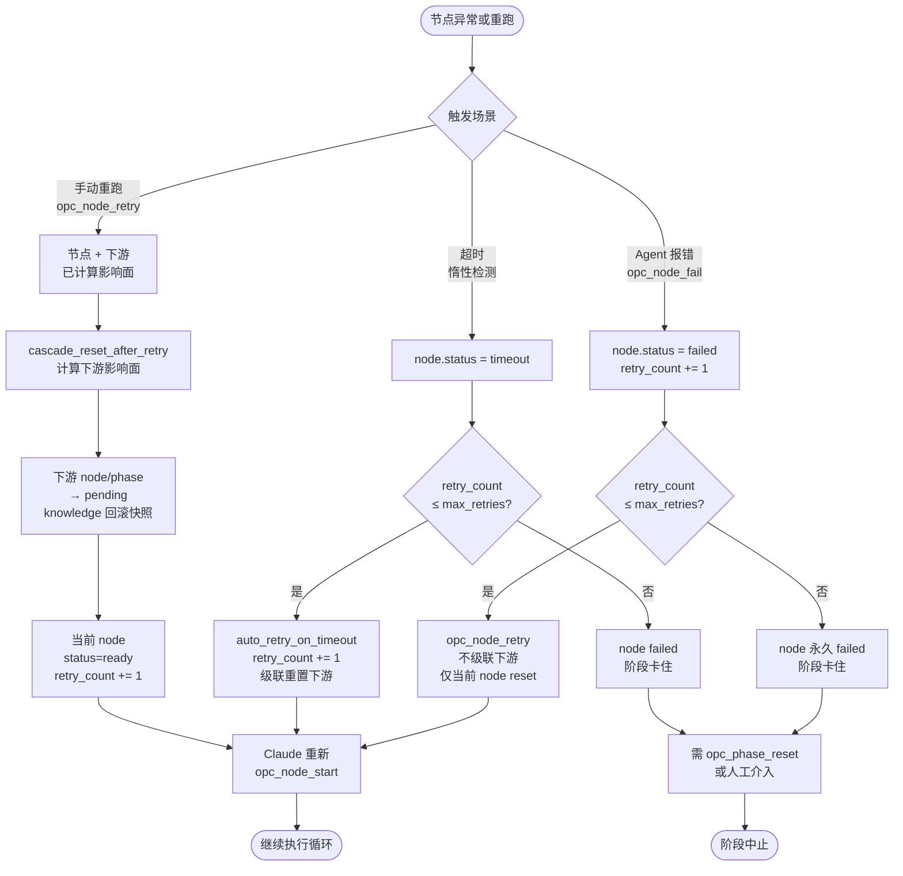

# 节点

节点是阶段执行的最小单元。node-resolver 自动解析依赖、拓扑排序、生成执行计划。本文档已按主题拆分为多个子文档，本文是**聚合索引**。

---

## 节点执行时序图

`opc_node_start` → Agent 委派 → evidence 回报 → `opc_node_complete` 的完整链路（含 L1/L2 质量门校验与依赖解锁）：

---

## 节点重试与级联重置决策流

三种重试场景（Agent 出错 / 超时 / 手动重跑）的语义差异：

---

## 子文档导航

### 节点定义

| 子文档 | 内容 |
|------|------|
| [01_types-and-definition.md](01_types-and-definition.md) | 节点类型（控制 vs 任务）+ 完整 markdown 定义示例 |
| [02_field-spec.md](02_field-spec.md) | frontmatter 全部字段：基础 + Agent + 质量门 + 超时重试 + input/output |

### 选择与编排

| 子文档 | 内容 |
|------|------|
| [03_signal-matching.md](03_signal-matching.md) | tag 交集 + 语义匹配 + Scenario 加权 |
| [04_concurrency-and-deps.md](04_concurrency-and-deps.md) | 文件域隔离、依赖解析、blocked_by 双写 |

### 执行与重试

| 子文档 | 内容 | 涉及工具 |
|------|------|------|
| [05_execution-and-retry.md](05_execution-and-retry.md) | 完整执行流程 + 三种重试场景 + retry_count 规则 | 4 个 `opc_node_*` |
| [07_tools.md](07_tools.md) | 4 个节点级工具完整规范 + Agent 委派模式 | 全部 |

### 来源与引擎

| 子文档 | 内容 |
|------|------|
| [06_source-and-override.md](06_source-and-override.md) | 节点项目覆盖优先级 + `plugin.json` 声明式能力 |
| [08_internal-engines.md](08_internal-engines.md) | node-resolver / state-manager / flow-router 三个内部引擎 + 自动机制 |

---

## 快速入口

- **启动节点**：[`opc_node_start`](07_tools.md#opc_node_start) — 由 `opc_phase_confirm` 路由触发
- **完成节点**：[`opc_node_complete`](07_tools.md#opc_node_complete) — Agent 回报 evidence 后调用
- **重跑节点**：[`opc_node_retry`](07_tools.md#opc_node_retry) — 手动重跑，自动级联重置下游

---

## 核心设计原则

- **零 LLM 引擎**：node-resolver / state-manager / flow-router 全部纯 TypeScript，语义匹配由 Claude 在主循环承担
- **Agent 委派隔离**：sub-agent 在隔离 context 中执行 node_body，避免主进程被污染
- **严格 blocked_by 解锁**：必须全部前置 completed 才进入 unblocked_nodes，并行场景下不会过早解锁
- **三种重试语义分明**：Agent 出错不级联、超时和手动重跑级联，retry_count 计数策略不同

---

## 相关文档

- [阶段](../03-phase/00_overview.md) — 节点选择与阶段生命周期
- [03-1 知识模型](../../03-opc-knowledge-server/01-knowledge-model/00_overview.md) — 知识读写与版本管理
