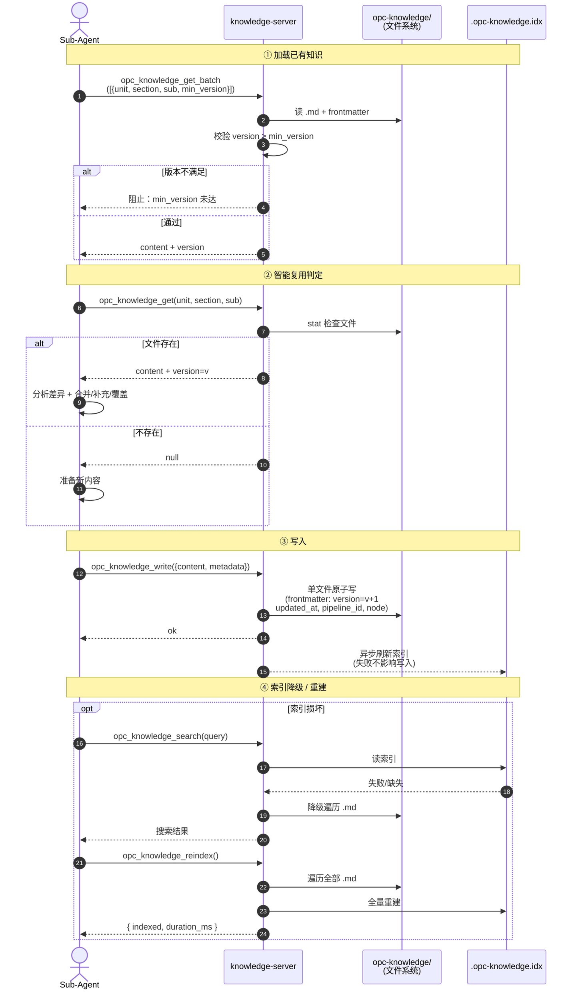
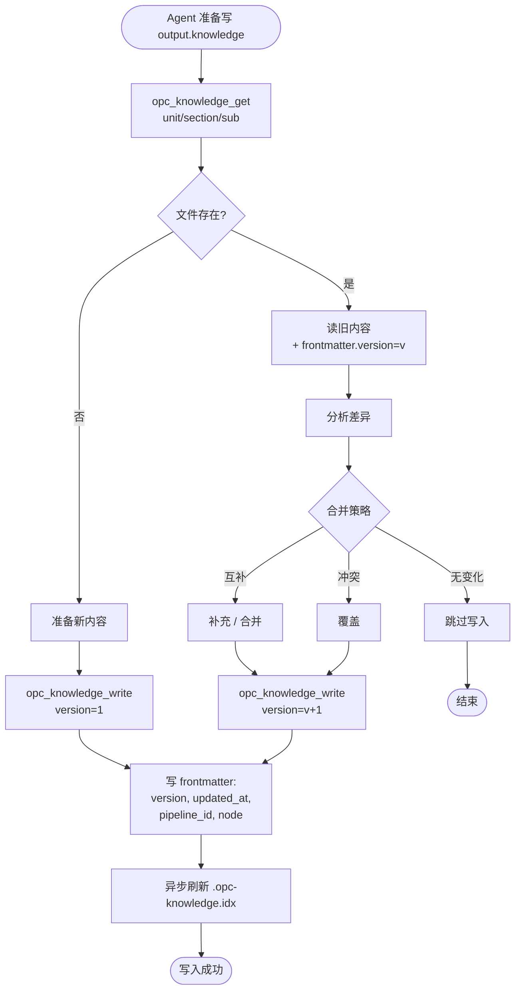

# 知识模型与存储

知识库按 **unit → section → subsection** 三层组织。文件系统是唯一真相源，version 存在 .md frontmatter 中。

本文档已按主题拆分为多个子文档，本文是**聚合索引**，附端到端时序图与决策流程图。

---

## 知识写入与版本递增时序图

`opc_knowledge_open` → Agent 读 → 智能合并 → `opc_knowledge_write` → version+1 → 异步索引刷新：

---

## 智能复用决策流

Agent 对每个 `output.knowledge` 路径的写入策略：

---

## 子文档导航

| 子文档 | 内容 |
|------|------|
| [01_concept-and-storage.md](01_concept-and-storage.md) | 三层概念模型 + opc-knowledge/ 目录布局 |
| [02_metadata-files.md](02_metadata-files.md) | `.md frontmatter` / `.opc-knowledge.json` / `.opc-knowledge.idx` |
| [03_node-driven-and-versioning.md](03_node-driven-and-versioning.md) | node frontmatter 的 input/output 声明、min_version 校验、创建 vs 更新策略 |

---

## 核心设计原则

- **文件系统单一真相源**：version 存 .md frontmatter，杜绝 index.json 与文件不一致的 crash 风险
- **索引零数据风险**：`.opc-knowledge.idx` 是派生数据，可随时 `opc_knowledge_reindex` 全量重建
- **min_version 强制校验**：`opc_node_start` 阶段拦截，保证 node 输入的版本契约
- **跨 unit 依赖通过 _refs 显式声明**：拆分管线时由 state-server 读 _refs 推导依赖

---

## 相关文档

- [知识 API](../02-knowledge-api/00_overview.md) — 8 个 MCP 工具完整规范
- [节点](../../02-opc-state-server/04-node/00_overview.md) — 节点定义中的 knowledge input/output 声明
