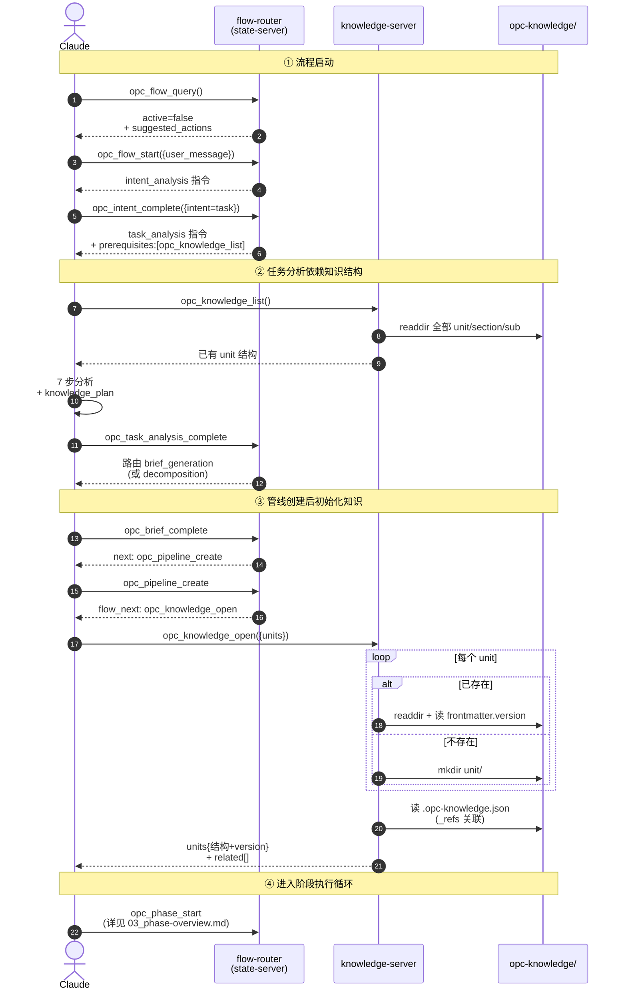

# 知识 MCP API

opc-knowledge-server 提供 8 个工具用于知识的 CRUD、版本管理和全文搜索。知识概念模型（三层结构、存储格式、版本管理）详见 [知识模型总览](../01-knowledge-model/00_overview.md)。

本文档已按主题拆分为多个子文档，本文是**聚合索引**，附端到端时序图与决策流程图。

---

## 管线启动中的知识工具时序图

从 flow_query 到 phase_start，knowledge 工具如何被 flow 路由穿插驱动：



---

## 工具职责边界决策流

何时用 list / get / get_batch / search 的选择：

```mermaid
flowchart TD
    Need([Agent 需要知识]) --> Q1{已知精确路径?}

    Q1 -->|否| Q2{需要查找?}
    Q1 -->|是<br/>单条| GetOne[opc_knowledge_get<br/>unit/section/sub]
    Q1 -->|是<br/>多条| GetBatch[opc_knowledge_get_batch<br/>entries]

    Q2 -->|按目录结构| List[opc_knowledge_list<br/>unit / section]
    Q2 -->|按内容关键词| Search[opc_knowledge_search<br/>query]

    GetOne --> Found1{found?}
    GetBatch --> Found2{全部 found?}
    List --> Structure[返回 section/sub 列表]
    Search --> Hits[返回 snippet + score]

    Found1 -->|是| Use1[使用 content]
    Found1 -->|否| WriteNew[opc_knowledge_write<br/>创建]

    Found2 -->|是| UseBatch[使用 content[]]
    Found2 -->|否| Mixed[部分使用<br/>+ 写缺失]

    Structure --> Pick[挑选目标路径]
    Pick --> GetOne

    Hits --> Pick

    Use1 --> Decide{需要更新?}
    UseBatch --> Decide
    Mixed --> Decide

    Decide -->|是| Update[opc_knowledge_write<br/>version+1]
    Decide -->|否| End1([读取完成])

    WriteNew --> End2([写入完成])
    Update --> End2

    End2 --> Idx[异步刷新 .opc-knowledge.idx]
    Idx --> EndAll([流程结束])
```

---

## 子文档导航

| 子文档 | 内容 |
|------|------|
| [01_tools-overview.md](01_tools-overview.md) | 8 个工具速览表 |
| [02_core-tools.md](02_core-tools.md) | 8 个工具完整规范（参数、行为、返回） |
| [03_initialization-flow.md](03_initialization-flow.md) | 管线启动中的知识工具时序文本版 |
| [04_collaboration.md](04_collaboration.md) | 与 state-server 的协作矩阵 |

---

## 核心设计原则

- **写入原子性**：单文件原子写，version 在 frontmatter，无需跨文件事务
- **索引可重建**：`.opc-knowledge.idx` 损坏时自动降级遍历 + 显式 reindex
- **批量优先**：`get_batch` 一次性加载，减少 sub-agent 的 round-trip
- **跨 unit 通过 _refs**：在 `.opc-knowledge.json` 显式声明依赖，open 时自动联动

---

## 相关文档

- [知识模型](../01-knowledge-model/00_overview.md) — 概念模型、存储结构、版本管理
- [意图分析](../../02-opc-state-server/01-intent-analysis/00_overview.md) — 流程状态机 + 方法论文档协作
- [节点](../../02-opc-state-server/04-node/00_overview.md) — 节点定义中的 knowledge input/output 声明
- [管线](../../02-opc-state-server/02-pipeline/00_overview.md) — 管线创建与状态管理
