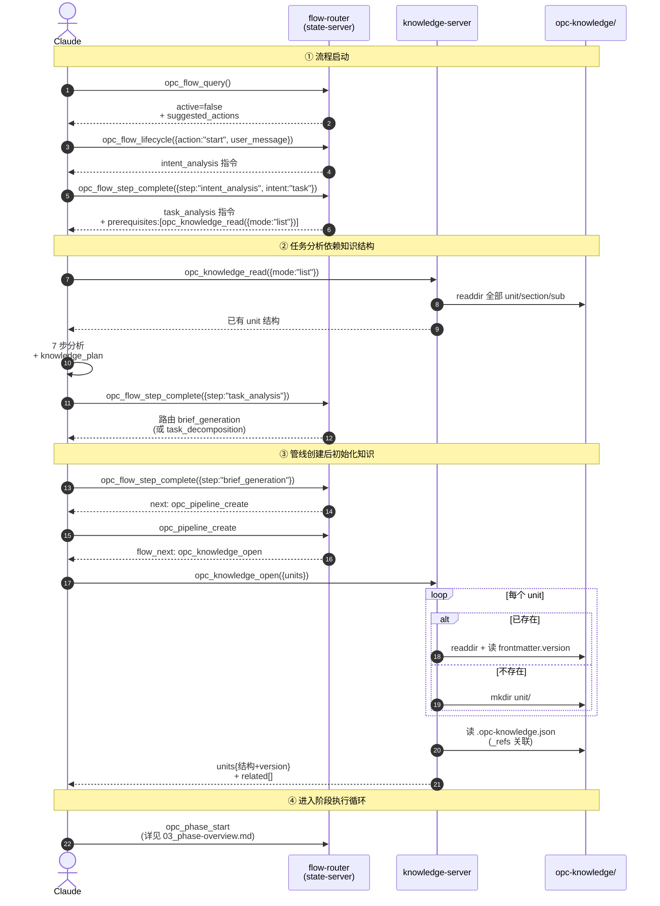

# 知识 MCP API

opc-knowledge-server 提供 **4 个工具**（`open` / `read` / `write` / `admin`）覆盖知识的 CRUD、版本管理和全文搜索。`read` 与 `admin` 通过 discriminator 字段（`mode` / `action`）路由到不同子操作。知识概念模型（三层结构、存储格式、版本管理）详见 [知识模型总览](../01-knowledge-model/00_overview.md)。

> **工具合并**：历史名 `opc_knowledge_get` / `opc_knowledge_get_batch` / `opc_knowledge_list` / `opc_knowledge_search` 已折叠为 `opc_knowledge_read({mode})` 的 discriminator 分支（`mode ∈ {single, batch, list, search, diff}`）；`opc_knowledge_delete` / `opc_knowledge_reindex` 已折叠为 `opc_knowledge_admin({action})`（`action ∈ {delete, reindex}`）。详见 [../../01-overview/07-tool-consolidation.md](../../01-overview/07-tool-consolidation.md)。

本文档已按主题拆分为多个子文档，本文是**聚合索引**，附端到端时序图与决策流程图。

---

## 管线启动中的知识工具时序图

从 flow_query 到 phase_start，knowledge 工具如何被 flow 路由穿插驱动：



---

## 工具职责边界决策流

`opc_knowledge_read` 五个 mode 的选择路径：

```mermaid
flowchart TD
    Need([Agent 需要知识]) --> Q1{已知精确路径?}

    Q1 -->|否| Q2{需要查找?}
    Q1 -->|是<br/>单条| GetOne[opc_knowledge_read<br/>mode:single<br/>unit/section/sub]
    Q1 -->|是<br/>多条| GetBatch[opc_knowledge_read<br/>mode:batch<br/>entries]

    Q2 -->|按目录结构| List[opc_knowledge_read<br/>mode:list<br/>unit / section]
    Q2 -->|按内容关键词| Search[opc_knowledge_read<br/>mode:search<br/>query]

    GetOne --> Found1{found?}
    GetBatch --> Found2{全部 found?}
    List --> Structure[返回 section/sub 列表]
    Search --> Hits[返回 snippet + score]

    Found1 -->|是| Use1[使用 content]
    Found1 -->|否| WriteNew[opc_knowledge_write<br/>创建]

    Found2 -->|是| UseBatch[使用 content[]]
    Found2 -->|否| Mixed[部分使用<br/>+ 写缺失]

    Structure --> Pick[挑选目标路径]
    Pick --> GetOne

    Hits --> Pick

    Use1 --> Decide{需要更新?}
    UseBatch --> Decide
    Mixed --> Decide

    Decide -->|是| Update[opc_knowledge_write<br/>base_version+content<br/>v+1]
    Decide -->|否| End1([读取完成])

    WriteNew --> End2([写入完成])
    Update --> WriteRes{merge_status?}
    WriteRes -->|clean / fast_forward / auto_merged| End2
    WriteRes -->|conflict| Conflict[node 不允许 complete<br/>state-server 通过 suggested_actions<br/>暴露 accept_theirs / keep_ours / spawn_merge_node]
    Conflict --> Pick

    End2 --> Idx[入队 reindex job<br/>2s debounce 异步]
    Idx --> EndAll([流程结束])
```

---

## 4 个工具速览

| # | 工具 | 说明 |
|---|------|------|
| 1 | `opc_knowledge_open` | 打开知识点：已有则返回结构树+version，没有则创建 |
| 2 | `opc_knowledge_read({mode})` | 读取，按 mode 路由：`single` 单条 / `batch` 批量 / `list` 目录结构 / `search` 全文搜索 / `diff` 3-way 合并预演 |
| 3 | `opc_knowledge_write` | 写入 .md，自动判断创建/更新，version 写入 frontmatter；写时可传 `base_version` 触发 3-way diff-and-merge |
| 4 | `opc_knowledge_admin({action})` | 管理操作，按 action 路由：`delete` 删除 subsection（传 `base_version` 不一致则 reject，不走 merge） / `reindex` 全量重建 .opc-knowledge.idx |

完整参数 / 行为 / 返回详见 [02_core-tools.md](02_core-tools.md)。

> 历史名 → 新调用对照：`opc_knowledge_get` → `opc_knowledge_read({mode:"single"})`；`opc_knowledge_get_batch` → `opc_knowledge_read({mode:"batch"})`；`opc_knowledge_list` → `opc_knowledge_read({mode:"list"})`；`opc_knowledge_search` → `opc_knowledge_read({mode:"search"})`；`opc_knowledge_delete` → `opc_knowledge_admin({action:"delete"})`；`opc_knowledge_reindex` → `opc_knowledge_admin({action:"reindex"})`。

---

## 与 state-server 协作矩阵

| 场景 | knowledge-server 角色 | state-server 角色 |
|------|----------------------|-------------------|
| 流程启动 | 被 prerequisites 驱动调用 `opc_knowledge_read({mode:"list"})` | flow tools 路由判定 |
| 管线创建 | `opc_knowledge_open` 接收 flow_next 指令 | `opc_pipeline_create` 返回 `flow_next:opc_knowledge_open` |
| node 执行 | `read({mode:"batch"})` 加载 input，`write` 产出 output | `opc_node_start` 返回 node_body + dispatch；`opc_node_finish({status:"completed"})` 校验 knowledge 文件存在性（L1） |
| 阶段回退 | 接收 phase_reset 触发的 base_version 写入（v+1，走标准 diff-and-merge） | `opc_flow_correct({action:"phase_reset"})` 走 git checkout 锚点 + `opc_knowledge_write` 链路 |
| 搜索 | `read({mode:"search"})` / `read({mode:"list"})` / `admin({action:"reindex"})` | 无感知 |

完整启动时序详见 [03_initialization-flow.md](03_initialization-flow.md)。

---

## 子文档导航

| 子文档 | 内容 |
|------|------|
| [02_core-tools.md](02_core-tools.md) | 4 个工具完整规范（参数、行为、返回） |
| [03_initialization-flow.md](03_initialization-flow.md) | 管线启动中的知识工具时序文本版 |

---

## 核心设计原则

- **写入原子性**：单文件原子写，version 在 frontmatter，无需跨文件事务
- **索引可重建**：`.opc-knowledge.idx` 损坏时自动降级遍历 + 显式 `opc_knowledge_admin({action:"reindex"})`
- **批量优先**：`opc_knowledge_read({mode:"batch"})` 一次性加载，减少 sub-agent 的 round-trip
- **跨 unit 通过 _refs**：在 `.opc-knowledge.json` 显式声明依赖，open 时自动联动
- **reindex 不进 sub-agent 上下文**：`opc_knowledge_write` 入队即返回（debounce 2s），reindex 在 knowledge-server 主进程跑；node 边界 hard flush 保证下一个 sub-agent 不漏读。完整契约见 [02_core-tools.md § 2.9 reindex 调度契约](02_core-tools.md#29-reindex-调度契约异步--节点级-flush)

---

## 相关文档

- [知识模型](../01-knowledge-model/00_overview.md) — 概念模型、存储结构、版本管理
- [意图分析](../../02-opc-state-server/01-intent-analysis/00_overview.md) — 流程状态机 + 方法论文档协作
- [节点](../../02-opc-state-server/04-node/00_overview.md) — 节点定义中的 knowledge input/output 声明
- [管线](../../02-opc-state-server/02-pipeline/00_overview.md) — 管线创建与状态管理
- [../../01-overview/07-tool-consolidation.md](../../01-overview/07-tool-consolidation.md) — 54→28 工具合并方案
