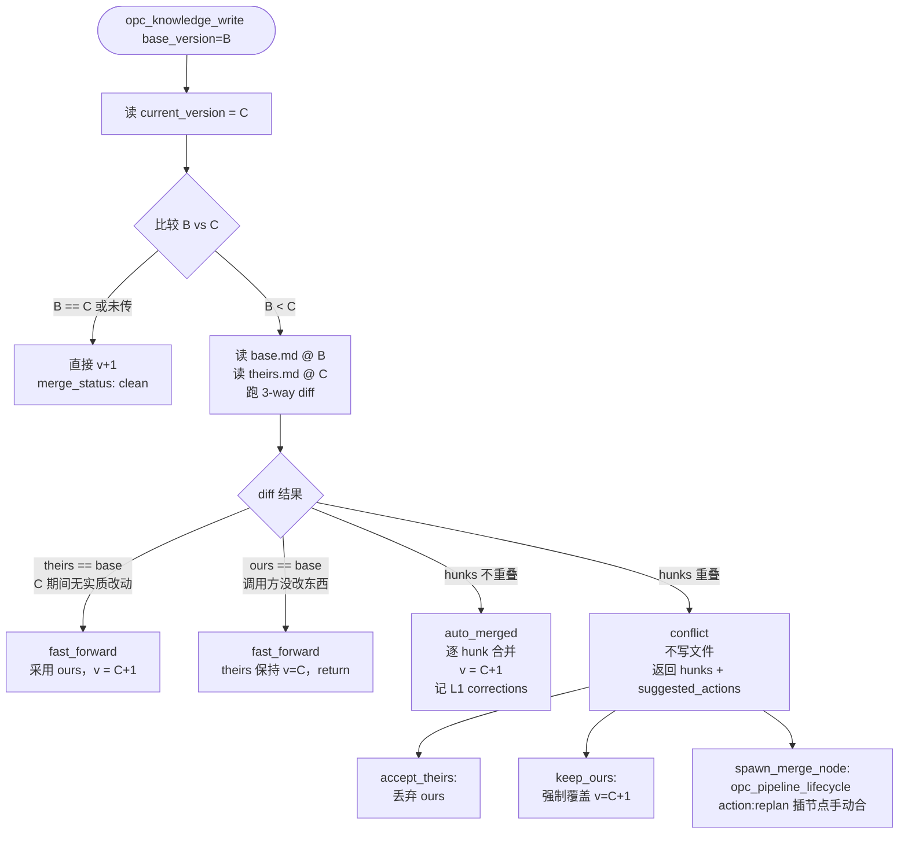

# 02 核心 API

> 本文档是 [知识 API 总览](00_overview.md) 的子文档。其他子文档：
> [初始化时序](03_initialization-flow.md)

opc-knowledge-server 对外暴露 **4 个 MCP 工具**。`opc_knowledge_read` 通过 `mode` discriminator 路由到 5 种读操作（`single` / `batch` / `list` / `search` / `diff`）；`opc_knowledge_admin` 通过 `action` discriminator 路由到 2 种管理操作（`delete` / `reindex`）。

> **工具合并**：历史名 `opc_knowledge_get` / `opc_knowledge_get_batch` / `opc_knowledge_list` / `opc_knowledge_search` 已折叠为 `opc_knowledge_read({mode})`；`opc_knowledge_delete` / `opc_knowledge_reindex` 已折叠为 `opc_knowledge_admin({action})`。详见 [../../07-tool-consolidation/00_overview.md](../../07-tool-consolidation/00_overview.md)。

---

## 2.1 `opc_knowledge_open` — 打开知识点

```
参数: units: string[]
行为:
  ① 遍历每个 unit:
    → 已存在 → readdir 扫描 section/ → 读每个 .md 的 frontmatter 取 version
    → 不存在 → 创建 unit 目录
  ② 查找 _refs 关联的 unit:
    → 读取 .opc-knowledge.json 的 _refs
    → 关联 unit 标记为可读（Agent 可跨 unit 加载知识）
  ③ 汇总返回（version 来自 .md frontmatter）

返回:
{
  units: {
    "user-auth": {
      "login":    { "api": {version:2}, "ui": {version:1} },
      "register": { "api": {version:1} },
      "session":  { "api": {version:3}, "model": {version:2} }
    }
  },
  related: ["authorization"]
}
```

---

## 2.2 `opc_knowledge_read` — 统一读取入口

请求体顶层必含 `mode` 字段（discriminator），路由到 single / batch / list / search / diff 子分支。

```
公共参数:
  mode: "single" | "batch" | "list" | "search" | "diff"

discriminator 分支:
  mode="single"  → 见 §2.2.1
  mode="batch"   → 见 §2.2.2
  mode="list"    → 见 §2.2.3
  mode="search"  → 见 §2.2.4
  mode="diff"    → 见 §2.2.5（详见 §2.10）
```

---

### 2.2.1 `opc_knowledge_read({mode:"single"})` — 读取单条知识

```
参数: { mode:"single", unit, section, subsection, version? (可选) }
返回: { content, version, updated_at } | null
若不存在则返回 null
若指定 version 则返回对应版本（走 git history），不传返回最新
```

---

### 2.2.2 `opc_knowledge_read({mode:"batch"})` — 批量读取

```
参数: { mode:"batch", entries: [{unit, section, subsection, min_version?}] }
返回: [{ unit, section, subsection, content, version, updated_at, found }]
一次性读取多条知识，避免 Agent 逐条调用的 round-trip。
opc_node_start 内部固定走此 mode 加载 input.knowledge。
```

---

### 2.2.3 `opc_knowledge_read({mode:"list"})` — 列出知识结构

```
参数: { mode:"list", unit, section? (可选), subsection? (可选) }
行为: readdir 直接扫描目录结构，不读文件内容（5000+ 文件无性能问题）

返回:
  只传 unit → 返回该 unit 下所有 section 及 subsection 列表
  传 unit + section → 返回该 section 下所有 subsection 列表
  传 unit + subsection → 返回该 unit 下所有包含此 subsection 的 section

例: opc_knowledge_read({mode:"list", unit:"user-auth"})
      → [login, register, logout, session]
    opc_knowledge_read({mode:"list", unit:"user-auth", section:"login"})
      → [api, ui, architecture]
    opc_knowledge_read({mode:"list", unit:"user-auth", subsection:"api"})
      → [login/api, register/api, session/api]
```

---

### 2.2.4 `opc_knowledge_read({mode:"search"})` — 全文搜索

```
参数: { mode:"search", query, unit? (可选), consistency?: "eventual" | "fresh" (默认 eventual) }
返回: [{ unit, section, subsection, snippet, score, indexed_at }, ...]
行为:
  → consistency == "eventual"（默认）:
      走 .opc-knowledge.idx；索引不存在或损坏 → 自动降级遍历 .md 文件
      可能漏读最近 ≤ 2s 内的写入（reindex debounce 窗口，详见 § 2.9）
  → consistency == "fresh"（关键场景，如反思 sub-agent 校验 evidence）:
      若有 pending reindex job → 先等待 flush（最多 5s），再走 .idx
      超时则降级遍历 .md，保证不漏读
```

---

### 2.2.5 `opc_knowledge_read({mode:"diff"})` — 3-way 合并预演

详见 [§ 2.10](#210-版本冲突与-3-way-diff-and-merge-契约)。

---

## 2.3 `opc_knowledge_write` — 写入知识

```
参数:
  unit, section, subsection, content
  base_version?: number              # 调用方刚才 read 到的 version（乐观锁）
  metadata?: {pipeline_id, node}

行为:
  → 检查 opc-knowledge/<unit>/<section>/<subsection>.md
    ├── 不存在
    │   └── 创建 section 目录 + 文件，version: 1，merge_status: "clean"
    └── 已存在 → 读 current_version
        ├── 不传 base_version          → 直接 v+1 写入，merge_status: "clean"
        │                                 （兼容：旧调用方 / 创建后首次更新）
        ├── base_version == current     → v+1 写入，merge_status: "clean"
        └── base_version <  current     → 触发 3-way diff-and-merge（详见 § 2.10）
                                          base=base_version 的快照
                                          ours=本次 content
                                          theirs=current_version 的内容
  → 写入 frontmatter（version, updated_at, pipeline_id, node）
  → 内容覆盖写入（单文件原子操作）
  → **入队 reindex job**（不阻塞调用方；详见 § 2.9 reindex 调度契约）

返回:
  merge_status: "clean" | "fast_forward" | "auto_merged" | "conflict"
  { unit, section, subsection, version, merge_status, reindex_enqueued: true }
  conflict 时额外返回:
  { merge_status: "conflict", hunks: [...], suggested_actions:
    ["accept_theirs", "keep_ours", "spawn_merge_node"], written: false }
```

> **注**：`opc_node_finish({status:"completed"})` L1 evidence 校验时若收到 `merge_status="conflict"`，会拒绝节点完成并把 `suggested_actions` 通过 `opc_flow_query` 暴露给 Claude；不会自动 keep_ours 静默覆盖。

---

## 2.4 `opc_knowledge_admin` — 统一管理入口

请求体顶层必含 `action` 字段（discriminator），路由到 delete / reindex 子分支。

```
公共参数:
  action: "delete" | "reindex"

discriminator 分支:
  action="delete"   → 见 §2.4.1
  action="reindex"  → 见 §2.4.2
```

---

### 2.4.1 `opc_knowledge_admin({action:"delete"})` — 删除知识

```
参数: { action:"delete", unit, section, subsection, base_version?: number }
行为:
  → 若传了 base_version 且 ≠ current_version → **reject**（删除不走 merge）
    返回 { deleted: false, reason: "version_mismatch", current_version }
  → 删除文件
  → 若 section 目录为空，删除目录
  → **入队 reindex job**（同 § 2.9）
返回: { deleted: true, reindex_enqueued: true }
```

> **为什么 delete 不走 merge**：删除 vs 改动无法做 3-way diff，且后果重（文件没了）。强制传 base_version 并 reject 不一致，让调用方显式重读再决定是否真的要删。

---

### 2.4.2 `opc_knowledge_admin({action:"reindex"})` — 重建搜索索引

```
参数: { action:"reindex", mode?: "full" | "incremental" } (默认 incremental)
行为:
  → full:        遍历 opc-knowledge/ 下所有 .md，全量重建 .opc-knowledge.idx
  → incremental: 只重建调度队列 dirty_paths[] 中的条目（详见 § 2.9）
返回: { indexed: number, mode, duration_ms }
```

`opc_knowledge_admin({action:"reindex"})` **不是 Claude 路径的常规工具**，主要用于：
- 启动时检测到 `.idx` 缺失/损坏的自愈
- `opc_node_finish({status:"completed"})` 完成时的 flush 触发点（详见 § 2.9 节点级 flush）
- 用户在 `/opc-status` 看到 stale-window 异常时的手动修复

---

## 2.9 reindex 调度契约（异步 + 节点级 flush）

### 背景

`opc_knowledge_write` 触发后必须更新 `.opc-knowledge.idx`，否则 `opc_knowledge_read({mode:"search"})` 漏读新内容。但**直接同步 reindex 会拖慢 sub-agent**——一个 node 内多次 write 就要重建多次索引，扰动 sub-agent 上下文且无意义。

R6 的核心矛盾：**sub-agent 上下文不能背 reindex**，但 search 也不能漏读。

### 设计：debounce 异步队列 + node 边界强 flush

```
            ┌──────────────────────────────────────────┐
            │   knowledge-server 主进程（MCP server）    │
            │                                          │
write 调用 → │  ┌─────────────┐    ┌──────────────────┐ │
            │  │ dirty queue │ →  │  reindex worker  │ │
            │  │ Set<path>   │    │  (debounce 2s)   │ │
            │  └─────────────┘    └────────┬─────────┘ │
            │                              │           │
            │                              ▼           │
            │                      .opc-knowledge.idx │
            └──────────────────────────────────────────┘
                       ▲
                       │ Hard flush 触发点：
                       ├─ opc_node_finish({status:"completed"}) 调用
                       ├─ opc_phase_complete 调用
                       ├─ opc_knowledge_read({mode:"search", consistency:"fresh"})
                       └─ opc_knowledge_admin({action:"reindex"}) 显式调用
```

### 工程细节

| 维度 | 设计 |
|---|---|
| **跑在哪里** | knowledge-server 的**主进程**（与 stdio MCP 同进程），用 `setImmediate` / Node worker thread；**不在 sub-agent 上下文里跑** |
| **触发** | `opc_knowledge_write` / `opc_knowledge_admin({action:"delete"})` 调用时把 path 推入 `dirty_paths: Set<string>` 后立刻返回 |
| **debounce** | 默认 2s（`OPC_REINDEX_DEBOUNCE_MS` 可配）。短时间内多个 write 合并为一次 incremental reindex |
| **失败处理** | reindex 抛错 → 不阻塞写；error 写 `opc-logs/knowledge-reindex.log`；下次 search 检测到 `.idx.broken` 标记 → 自动降级遍历 |
| **进程退出** | knowledge-server 进程退出前必须 flush 队列（注册 `process.on('beforeExit')` hook）；崩溃则 `.idx` 滞后，下次启动自检 → 自动 incremental reindex |
| **并发写合并** | OPC 内部串行模型保证同一时刻只有一个 sub-agent 在跑 → 同 `subsection.md` 不会被并发写；队列只需 Set 去重 |

### Hard flush 触发点

knowledge-server 在以下时机**同步 flush** dirty queue（最多 5s 超时）：

| 触发 | 调用方 | 目的 |
|---|---|---|
| `opc_node_finish({status:"completed"})` 被 state-server 接收时 | state-server 内部跨进程通知 knowledge-server flush | 保证 node 边界后下一个 node 的 sub-agent search 不漏读上个 node 的产物 |
| `opc_phase_complete` 同上 | state-server | 跨 phase / sub-pipeline 切换前的强一致点 |
| `opc_knowledge_read({mode:"search", consistency:"fresh"})` | 反思 sub-agent 等关键路径 | 校验 evidence 时不漏读 |
| `opc_knowledge_admin({action:"reindex"})` 显式调用 | 用户 / 自愈脚本 | 修复异常 |

> **跨进程通知 = 文件信号**：state-server 不直接调 knowledge-server 的内部函数。`opc_node_finish({status:"completed"})` 写一个标记文件 `.opc/sessions/<id>/.knowledge-flush-required`，knowledge-server 主进程 fs.watch 监听并 flush。简单可靠、无 IPC 复杂度。

### `opc_node_finish({status:"completed"})` 的 reindex 协作

```
state-server.opc_node_finish({status:"completed"}, node_evidence) 内部:
  1. L1 evidence 校验 + L2 unblocked_by 校验
  2. 若 evidence.artifacts[] 含 knowledge_write 标记:
     → touch .opc/sessions/<id>/.knowledge-flush-required
     → 同步等 knowledge-server flush 完成（最多 5s）或超时降级
  3. P6 节点执行反思（若有）
  4. 路由 flow_next
```

### 与 sub-agent 上下文的解耦

| 不变量 | 强度 |
|---|---|
| sub-agent **不应**调 `opc_knowledge_admin({action:"reindex"})` | **约定**（kit 规范）。sub-agent 的 `allowed_tools` 不允许包含该工具 |
| sub-agent `opc_knowledge_write` 返回 `{reindex_enqueued: true}` 即返回，不等 reindex 完成 | **hard** |
| reindex 失败永不影响 write 的 success 返回 | **hard** |
| sub-agent 在同一 node 内多次 search **可能** stale ≤ 2s | **acceptable**（同 node 内 sub-agent 通常通过 `read({mode:"batch"})` 拿自己刚写的内容，不靠 search） |

### 失败模式与降级链

| 失败 | 降级 |
|---|---|
| reindex worker hang | 队列堆积 > 50 → `.idx.broken` 标记 → search 全部降级遍历 |
| `.opc-knowledge.idx` 损坏 | search 检测 → 自动降级遍历 + 后台触发 `opc_knowledge_admin({action:"reindex", mode:"full"})` |
| Hard flush 5s 超时 | `opc_node_finish({status:"completed"})` 不阻塞，返回 warning `{knowledge_index_stale: true}`，state-server 在下一次 search 前重试 |
| knowledge-server 进程崩溃后启动 | 启动自检脚本扫 `.md` 文件 mtime > `.idx` mtime → 自动 incremental reindex |

---

## 2.10 版本冲突与 3-way diff-and-merge 契约

### 背景：两条 version 路径不要混淆

| 路径 | 字段位置 | 触发时机 | 失败语义 |
|---|---|---|---|
| **input 侧** | node frontmatter `input.knowledge[].min_version` | `opc_node_start` 前置条件校验 | **reject node 启动**（正向调度信号，让路由先跑能产出新版本的节点；也是 P5 反思 V2 referential 校验抓手） |
| **write 侧** | `opc_knowledge_write({base_version})` | 写入时检测是否被并发改过 | **3-way diff-and-merge**（本节描述） |

input 侧的 `min_version` **保持 reject 不变**，本节只描述 write 侧 base_version 的处理。

### 何时会触发 write 冲突

OPC 默认串行执行（同一时刻只有一个 sub-agent 跑），但以下边界场景会出现 `base_version < current_version`：

1. **sub-pipeline 插入恢复**：sub-pipeline A 读了 `user-auth/session/api@v3` 后被挂起 → temp sub-pipeline B 写出 v4 → A resume 后基于 v3 继续写
2. **跨 session 接管**：旧 session 在节点中段崩溃，新 session 接管后另一条路径已更新该 unit
3. **用户在两次 session 间手工编辑了 .md** 导致 disk version 跳变
4. **L3 corrections 注入**改写了某 unit，原 sub-agent 不知情

### 3-way diff-and-merge 决策



### diff 粒度

- 行级 unified diff，knowledge 文件都是 markdown，行级足够
- frontmatter 不参与 diff（version / updated_at 永远是新的）
- hunks 按 `---` section 分隔检测重叠：同一 markdown section 内的修改视为重叠

### 调用方协议

| 谁负责传 base_version | 怎么传 |
|---|---|
| **node sub-agent**（标准路径） | 写之前先 `opc_knowledge_read({mode:"single"})` 取到 version → write 时回传作为 base_version |
| **node sub-agent**（新建 subsection） | 不传 base_version（文件不存在 → merge_status: clean） |
| **L1/L2/L3 corrections 注入** | reflection-server 写时**必须**传 base_version；否则反思可能静默覆盖 sub-agent 的产出 |
| **knowledge-server 内部 reindex** | 不调 write，不涉及 |

### 与 `opc_node_finish({status:"completed"})` 的衔接

```
state-server.opc_node_finish({status:"completed"}, node_evidence) 内部:
  1. L1 evidence 校验
     → 若 evidence.artifacts[] 中任一 write 返回 merge_status="conflict":
       → node 不允许 complete
       → state-server 通过 opc_flow_query 向 Claude 暴露 suggested_actions
       → Claude 选择后回到节点内再次写入
  2. L2 unblocked_by 校验
  3. 若 evidence.artifacts[] 含 knowledge_write 标记 → touch flush-required（见 § 2.9）
  4. P6 节点执行反思（若有）
  5. 路由 flow_next
```

### `opc_knowledge_read({mode:"diff"})` — 显式查 diff

调用方需要在 write 之前**预演** diff（比如 reflection-server 评估"如果我现在写下去会不会冲突"），可走 `opc_knowledge_read` 的 diff 模式：

```
opc_knowledge_read({
  mode: "diff",
  unit, section, subsection,
  base_version: 3,
  candidate_content?: string    # 可选，传则做 3-way 预演
})

返回:
  {
    base_version: 3,
    current_version: 5,
    hunks: [{op: "add"|"remove"|"context", lines: [...]}],
    overlap_with_candidate?: boolean,
    predicted_merge_status?: "fast_forward" | "auto_merged" | "conflict"
  }
```

### 历史版本依赖

3-way diff 需要读 base_version 的内容。当前存储模型 `.md` 只保留最新版本，**历史版本依赖 git**（OPC 在 phase_complete 时会自动 commit knowledge 变更，见 [phase 文档](../../02-opc-state-server/03-phase/00_overview.md)）。

| base_version 可达性 | 处理 |
|---|---|
| `base_version` 在 git history 内可找到 | `git show <commit>:opc-knowledge/...` 读出 base 内容 |
| `base_version` 找不到（极少：sub-pipeline 挂起跨越多次 phase commit 后内容被 squash） | 降级为 2-way diff（ours vs theirs），重叠判定一律按 conflict 上抛 |

---

## 相关文档

- [00_overview.md](00_overview.md#4-个工具速览) — 工具速览
- [03_initialization-flow.md](03_initialization-flow.md) — 流程启动中的工具时序
- [00_overview.md](00_overview.md#与-state-server-协作矩阵) — 与 state-server 的协作分工
- [../../07-tool-consolidation/00_overview.md](../../07-tool-consolidation/00_overview.md) — 54→28 工具合并方案
