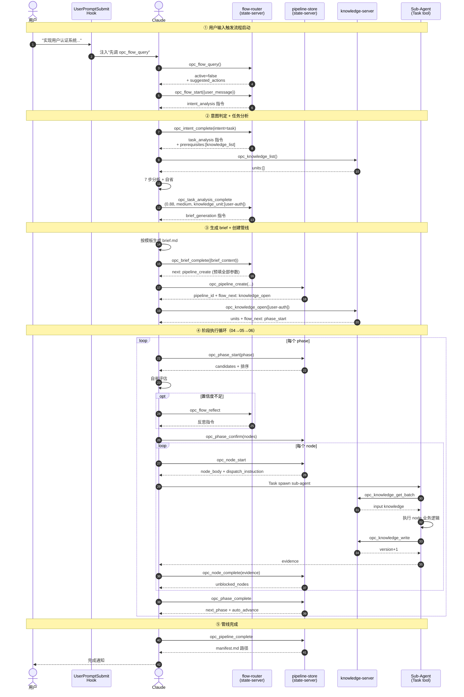
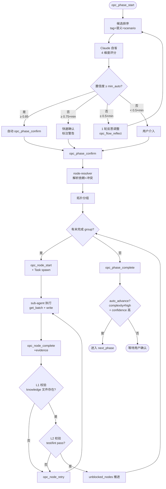

# 端到端走查：从 0 到 1 实现需求

以"实现用户认证系统（邮箱登录 + Session 管理）"为例，从头到尾逐步追踪 MCP 调用链与状态演进。

本文档已按主题拆分为多个子文档，本文是**聚合索引**，附端到端时序图与决策流程图。

---

## 端到端流程时序图

从用户输入到 pipeline_complete 的完整 MCP 调用链：

---

## 走查阶段决策流程图

每个 phase 内的决策路径（节点选择 → 反思 → 执行 → 推进）：

---

## 子文档导航

| 子文档 | 内容 |
|------|------|
| [walkthrough/01_user-input.md](01_user-input.md) | 第一步：用户输入 + 知识库初始状态 |
| [walkthrough/02_flow-startup.md](02_flow-startup.md) | 第二步：流程启动 + 意图分析 + 任务分析 |
| [walkthrough/03_brief-to-create.md](03_brief-to-create.md) | 第三步：brief 生成 + pipeline_create + knowledge_open |
| [walkthrough/04_phase-04-implement-design.md](04_phase-04-implement-design.md) | 第四步：Phase 04-implement-design（api-design + database-schema）|
| [walkthrough/05_phase-05-implement.md](05_phase-05-implement.md) | 第五步：Phase 05-implement（含反思调整）|
| [walkthrough/06_phase-06-testing.md](06_phase-06-testing.md) | 第六步：Phase 06-testing |
| [walkthrough/07_pipeline-complete.md](07_pipeline-complete.md) | 第七、八步：pipeline_complete + 最终知识库 + MCP 调用汇总 |

---

## 核心设计亮点（贯穿走查）

- **MCP 状态机驱动**：每一步由 flow-router 返回 step_instruction + next 工具，Claude 无需自行查阅文档
- **方法论文档按需引用**：flow tools 返回 methodology.docs，Claude 仅在自省不足或反思时读
- **预填参数减少决策**：`opc_brief_complete` 直接预填 `opc_pipeline_create` 的全部参数
- **flow_next 链式推进**：pipeline_create → knowledge_open → phase_start 串成自动链
- **Sub-agent 隔离执行**：node 内 Task spawn 隔离 context，sub-agent 自主调 knowledge 工具
- **L1+L2 双层校验**：knowledge 文件存在性（L1）+ 节点声明的 quality_gates（L2）

---

## 相关文档

- [02_test-overview.md](../02-test/00_overview.md) — 10 个测试场景从简单到复杂
- [../02-opc-state-server/01-intent-analysis/00_overview.md](../../02-opc-state-server/01-intent-analysis/00_overview.md) — 流程状态机
- [../02-opc-state-server/02-pipeline/00_overview.md](../../02-opc-state-server/02-pipeline/00_overview.md) — 管线模型
- [../02-opc-state-server/03-phase/00_overview.md](../../02-opc-state-server/03-phase/00_overview.md) — 阶段模型
- [../02-opc-state-server/04-node/00_overview.md](../../02-opc-state-server/04-node/00_overview.md) — 节点模型
- [../03-opc-knowledge-server/01-knowledge-model/00_overview.md](../../03-opc-knowledge-server/01-knowledge-model/00_overview.md) — 知识模型
- [../03-opc-knowledge-server/02-knowledge-api/00_overview.md](../../03-opc-knowledge-server/02-knowledge-api/00_overview.md) — 知识 API
