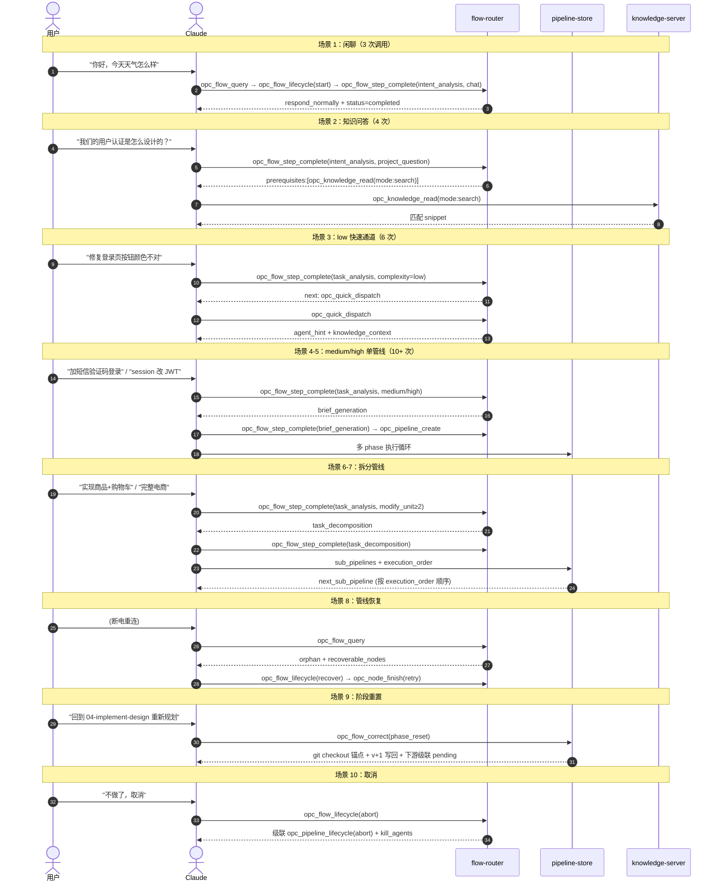
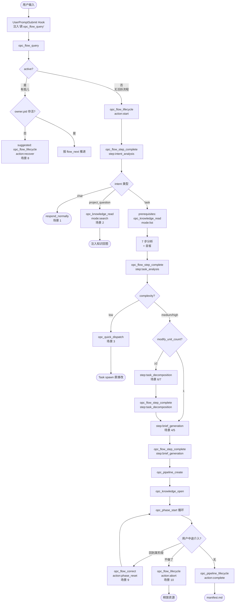

# OPC 完整链路测试

10 个输入从简单到复杂，逐条追踪 MCP 调用链，检查工具覆盖和流程完整性。

本文档已按主题拆分为多个子文档，本文是**聚合索引**，附场景对比时序图与意图路由决策流程图。

> **工具名约定**：本章及全部子文档统一使用 [07-tool-consolidation](../../07-tool-consolidation/00_overview.md) 合并后的新工具名（24 工具集，discriminator 模式）。旧名 alias 保留到 v2.2，v2.3 移除（详见本文档 [v2.x 工具名迁移时间线](#vx-工具名迁移时间线)）。

---

## 10 场景对比时序图

10 个场景在 MCP 状态机中走过的不同路径：

---

## 意图路由决策流程图

10 个场景的分流逻辑都汇聚到这张图：

---

## 子文档导航

| 子文档 | 场景 | 调用次数 |
|------|------|---------|
| [test/01_chat.md](01_chat.md) | 闲聊 | 3 |
| [test/02_project-question.md](02_project-question.md) | 项目知识问答 | 4 |
| [test/03_low-complexity.md](03_low-complexity.md) | low 快速通道 | 6 |
| [test/04_medium-single.md](04_medium-single.md) | 中等复杂度单管线 | ~30 |
| [test/05_high-single.md](05_high-single.md) | 高复杂度单管线 | ~30 |
| [test/06_split-3-sub.md](06_split-3-sub.md) | 3 子管线 | ~50 |
| [test/07_split-5-sub.md](07_split-5-sub.md) | 5 子管线（完整电商） | ~100 |
| [test/08_recovery.md](08_recovery.md) | 管线恢复（断电重连） | ~3 + 续跑 |
| [test/09_phase-reset.md](09_phase-reset.md) | 阶段重置 | ~2 + 重跑 |
| [test/10_abort.md](10_abort.md) | 取消管线 | 2 |
| [test/11_registry-guard-reject.md](11_registry-guard-reject.md) | 反思未登记被 guard 拒绝（负向） | ~5 |
| [test/12_reflection-rounds-exceeded.md](12_reflection-rounds-exceeded.md) | 反思 rounds 耗尽 A3 闭环 | ~8 |
| [test/13_insert-resume.md](13_insert-resume.md) | 子管线插队 + 自动 resume | ~10 |
| [test/14_reflection-tool-surface.md](14_reflection-tool-surface.md) | 反思工具面 5 步 + 3 步 inline | ~12 |

---

## 已修复的问题（混合方案落地）

| # | 测试 | 原问题 | 已修复方式 |
|---|------|--------|-----------|
| 1 | #3 | low 复杂度时 Agent 缺知识引导 | opc_quick_dispatch 返回 agent_hint + knowledge_context + dispatch_context；流程内部 status=completed |
| 2 | #6 | 跨子管线的 next 检测无通知 | `opc_phase_complete` 返回 `pipeline_progress.next_sub_pipeline` + `flow_next` |
| 3 | #7 | 子管线失败对 downstream 的影响 | state-manager 聚合规则：blocked_by 全 completed 且 upstream 无 failed |
| 4 | #8 | crash 导致的脏 in_progress 状态 | `opc_flow_lifecycle({action:"recover"})` 自动 timeout 检测，标记 failed |
| 5 | #4 | 并行场景误解锁下游 | unblocked_nodes 严格语义（blocked_by 全 completed 才返回） |
| 6 | #5 | auto_advance 计算规则不明 | 公式落地到 `phase/08_tools-and-automation.md 自动机制` |
| 7 | 全部 | 反思循环零持久化 | `opc_flow_reflect` 按 step_id 分流：task→flow-state；node_selection→state.json + flow-state 指针 |
| 8 | 全部 | pipeline 文档链无硬跳转 | MCP 状态机驱动 + methodology 引用 |
| 9 | 全部 | hook 重复触发会覆盖流程 | hook 改为提示调 opc_flow_query，由 query + Claude 决策 9 种延续模式 |
| 10 | #1, #2, #3 | project_question / chat / low 流程不终结 | `opc_flow_step_complete({step:"intent_analysis"})` / `opc_quick_dispatch` 内部自动标记 status=completed |
| 11 | #10 | abort 不处理 in_progress sub-agent | `opc_flow_lifecycle({action:"abort"})` + `opc_pipeline_lifecycle({action:"abort", kill_agents: true})` 默认杀进程 |
| 12 | 全部 | 跨步骤参数无累积存储 | flow-state.json schema 完整定义 + accumulated 字段 |
| 13 | 全部 | crash 后无法精确恢复到 phase/node | 阶段/节点工具同步更新 current_pipeline_pointer + heartbeat |
| 14 | 全部 | 工具乱序调用无保护 | 每个 F 工具前置校验 current_step ∈ expected_steps |
| 15 | #11 | 反思 pending 未登记可被推进 | reflection-registry-guard 拦截后 9 项保护清单工具，返回 PENDING_REFLECTION |
| 16 | #12 | 反思死循环耗尽预算 | A3 闭环：rounds_exceeded → pending_user_question → `opc_flow_user_reply` → `_skip_reflection_once` |
| 17 | #13 | 长管线无法中途插队子任务 | `opc_pipeline_lifecycle({action:"replan", add_sub_pipeline, execution_priority:"immediate"})` + node 边界 paused + 自动 resume |
| 18 | A1 | HTTP/SSE 模式下 owner.pid + kill 探活失效 | C6 落地：`Mcp-Session-Id` 作主归属键 + heartbeat ledger 替代 kill 探活 + session/project 双层 advisory lock（详见 [06-host-contract/00_overview.md 2.7-pre C6](../../06-host-contract/00_overview.md#27-prec6httpsse-模式-session-归属与孤儿恢复a1)） |
| 19 | A2 | V4/V5 未验前 `OPC_HOOK_INTENSITY=loud` 默认不安全 | C5 修订：v1 默认 `quiet`（关键词命中或已有活跃流程时才注入），V4/V5 PoC 通过后再考虑提升默认（详见 [06-host-contract/00_overview.md 2.6](../../06-host-contract/00_overview.md#26-c5hook-注入策略)） |
| 20 | A3 | distiller sub-agent 提示词与 L1→L2 通路无落地 | 新增 [05-opc-reflection-server/03-corrections-store/05_distiller-agent.md](../../05-opc-reflection-server/03-corrections-store/05_distiller-agent.md)：输入/输出 schema + 提示词模板 + 相似度合并阈值 0.72 + 失败模式可观测 |
| 21 | A4 | kit 装完未重启时链路深处才报 "Agent type not found" | 新增 `.opc/installed-kits.json` + `opc_flow_query` 启发式对账，预报 `KIT_PROBABLY_NOT_LOADED` 警告；`opc_pipeline_create` 预检直接 reject `KIT_NOT_LOADED_PRE_FLIGHT`（详见 [06-host-contract/00_overview.md 2.7.5](../../06-host-contract/00_overview.md#275-server-端-kit-未加载-主动检测a4)） |

---

## 流程修改/纠错能力（新工具集）

| 用户意图 | 工具 | 说明 |
|---------|------|------|
| 启动新任务 | `opc_flow_lifecycle({action:"start"})` | active=false 时由 query 引导调用 |
| 延续推进 | 按 flow_next 推进 | 不调任何 flow 工具 |
| 修改累积参数 | `opc_flow_correct({action:"revise", field, value})` | complexity / phases / scenario 等局部修订 |
| 回退某分析步骤 | `opc_flow_correct({action:"restart", from_step, additional_input?})` | 保留前置 accumulated，可附补充输入 |
| 管线内增删节点 | `opc_pipeline_lifecycle({action:"replan", changes})` | 细粒度：add_phase_node / remove / replace / add_phase / change_complexity |
| 长管线中途插队 | `opc_pipeline_lifecycle({action:"replan", add_sub_pipeline, execution_priority:"immediate"})` | node 边界挂起当前 sub → 插队 sub 跑完 → 自动 `opc_pipeline_lifecycle({action:"resume"})` |
| 废弃某阶段产出 | `opc_flow_correct({action:"phase_reset"})` | git checkout confirm 锚点 + v+1 写回 |
| 彻底放弃 | `opc_flow_lifecycle({action:"abort"})` | 自动级联 `opc_pipeline_lifecycle({action:"abort", kill_agents:true})` |
| 恢复孤儿流程 | `opc_flow_lifecycle({action:"recover"})` | pid 接管 + 超时检测 + 级联 pipeline 恢复 |
| 调试可观测 | `opc_flow_query` | 查看 snapshot + history + reflection_log |
| 反思登记 | `opc_flow_reflect({reflection_id})` | pending_reflection 锁解除唯一入口 |
| 反思预算耗尽时回话 | `opc_flow_user_reply({question_id, decision})` | A3 闭环：跳过本次反思 / 重启 / 终止 |

---

## v2.x 工具名迁移时间线

| 版本 | 状态 | 行为 |
|------|------|------|
| v2.0 | 双名共存 | server 同时响应旧名（如 `opc_intent_complete`）和新名（如 `opc_flow_step_complete({step:"intent_analysis"})`），旧名不发 warning |
| v2.1 | 双名共存 + warning | 调用旧名时，server 返回结果同时在 `_warnings: [{level:"deprecation", from:"opc_intent_complete", to:"opc_flow_step_complete({step:'intent_analysis'})"}]` 中提示 |
| v2.2 | 双名共存 + 强 warning | warning 升级到 `level:"error"`，client SDK / Claude 系统提示中突出显示；文档不再展示旧名 |
| v2.3 | 移除旧名 | 仅响应新名；旧名调用直接 reject `{code:"UNKNOWN_TOOL", suggest:"<new name>"}` |

**迁移期长度**：v2.0 → v2.3 至少跨越 2 个发布周期（约 6–12 周），确保所有依赖方完成切换。详见 [07-tool-consolidation/00_overview.md 二·5 迁移策略](../../07-tool-consolidation/00_overview.md#25-迁移策略)。

---

## 待评估问题（P2 优先级）

| # | 问题 | 建议 |
|---|------|------|
| 1 | `opc_knowledge_write` 不更新 _refs | 加 `refs?: string[]` 参数显式声明 |
| 2 | ~~多 session 并发写同一 knowledge~~ | 串行执行下不存在此问题，已关闭 |
| 3 | project_question 升级 task 上下文丢失 | 缓存 last-query.json |
| 4 | knowledge_open 跨子管线聚合策略 | 当前选 A（聚合 open 所有 unit），文档已明确 |
| 5 | sub-agent 工具权限校验 | kit 的 agents/*.md 强制声明必备工具集 |

---

## 相关文档

- [01_walkthrough-overview.md](../01-walkthrough/00_overview.md) — 端到端走查（同 medium-single 场景的全展开）
- [../02-opc-state-server/01-intent-analysis/00_overview.md](../../02-opc-state-server/01-intent-analysis/00_overview.md) — 流程状态机
- [../03-opc-knowledge-server/02-knowledge-api/00_overview.md](../../03-opc-knowledge-server/02-knowledge-api/00_overview.md) — 知识 API
- [../07-tool-consolidation/00_overview.md](../../07-tool-consolidation/00_overview.md) — 工具合并规范（54 → 24）
