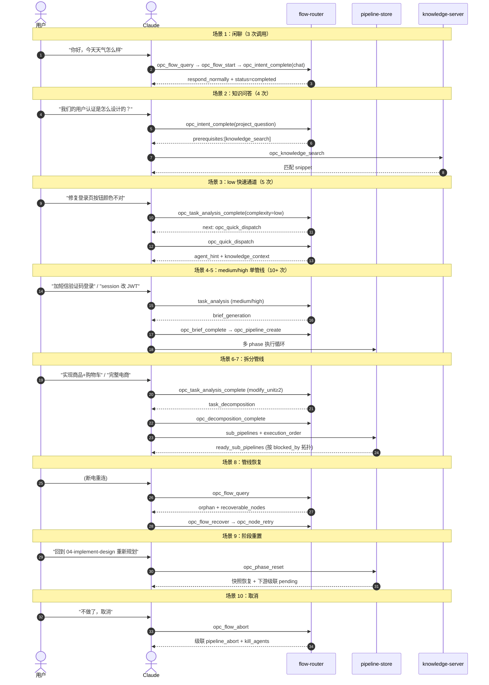
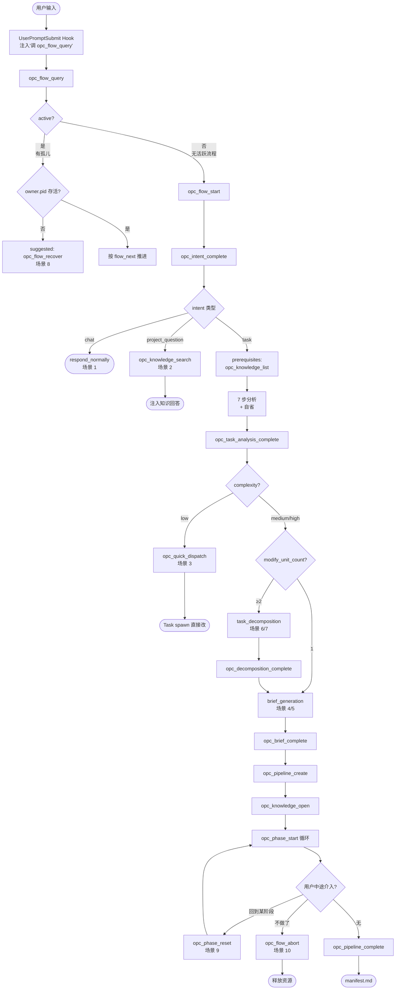

# OPC 完整链路测试

10 个输入从简单到复杂，逐条追踪 MCP 调用链，检查工具覆盖和流程完整性。

本文档已按主题拆分为多个子文档，本文是**聚合索引**，附场景对比时序图与意图路由决策流程图。

---

## 10 场景对比时序图

10 个场景在 MCP 状态机中走过的不同路径：

---

## 意图路由决策流程图

10 个场景的分流逻辑都汇聚到这张图：

---

## 子文档导航

| 子文档 | 场景 | 调用次数 |
|------|------|---------|
| [test/01_chat.md](test/01_chat.md) | 闲聊 | 3 |
| [test/02_project-question.md](test/02_project-question.md) | 项目知识问答 | 4 |
| [test/03_low-complexity.md](test/03_low-complexity.md) | low 快速通道 | 6 |
| [test/04_medium-single.md](test/04_medium-single.md) | 中等复杂度单管线 | ~30 |
| [test/05_high-single.md](test/05_high-single.md) | 高复杂度单管线 | ~30 |
| [test/06_split-3-sub.md](test/06_split-3-sub.md) | 3 子管线 | ~50 |
| [test/07_split-5-sub.md](test/07_split-5-sub.md) | 5 子管线（完整电商） | ~100 |
| [test/08_recovery.md](test/08_recovery.md) | 管线恢复（断电重连） | ~3 + 续跑 |
| [test/09_phase-reset.md](test/09_phase-reset.md) | 阶段重置 | ~2 + 重跑 |
| [test/10_abort.md](test/10_abort.md) | 取消管线 | 2 |

---

## 已修复的问题（混合方案落地）

| # | 测试 | 原问题 | 已修复方式 |
|---|------|--------|-----------|
| 1 | #3 | low 复杂度时 Agent 缺知识引导 | opc_quick_dispatch 返回 agent_hint + knowledge_context + dispatch_context；流程内部 status=completed |
| 2 | #6 | 跨子管线的 ready 检测无通知 | `opc_phase_complete` 返回 `pipeline_progress.ready_sub_pipelines` + `flow_next` |
| 3 | #7 | 子管线失败对 downstream 的影响 | state-manager 聚合规则：blocked_by 全 completed 且 upstream 无 failed |
| 4 | #8 | crash 导致的脏 in_progress 状态 | opc_flow_recover 自动 timeout 检测，标记 failed |
| 5 | #4 | 并行场景误解锁下游 | unblocked_nodes 严格语义（blocked_by 全 completed 才返回） |
| 6 | #5 | auto_advance 计算规则不明 | 公式落地到 `phase/08_tools-and-automation.md §自动机制` |
| 7 | 全部 | 反思循环零持久化 | opc_flow_reflect 按 step_id 分流：task→flow-state；node_selection→state.json + flow-state 指针 |
| 8 | 全部 | pipeline 文档链无硬跳转 | MCP 状态机驱动 + methodology 引用 |
| 9 | 全部 | hook 重复触发会覆盖流程 | hook 改为提示调 opc_flow_query，由 query + Claude 决策 9 种延续模式 |
| 10 | #1, #2, #3 | project_question / chat / low 流程不终结 | opc_intent_complete/opc_quick_dispatch 内部自动标记 status=completed |
| 11 | #10 | abort 不处理 in_progress sub-agent | opc_flow_abort + opc_pipeline_abort(kill_agents: true) 默认杀进程 |
| 12 | 全部 | 跨步骤参数无累积存储 | flow-state.json schema 完整定义 + accumulated 字段 |
| 13 | 全部 | crash 后无法精确恢复到 phase/node | 阶段/节点工具同步更新 current_pipeline_pointer + heartbeat |
| 14 | 全部 | 工具乱序调用无保护 | 每个 F 工具前置校验 current_step ∈ expected_steps |

---

## 流程修改/纠错能力（新工具集）

| 用户意图 | 工具 | 说明 |
|---------|------|------|
| 启动新任务 | `opc_flow_start` | active=false 时由 query 引导调用 |
| 延续推进 | 按 flow_next 推进 | 不调任何 flow 工具 |
| 修改累积参数 | `opc_flow_revise(field, value)` | complexity / phases / scenario 等局部修订 |
| 回退某分析步骤 | `opc_flow_restart(from_step, additional_input?)` | 保留前置 accumulated，可附补充输入 |
| 管线内增删节点 | `opc_pipeline_replan(changes)` | 细粒度：add_phase_node / remove / replace / add_phase / change_complexity |
| 废弃某阶段产出 | `opc_phase_reset` | 快照恢复 + 立即重生快照 |
| 彻底放弃 | `opc_flow_abort` | 自动级联 opc_pipeline_abort + kill_agents |
| 恢复孤儿流程 | `opc_flow_recover` | pid 接管 + 超时检测 |
| 调试可观测 | `opc_flow_query` | 查看 snapshot + history + reflection_log |

---

## 待评估问题（P2 优先级）

| # | 问题 | 建议 |
|---|------|------|
| 1 | `opc_knowledge_write` 不更新 _refs | 加 `refs?: string[]` 参数显式声明 |
| 2 | 多 session 并发写同一 knowledge | 加 `expected_version?` 乐观锁 |
| 3 | project_question 升级 task 上下文丢失 | 缓存 last-query.json |
| 4 | knowledge_open 跨子管线聚合策略 | 当前选 A（聚合 open 所有 unit），文档已明确 |
| 5 | sub-agent 工具权限校验 | kit 的 agents/*.md 强制声明必备工具集 |

---

## 相关文档

- [01_walkthrough-overview.md](01_walkthrough-overview.md) — 端到端走查（同 medium-single 场景的全展开）
- [../02-opc-state-server/01_intent-analysis-overview.md](../02-opc-state-server/01_intent-analysis-overview.md) — 流程状态机
- [../03-opc-knowledge-server/02_knowledge-api-overview.md](../03-opc-knowledge-server/02_knowledge-api-overview.md) — 知识 API
