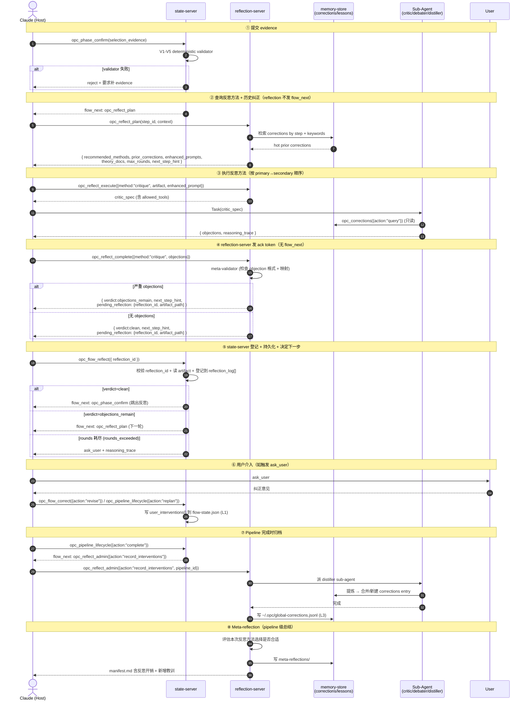

# 05 opc-reflection-server — 反思方法学

> MCP 服务边界：反思方法学标准库 + 用户纠正归档 + 跨次教训管理。纯 TypeScript 确定性逻辑，零 LLM 依赖（反思 sub-agent 由 Claude Host 派发）。

---

## 一、定位

**反思 = 工程化的方法学标准库，不是 LLM 的自我评分**。

opc-reflection-server 把 5 种学术反思方法 + validator 兜底封装成标准工具，opc-state-server 按 step 类型调用，配合 deterministic validator 兜底，配合用户纠正库形成闭环进化。

### 核心原则

| # | 原则 | 含义 |
|---|---|---|
| 1 | 不让 LLM 给自己打分 | 删除所有 `confidence: number` 字段 |
| 2 | 让 LLM 列证据，让 TS 检证据 | Evidence Artifact + Deterministic Validator |
| 3 | 让另一个 LLM 找洞 | 独立 context 的 critic / debater 破 sunk cost |
| 4 | 反思方法学要工程化 | 5 种方法做成标准库，按位点选 |
| 5 | 用户纠正必须沉淀 | 三层归档，反向注入反思 prompt |
| 6 | 任何反思都要有 budget | 否则会无限循环 |
| 7 | 反思器自身会失败 | 必须有 meta-validator + fallback + 健康度监控 |
| 8 | 反思永不阻塞主流程 | 失败时降级到 validator-only，不卡用户 |

---

## 二、主题地图

- [01 反思方法学](01-method-theory/00_overview.md) — 7 种学术方法 + 选择决策表 + 4 类失败模式 + primary/secondary 组合规则
- [02 server 设计](02-server-design/00_overview.md) — 4 个工具（`plan` / `execute({method})` / `complete({method})` / `admin({action})`） + evidence schema + validator + sub-agent 权限 + 可靠性 + 可观测性
- [03 corrections 存储](03-corrections-store/00_overview.md) — 三层存储 + 三层模型目录 + 4 个膨胀控制 + seed-corrections 冷启动 + schema 演化
- [04 反思流程](04-reflection-flow/00_overview.md) — per-step 反思时序 + 用户介入 + 用户自治 + meta-reflection + phase_reset 交互
- [04·补 三 server 接缝矩阵](04-reflection-flow/07_three-server-seam-matrix.md) — **P1–P8 × 触发器/evidence/方法/ack/持久化/knowledge/降级 整合表**（取代原本散落在 4 篇文档的引用）

---

## 三、阅读顺序

```
01 方法学（理论） → 02 server 设计（工程） → 03 corrections（存储） → 04 反思流程（链路）
```

---

## 四、与现有 server 的关系

| Server | 职责 | LLM 依赖 |
|---|---|---|
| opc-state-server | 流程状态机 + 管线/阶段/节点编排 | 零（路由 LLM 在 Host） |
| opc-knowledge-server | 项目知识库 CRUD + 搜索 | 零 |
| **opc-reflection-server** | **反思方法学 + 纠正归档 + 跨次教训** | **零（反思 sub-agent 在 Host）** |
| shared/memory-store | 三层模型 + 索引 + 原子写引擎 | — |

三个 server 共享 `shared/memory-store/` 引擎：knowledge / corrections / lessons 都用它。

---

## 五、端到端时序（反思链路全景）

> ⚠️ 本时序图遵循单驱动者原则：**`flow_next` 只从 state-server 发出**。reflection-server 通过返回值 `next_step_hint`（数据层提示）+ `pending_reflection`（登记契约，含已写盘 artifact 路径）与 state-server 协作。完整契约见 [04-reflection-flow/06_call-sequence-contract.md](04-reflection-flow/06_call-sequence-contract.md)。



---

## 六、12 个关键设计点（缺漏整合后的最终版）

| # | 设计点 | 文档位置 |
|---|---|---|
| 1 | 不让 LLM 自评，强制 evidence artifact | 02-server-design evidence-schema |
| 2 | Deterministic validator 兜底（V1-V5 / coverage / discrimination / budget） | 02-server-design validators |
| 3 | 6 种方法（cove / critique / debate / tot / reflexion / validator） | 01-method-theory |
| 4 | 按 step 自动选方法（primary + secondary 组合） | 01-method-theory 决策表 |
| 5 | 反思 sub-agent 权限白名单（只读） | 02-server-design agent-权限 |
| 6 | 反思器自身失败处理（meta-validator + 健康度监控 + fallback） | 02-server-design 可靠性 |
| 7 | 反思开销可观测（tokens / 延迟 / agent 数） | 02-server-design 可观测性 |
| 8 | 反思可解释（reasoning_trace + `opc_reflect_admin({action:"explain"})`） | 02-server-design 可解释性 |
| 9 | 用户纠正三层存储（L1 flow-state / L2 corrections / L3 global） | 03-corrections-store |
| 10 | corrections 复用知识三层模型 + 4 个膨胀控制 | 03-corrections-store |
| 11 | Seed corrections（冷启动） + schema 演化 | 03-corrections-store seed |
| 12 | 用户自治（reflection_intensity / skip / on_demand）+ meta-reflection | 04-reflection-flow |

---

## 七、与 opc-state-server 的接口契约

state-server 调用 reflection-server 的所有入口（4 个工具按 discriminator 分支汇总）：

| 阶段 | state-server 触发 | reflection-server 响应 |
|---|---|---|
| evidence 通过 validator 后 | flow_next: opc_reflect_plan | 返回方法 + 历史纠正 + max_rounds |
| 执行反思方法 | opc_reflect_execute({method:"cove"\|"critique"\|"debate"\|"tot"\|"reflexion"\|"validator"}) | 返回 sub-agent spec |
| 反思完成 | opc_reflect_complete({method:"<同上>"}) | 返回路由 + meta-validator 结果 |
| 用户跳过 | opc_flow_user_reply({disposition:"skip"}) | 记录 skip，设置 skip_reflection_once_for_step |
| 用户主动反思 | opc_reflect_admin({action:"on_demand"}) | 返回 on_demand_reflection_log |
| pipeline 结束 | opc_reflect_admin({action:"record_interventions"}) | 提炼归档 + 更新全局画像 |
| 健康度查询 | opc_reflect_admin({action:"query_stats"}) | 返回方法健康度 + 反思开销统计 |
| 可解释性 | opc_reflect_admin({action:"explain"}) | 返回 reasoning_trace |
| 方法禁用 | opc_reflect_admin({action:"unlearn_method"}) | 临时禁用某反思方法 |
| 纠正管理 | opc_corrections({action:"query"\|"record"\|"unlearn"\|...}) | corrections 库 9 个 action 全覆盖 |
| 索引重建 | opc_corrections({action:"reindex"}) | 全文索引重建 |

> 历史名 → 新调用对照：`opc_reflect_execute({method:"cove"})/critique/debate/tot` → `opc_reflect_execute({method:"<name>"})`；`opc_reflect_*_complete` → `opc_reflect_complete({method:"<name>"})`；`opc_reflect_admin({action:"record_interventions"})/on_demand/explain/query_stats/unlearn_method` → `opc_reflect_admin({action:"<name>"})`；`opc_corrections({action:"query"})/record/unlearn/reindex/...（9 个 action）` → `opc_corrections({action:"<name>"})`。详见 [../07-tool-consolidation/00_overview.md](../07-tool-consolidation/00_overview.md)。

---

## 八、与其他章节的关系

- 与 [02 opc-state-server](../02-opc-state-server/00_index.md) — state-server 不再有 confidence 字段，所有判断点接 reflection-server
- 与 [03 opc-knowledge-server](../03-opc-knowledge-server/00_index.md) — 共享 memory-store 引擎
- 与 [04 e2e](../04-e2e/00_index.md) — 新增 4 个反思相关测试用例（11-14）

---

## 九、相关章节

- [01 概览](../01-overview/00_index.md) — 全局架构（已更新为三 MCP server）
- [02 opc-state-server](../02-opc-state-server/00_index.md) — 状态机与判断位点
- [03 opc-knowledge-server](../03-opc-knowledge-server/00_index.md) — 共享存储引擎
- [04 e2e](../04-e2e/00_index.md) — 反思场景测试
