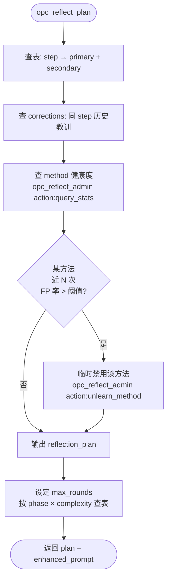

# 01 反思方法学

> 把学术上验证过的反思方法做成「标准库」：opc-reflection-server 不发明方法，只负责按 step 选方法、提供增强 prompt、给 sub-agent 派单。所有「LLM 自打分」的方案在本章被显式拒绝。

---

## 一、为什么需要方法学标准库

| 不做方法学的后果 | 做了方法学的收益 |
|---|---|
| LLM 自评 → 乐观偏差，confidence 全 ≥ 0.8 | Evidence Artifact 强制列证据，TS 检证据 |
| 反思 prompt 一锅炖 → 反思不到点 | 每个 step 选 primary + secondary 方法组合 |
| 反思无 budget → 无限循环 | 每种方法都有 token / 轮次预算 |
| 反思器自己会失败 → 误判 | meta-validator + fallback + 健康度统计 |
| 反思失败 → 阻塞主流程 | 永不阻塞，降级到 validator-only |

**核心立场**：反思不是「LLM 想得更深」，而是「换一个独立视角去找洞 + 用 TS 兜底证据」。

---

## 二、7 种学术方法概览

| # | 方法 | 全称 | 核心动作 | 适用 | 是否纳入标准库 |
|---|---|---|---|---|---|
| M1 | Self-Refine | Self-Refine (Madaan 2023) | 自我打分 → 自我修订 | 文本润色 | ❌ 不纳入（自评有偏差） |
| M2 | Reflexion | Reflexion (Shinn 2023) | 失败后写「教训记忆」，下次注入 prompt | 多次尝试同类任务 | ✅ 纳入（教训库形式） |
| M3 | CoVe | Chain-of-Verification (Dhuliawala 2023) | 拆解断言 → 逐条验证问题 → 重写 | 事实性输出 | ✅ 纳入（核心方法） |
| M4 | Critique | Self-Critique / RLAIF | 独立 critic agent 列反对意见 | 选择 / 决策 | ✅ 纳入（核心方法） |
| M5 | Debate | Multi-Agent Debate (Du 2023) | 多 agent 持不同立场辩论 | 高风险决策 | ✅ 纳入（重大节点） |
| M6 | ToT | Tree-of-Thoughts (Yao 2023) | 多分支搜索 → 评估剪枝 | 规划 / 分解 | ✅ 纳入（decomposition） |
| M7 | PRM | Process Reward Model | 训练 reward 模型逐步打分 | 数学推理 | ❌ 不纳入（需训练，重） |

**最终标准库 = M2 + M3 + M4 + M5 + M6 = 5 种方法**。

---

## 三、8 个反思位点（判断点 P1–P8）

整个 OPC 流程中存在 8 个需要「停下来检验」的位点：

| # | 位点 | 触发工具 | 风险 | 失败类型 |
|---|---|---|---|---|
| P1 | 意图分类 | opc_flow_step_complete({step:"intent_analysis"}) | 把 chat 当 task | A 分类 |
| P2 | 任务分析 | opc_flow_step_complete({step:"task_analysis"}) | 漏需求、漏依赖 | B 完整性 |
| P3 | 分解 | opc_flow_step_complete({step:"task_decomposition"}) | sub-pipeline 切分不合理 | D 元决策 |
| P4 | Brief | opc_flow_step_complete({step:"brief_generation"}) | brief 与 task 偏移 | B 完整性 |
| P5 | 节点选择 | opc_phase_confirm | 选错节点组合 | D 元决策 |
| P6 | 节点执行 | opc_node_finish({status:"success"}) | evidence 造假 / 缺失 | C 执行 |
| P7 | 阶段完成 | opc_phase_complete | quality_gate 没真跑 | C 执行 |
| P8 | 阶段推进 | auto_advance | 该回退却前进 | D 元决策 |

---

## 四、4 类失败模式

| 类 | 名称 | 典型 | 最克制的方法 |
|---|---|---|---|
| A | 分类错误 | task ↔ chat 误判 | M3 CoVe（拆判定条件逐条验证） |
| B | 完整性缺失 | 漏需求 / 漏依赖 / 漏 quality_gate | M3 CoVe + M4 Critique |
| C | 执行偏差 | evidence 不达标 / artifact 缺失 | Deterministic Validator（V1–V5）+ M4 Critique |
| D | 元决策错误 | 选错节点 / 选错分解 / 该回退却前进 | M4 Critique + M5 Debate（重大）/ M6 ToT（规划） |

---

## 五、Step → 方法 选择决策表（primary + secondary）

state-server 在 `opc_reflect_plan` 时按下表自动选方法。primary 必跑，secondary 仅在 primary 触发 objection 时才跑（节省 token）。

| Step | Primary | Secondary | 理由 |
|---|---|---|---|
| P1 意图 | M3 CoVe | M4 Critique | 拆「task 判定 5 条」逐条验证；critic 兜底 |
| P2 任务分析 | M3 CoVe | M2 Reflexion 注入 | 列断言、验断言；附历史同类纠正 |
| P3 分解 | M6 ToT | M5 Debate | 多方案搜索 → 评估；高风险时辩论 |
| P4 Brief | M3 CoVe | M4 Critique | brief 字段逐条对照 task |
| P5 节点选择 | M4 Critique | M5 Debate（≥ medium 复杂度） | critic 找漏选 / 错选 |
| P6 节点执行 | Validator | M4 Critique | TS 校验 artifacts + critic 看证据 |
| P7 阶段完成 | Validator | M3 CoVe | quality_gate 真跑 + 断言核对 |
| P8 阶段推进 | M4 Critique | M5 Debate（回退决策） | 是否该回退 |

**规则**：
- primary 失败（meta-validator 拒收）→ 触发 secondary
- secondary 失败 → fallback 到「validator-only + 强制 ask_user」
- 任何方法都受 `max_rounds` 轮次约束，达到上限 → `verdict: rounds_exceeded` → `flow_next: ask_user`（token 不再追踪）

---

## 六、方法组合规则（primary / secondary / 禁用矩阵）



**禁用矩阵**：

| 场景 | 禁用 |
|---|---|
| complexity = simple | M5 Debate / M6 ToT（太重） |
| token 预算已超阈值 | secondary 全禁用 |
| 该 step corrections 命中 ≥ 3 条 | M2 注入优先于 M3/M4 |
| 反思器自身故障 | 全部禁用，降级到 validator-only |

---

## 七、Evidence Artifact 与 LLM 自评的对比

| 维度 | LLM 自评（被拒绝） | Evidence Artifact（采用） |
|---|---|---|
| 输出 | `confidence: 0.85` | `selection_evidence: { matched_tags, scenario_hits, file_domain_conflicts, ... }` |
| 谁判定 | LLM 自己 | TS Deterministic Validator (V1–V5) |
| 可复现 | 否（每次不同） | 是（同输入同输出） |
| 可审计 | 否 | 是（evidence 入 flow-state.json） |
| 可降级 | 否（黑盒） | 是（validator 失败 → ask_user） |

Evidence schema 与 V1–V5 验证规则的完整定义见 [02-server-design](../02-server-design/00_overview.md#二evidence-schema)。

---

## 八、Reflexion 教训记忆的实现（M2）

不是「让 LLM 记住教训」，而是「用户介入 / 反思 objection」沉淀到 corrections 库，下次反思时**反向注入 prompt**：

```
opc_reflect_plan({step}) →
  ① 查 corrections by step + keywords
  ② 取 top-K (按 hotness 排序)
  ③ 拼到 enhanced_prompt: "以下是同类历史教训，请逐条对照检查：..."
  ④ 返回给 Host
```

corrections 三层存储 + 三层模型 + 4 个膨胀控制详见 [03-corrections-store](../03-corrections-store/00_overview.md)。

---

## 九、子文档导航

| 子文档 | 内容 |
|------|------|
| 01_method-catalog.md | 5 种纳入方法的完整定义（输入 / 输出 / 适用 / 失败模式） |
| 02_step-method-mapping.md | 8 step × 5 方法矩阵 + 决策树细节 |
| 03_failure-modes.md | 4 类失败模式的诊断与缓解 |
| 04_composition-rules.md | primary / secondary / 禁用矩阵 + max_rounds 配置 |

---

## 十、核心设计原则

- **不发明方法**：只整合学术上验证过的 5 种，并明确拒绝 Self-Refine 与 PRM
- **方法可禁用**：基于运行健康度自动 unlearn，避免坏方法持续污染
- **primary + secondary 双层**：节省 token；secondary 只在 primary 触发 objection 时跑
- **Evidence 替代 confidence**：所有「数字打分」必须配 evidence artifact + TS validator
- **永不阻塞**：方法全失败时降级到 validator-only + ask_user

---

## 十一、相关文档

- [02 server 设计](../02-server-design/00_overview.md) — 4 个工具（plan / execute / complete / admin）与 evidence schema 实现
- [03 corrections 存储](../03-corrections-store/00_overview.md) — Reflexion 教训记忆的存储引擎
- [04 反思流程](../04-reflection-flow/00_overview.md) — 方法在 per-step 反思链路中的位置
- [05 总览](../00_index.md) — 8 核心原则与端到端时序
