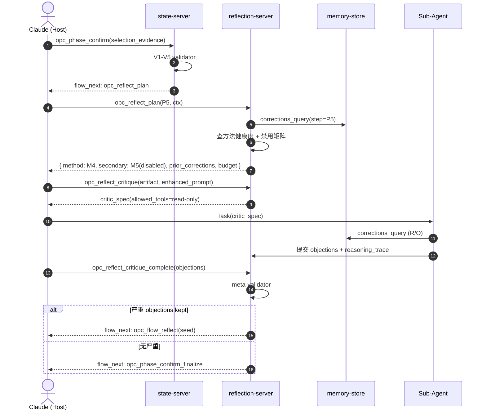

# 02 server 设计

> opc-reflection-server 的工程实现：13 个 MCP 工具、Evidence Schema、Deterministic Validator、sub-agent 权限白名单、meta-validator、可观测性、可解释性。**零 LLM 依赖**，所有 sub-agent 由 Claude Host 派发。

---

## 一、13 个 MCP 工具总览

按职责分 5 组：

| 组 | 工具 | 说明 |
|---|---|---|
| 规划 | `opc_reflect_plan` | 输入 step + context，返回 method 选择 + 历史纠正 + token_budget |
| 方法 | `opc_reflect_cove` | Chain-of-Verification：拆断言 → 验证问题 → 重写 |
| 方法 | `opc_reflect_critique` | 派 critic sub-agent，列 objection |
| 方法 | `opc_reflect_debate` | 派 2+ debater sub-agent，对立立场辩论 |
| 方法 | `opc_reflect_tot` | Tree-of-Thoughts：多分支搜索 + 评估剪枝 |
| 完成 | `opc_reflect_cove_complete` | 收 CoVe 结果，跑 meta-validator |
| 完成 | `opc_reflect_critique_complete` | 收 objection，meta-validator + 路由 |
| 完成 | `opc_reflect_debate_complete` | 收辩论结论 + dissent |
| 完成 | `opc_reflect_tot_complete` | 收最佳路径 + 剪枝理由 |
| 归档 | `opc_reflect_record_interventions` | pipeline 结束，派 distiller 提炼用户介入 |
| 元 | `opc_reflect_on_demand` | 用户主动触发反思 |
| 元 | `opc_reflect_explain` | 返回某次反思的 reasoning_trace |
| 元 | `opc_reflect_query_stats` | 查方法健康度 + 反思开销 |
| 元 | `opc_reflect_unlearn_method` | 临时禁用某反思方法 |
| 纠正 | `opc_corrections_query` | 按 step / keywords 查纠正库 |
| 纠正 | `opc_corrections_record` | 写入新纠正（distiller / 用户 / 反思器） |
| 纠正 | `opc_corrections_unlearn` | 删除过期/错误纠正 |
| 纠正 | `opc_corrections_reindex` | 全文索引重建 |

（实际共 17 个，但「13 个工具」是按 reflection 主链路统计，corrections CRUD 算独立子模块；命名见各组完整列表。）

---

## 二、Evidence Schema

所有 step 完成时必须提交 evidence artifact，**禁止 `confidence: number`**。

### 通用结构

```typescript
type EvidenceArtifact = {
  step: 'P1' | 'P2' | ... | 'P8'
  artifact_type: string            // 见下表
  payload: Record<string, unknown> // step 专属，schema 见下
  collected_at: ISO8601
  collected_by: 'host' | 'sub-agent-id'
}
```

### Step → Artifact 矩阵

| Step | artifact_type | 必须字段 |
|---|---|---|
| P1 意图 | `intent_evidence` | `task_criteria_hits[]`, `chat_signals[]`, `user_quotes[]` |
| P2 任务分析 | `task_analysis_evidence` | `requirements[]`, `dependencies[]`, `risks[]`, `knowledge_plan` |
| P3 分解 | `decomposition_evidence` | `sub_pipelines[]`, `interfaces[]`, `parallel_groups[]` |
| P4 Brief | `brief_evidence` | `brief_to_task_mapping[]`, `coverage_score` |
| P5 节点选择 | `selection_evidence` | `matched_tags`, `scenario_hits`, `file_domain_conflicts`, `blocked_by_graph` |
| P6 节点执行 | `node_evidence` | `artifacts[]`, `test_results`, `lint_results`, `build_output` |
| P7 阶段完成 | `phase_evidence` | `quality_gate_results[]`, `node_completion_map` |
| P8 阶段推进 | `advance_evidence` | `auto_advance_4_conditions`, `unblocked_phases[]` |

---

## 三、Deterministic Validator（V1–V5 + 三个工程兜底）

所有 artifact 进入前，先过 TS 纯函数验证：

| 验证器 | 检查 |
|---|---|
| V1 schema | JSON schema 完整性、字段类型 |
| V2 referential | unit/section/sub 路径存在、blocked_by 节点存在 |
| V3 evidence-presence | 必须字段非空、引用文件 stat 存在 |
| V4 coverage | task_criteria_hits 覆盖率、brief→task 映射覆盖率 |
| V5 discrimination | tag 匹配避免「全候选都过」（区分度 ≥ 阈值） |
| 兜底 1 coverage-guard | matched_tags / requirements 数 ≥ 最小阈值 |
| 兜底 2 budget-guard | 反思 token 累计不超 step 上限 |
| 兜底 3 freshness | corrections 引用未过期、knowledge version 满足 |

**关键性质**：所有 validator 是纯 TS 函数，零 LLM 调用，可单测、可复现。

---

## 四、Meta-Validator（反思器自身的输出校验）

sub-agent 也会出错（幻觉 objection / 编造 quote / 跑题）。Meta-validator 在 `opc_reflect_*_complete` 时跑：

| 检查 | 行动 |
|---|---|
| objection 引用的文件 / 字段不存在 | 丢弃该 objection |
| objection 引用的 evidence 字段在 artifact 中不存在 | 丢弃 + 计入 FP 率 |
| objection 文本与 artifact 无关键词重合 | 标记 low-relevance，要求 sub-agent 补 trace |
| Debate 双方立场重合度 > 阈值 | 视为「假辩论」，结果作废 |
| ToT 分支全部评分 > 0.9 | 怀疑乐观偏差，强制 critic |
| reasoning_trace 缺失 / < min_length | reject |

Meta-validator 也是纯 TS，配每个 sub-agent 的健康度统计。

---

## 五、Sub-Agent 权限白名单

派 sub-agent 时通过 `allowed_tools` 严格限制，**所有反思 agent 只读、禁写**：

| Sub-Agent | allowed_tools | 禁止 |
|---|---|---|
| critic | `opc_knowledge_get`, `opc_knowledge_search`, `opc_corrections_query`, `Read`, `Grep` | 任何 write / exec / network |
| debater | 同 critic | 同上 |
| ToT explorer | 同 critic | 同上 |
| distiller (pipeline 结束) | 上述 + `opc_corrections_record` | 仍禁 exec / network |
| meta-reflection synthesizer | `opc_reflect_query_stats`, `opc_corrections_query` (R/O) | 同上 |

state-server 在 `opc_node_start` 派 task agent 时与此独立，反思 agent **绝不能**继承 task agent 的写权限。

---

## 六、可靠性（反思器自身失败的处理）

| 失败 | 应对 |
|---|---|
| sub-agent 超时 | 丢弃，降级到 secondary 方法；记入健康度 |
| meta-validator reject | 整次反思作废，secondary 接管 |
| 5 次连续 reject 同方法 | 临时 unlearn 该方法 24h |
| budget 超限 | 立即终止 secondary，仅采用 primary |
| 反思 server 不可达 | state-server 降级到 validator-only + 强制 ask_user |
| corrections 库读写错误 | 反思继续（不依赖 corrections），仅打 warning |

**永不阻塞主流程**：反思失败的 worst case 是「validator-only + ask_user」，不会卡住 pipeline。

---

## 七、可观测性

每次反思自动写入 `opc-logs/reflection/<pipeline-id>/<step>.jsonl`：

```json
{
  "ts": "...",
  "step": "P5",
  "method": "M4-critique",
  "agent_id": "...",
  "tokens_in": 1200,
  "tokens_out": 350,
  "latency_ms": 4200,
  "objections_raised": 2,
  "objections_kept_by_meta": 1,
  "evidence_diff_after": true,
  "fallback_triggered": false
}
```

`opc_reflect_query_stats` 聚合维度：
- 方法 × step 的 FP 率（meta-validator reject 比例）
- 方法 × step 的「objection → evidence_diff」转化率（是否真的发现了问题）
- 反思总开销（tokens / 时长）占 pipeline 比例
- corrections 命中率（注入的 prior corrections 是否被采纳）

---

## 八、可解释性

`opc_reflect_explain({step, pipeline_id})` 返回：

```json
{
  "method_choice_reason": "step=P5, complexity=medium → primary=M4-critique, secondary=M5-debate disabled by budget",
  "prior_corrections_used": ["correction-id-1", "..."],
  "evidence_input": {...},
  "objections_raised": [...],
  "objections_kept": [...],
  "fallback_chain": ["M4 → ok"],
  "final_decision": "evidence_diff required",
  "reasoning_trace": [...]
}
```

reasoning_trace 由 sub-agent 在完成时随 objection 一同提交，meta-validator 校验最小长度与关键词重合度。

---

## 九、端到端工具调用时序



---

## 十、子文档导航（占位）

| 子文档 | 内容 |
|------|------|
| 01_tool-specs.md | 13/17 个工具的完整参数 / 返回 schema |
| 02_evidence-schema.md | P1–P8 evidence artifact 完整 schema + 例子 |
| 03_validators.md | V1–V5 + 三兜底验证器的纯 TS 实现规范 |
| 04_subagent-permissions.md | allowed_tools 白名单 + 反例 |
| 05_reliability.md | 失败矩阵 + 降级链 + 健康度统计 |
| 06_observability.md | 日志 schema + 聚合指标 + 仪表盘最小集 |
| 07_explainability.md | reasoning_trace 规范 + meta-validator 校验 |

---

## 十一、核心设计原则

- **零 LLM 引擎**：server 自身全 TS，sub-agent 由 Host 派发
- **Evidence 替代 confidence**：所有 step 强制 artifact，TS validator 兜底
- **Meta-validator 看反思器**：反思器输出本身也要被校验
- **Sub-agent 只读**：白名单严格，禁写禁 exec
- **永不阻塞**：失败链最差降级到 validator-only + ask_user
- **可观测 / 可解释 / 可禁用**：每种方法可被运行健康度自动 unlearn

---

## 十二、相关文档

- [01 反思方法学](../01-method-theory/00_overview.md) — 5 方法的理论基础
- [03 corrections 存储](../03-corrections-store/00_overview.md) — memory-store 引擎接口
- [04 反思流程](../04-reflection-flow/00_overview.md) — 工具在 per-step 链路的串联
- [02 opc-state-server](../../02-opc-state-server/00_index.md) — 调用方契约
