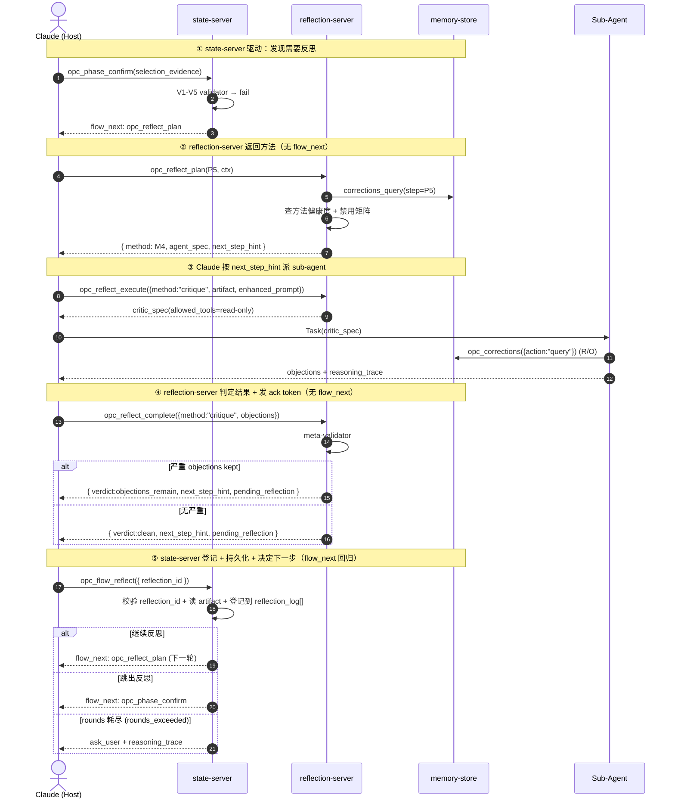

# 02 server 设计

> opc-reflection-server 的工程实现：**4 个 MCP 工具**（`plan` / `execute({method})` / `complete({method})` / `admin({action})`）+ `opc_corrections({action})`、Evidence Schema、Deterministic Validator、sub-agent 权限白名单、meta-validator、可观测性、可解释性。**零 LLM 依赖**，所有 sub-agent 由 Claude Host 派发。
>
> ⚠️ **驱动权契约**：reflection-server **所有工具禁止返回 `flow_next`**。`flow_next` 字段的发起权 100% 归 state-server。reflection-server 通过 `next_step_hint`（使用说明）+ `pending_reflection`（登记契约，含已写盘 artifact 路径）两种方式与 state-server 协作。完整命名约定 / 不变量 / 工具清单 / 契约见 [04-reflection-flow/06_call-sequence-contract.md](../04-reflection-flow/06_call-sequence-contract.md)。

---

## 一、4 个 MCP 工具总览（含 corrections 子模块 1 个）

按 discriminator 分支汇总：

| 工具 | discriminator | 分支 | 说明 |
|---|---|---|---|
| `opc_reflect_plan` | — | — | 输入 step + context，返回 method 选择 + 历史纠正 + max_rounds |
| `opc_reflect_execute` | `method` | `cove` | Chain-of-Verification：拆断言 → 验证问题 → 重写 |
|  |  | `critique` | 派 critic sub-agent，列 objection |
|  |  | `debate` | 派 2+ debater sub-agent，对立立场辩论 |
|  |  | `tot` | Tree-of-Thoughts：多分支搜索 + 评估剪枝 |
| `opc_reflect_complete` | `method` | `cove` | 收 CoVe 结果，跑 meta-validator |
|  |  | `critique` | 收 objection，meta-validator + 路由 |
|  |  | `debate` | 收辩论结论 + dissent |
|  |  | `tot` | 收最佳路径 + 剪枝理由 |
| `opc_reflect_admin` | `action` | `record_interventions` | pipeline 结束，派 distiller 提炼用户介入 |
|  |  | `on_demand` | 用户主动触发反思 |
|  |  | `explain` | 返回某次反思的 reasoning_trace |
|  |  | `query_stats` | 查方法健康度 + 反思开销 |
|  |  | `unlearn_method` | 临时禁用某反思方法 |
| `opc_corrections` | `action` | `query` | 按 step / keywords 查纠正库 |
|  |  | `record` | 写入新纠正（distiller / 用户 / 反思器） |
|  |  | `unlearn` | 删除过期/错误纠正 |
|  |  | `reindex` | 全文索引重建 |

> 历史名 → 新调用对照：`opc_reflect_execute({method:"cove"})/critique/debate/tot` → `opc_reflect_execute({method:"<name>"})`；`opc_reflect_*_complete` → `opc_reflect_complete({method:"<name>"})`；`opc_reflect_admin({action:"record_interventions"})/on_demand/explain/query_stats/unlearn_method` → `opc_reflect_admin({action:"<name>"})`；`opc_corrections({action:"query"})/record/unlearn/reindex` → `opc_corrections({action:"<name>"})`。详见 [../../01-overview/07-tool-consolidation.md](../../01-overview/07-tool-consolidation.md)。

---

## 一·补 通用返回结构（ReflectionResponse）

**所有 reflection-server 工具返回值的统一形态，禁止出现 `flow_next` 字段**：

```typescript
type ReflectionResponse = {
  // —— 数据部分（任何工具都有）——
  verdict?: 'clean' | 'objections_remain' | 'rounds_exceeded'  // 仅 complete 类工具
  kept_objections?: Objection[]
  reasoning_trace?: string[]
  // ...各工具专属数据字段

  // —— 提示部分（任何工具都可选）——
  next_step_hint?: {
    suggestion: string              // 一句话提示
    suggested_tool: string          // 下一个该调的工具
    suggested_args: object          // 预填的参数（仅含 reflection_id，不再整块搬运反思内容）
    why: string                     // 为什么这样做
  }

  // —— 登记契约（仅 complete 类工具发出）——
  pending_reflection?: {
    reflection_id: string                 // "rfl-<step>-r<n>-<ulid>"
    artifact_path: string                 // "opc-logs/reflection/<session_id>/<reflection_id>.json"
    expires_at: ISO8601                   // 默认 now + 30min
    must_be_registered_by: 'opc_flow_reflect'  // 当前只支持 flow_reflect 登记
  }
}
```

### 工具发 `pending_reflection` 的对照表

| 工具 | 是否发 pending | 理由 |
|---|---|---|
| `opc_reflect_plan` | ❌ 否 | 仅返回方法 + spec，无 artifact 落盘 |
| `opc_reflect_complete({method:"cove"})` | ✅ 是 | 反思 artifact 必须登记 |
| `opc_reflect_complete({method:"critique"})` | ✅ 是 | 同上 |
| `opc_reflect_complete({method:"debate"})` | ✅ 是 | 同上 |
| `opc_reflect_complete({method:"tot"})` | ✅ 是 | 同上 |
| `opc_reflect_admin({action:"record_interventions"})` | ❌ 否 | pipeline 已 complete，归档失败无伤大雅 |
| `opc_reflect_admin({action:"on_demand"})` | ❌ 否 | 用户主动触发，无强依赖 |
| `opc_reflect_admin({action:"explain"})` | ❌ 否 | 只读 |
| `opc_reflect_admin({action:"query_stats"})` | ❌ 否 | 只读 |
| `opc_reflect_admin({action:"unlearn_method"})` | ❌ 否 | CRUD |
| `opc_corrections({action:"*"})` | ❌ 否 | CRUD |

### `next_step_hint` 示例

```typescript
// opc_reflect_complete({method:"critique"}) 返回
{
  verdict: "objections_remain",
  kept_objections: [{ id: "obj-1", text: "...", evidence_ref: "..." }],
  reasoning_trace: ["...", "..."],
  next_step_hint: {
    suggestion: "调 opc_flow_reflect 登记本轮反思（artifact 已写盘），state-server 会决定是否继续",
    suggested_tool: "opc_flow_reflect",
    suggested_args: {
      reflection_id: "rfl-P5-r2-01HXY8"
    },
    why: "未登记的反思会在 phase_confirm 时被 registry-guard 拒绝"
  },
  pending_reflection: {
    reflection_id: "rfl-P5-r2-01HXY8",
    artifact_path: "opc-logs/reflection/sess-abc/rfl-P5-r2-01HXY8.json",
    expires_at: "2026-06-09T11:00:00Z",
    must_be_registered_by: "opc_flow_reflect"
  }
}
```

完整契约（5 步铁律 + 三层防御）见 [04-reflection-flow/06_call-sequence-contract.md](../04-reflection-flow/06_call-sequence-contract.md)。

---

## 二、Evidence Schema

所有 step 完成时必须提交 evidence artifact，**禁止 `confidence: number`**。

### 通用结构

```typescript
type EvidenceArtifact = {
  step: 'P1' | 'P2' | ... | 'P8'
  artifact_type: string            // 见下表
  payload: Record<string, unknown> // step 专属，schema 见下
  collected_at: ISO8601
  collected_by: 'host' | 'sub-agent-id'
}
```

### Step → Artifact 矩阵

| Step | artifact_type | 必须字段 |
|---|---|---|
| P1 意图 | `intent_evidence` | `task_criteria_hits[]`, `chat_signals[]`, `user_quotes[]` |
| P2 任务分析 | `task_analysis_evidence` | `requirements[]`, `dependencies[]`, `risks[]`, `knowledge_plan` |
| P3 分解 | `decomposition_evidence` | `sub_pipelines[]`, `interfaces[]`, `parallel_groups[]` |
| P4 Brief | `brief_evidence` | `brief_to_task_mapping[]`, `coverage_score` |
| P5 节点选择 | `selection_evidence` | `matched_tags`, `scenario_hits`, `file_domain_conflicts`, `blocked_by_graph` |
| P6 节点执行 | `node_evidence` | `artifacts[]`, `test_results`, `lint_results`, `build_output` |
| P7 阶段完成 | `phase_evidence` | `quality_gate_results[]`, `node_completion_map` |
| P8 阶段推进 | `advance_evidence` | `auto_advance_4_conditions`, `unblocked_phases[]` |

---

## 三、Deterministic Validator（V1–V5 + 三个工程兜底）

所有 artifact 进入前，先过 TS 纯函数验证：

| 验证器 | 检查 |
|---|---|
| V1 schema | JSON schema 完整性、字段类型 |
| V2 referential | unit/section/sub 路径存在、blocked_by 节点存在 |
| V3 evidence-presence | 必须字段非空、引用文件 stat 存在 |
| V4 coverage | task_criteria_hits 覆盖率、brief→task 映射覆盖率 |
| V5 discrimination | tag 匹配避免「全候选都过」（区分度 ≥ 阈值） |
| 兜底 1 coverage-guard | matched_tags / requirements 数 ≥ 最小阈值 |
| 兜底 2 rounds-guard | 反思轮数不超 step 的 `max_rounds` 上限（token 不再追踪） |
| 兜底 3 freshness | corrections 引用未过期、knowledge version 满足 |

**关键性质**：所有 validator 是纯 TS 函数，零 LLM 调用，可单测、可复现。

---

## 三·补 P6 / P7 不走 reflection 工具面（边界澄清）

P6（节点执行）/ P7（阶段完成）在主矩阵（[07_three-server-seam-matrix 二](../04-reflection-flow/07_three-server-seam-matrix.md#二主矩阵p1p8)）里 primary 写的是 **Validator-only**（V1–V5 + L1/L2 quality_gates）。这意味着：

| 维度 | P1–P5 / P8（反思路径） | **P6 / P7（Validator-only 路径）** |
|---|---|---|
| 工具入口 | `opc_reflect_plan` → `opc_reflect_execute` → `opc_reflect_complete` | **不调任何 `opc_reflect_*` 工具** |
| 由谁跑校验 | reflection-server 的 sub-agent + meta-validator | **state-manager 内部纯 TS 跑 V1–V5 + L1/L2** |
| 是否注册 `reflection_id` | ✅ 是（`opc_flow_reflect` 登记）| ❌ 否（无 pending_reflection 产物） |
| 是否受 reflection-registry-guard 保护 | ✅ 是 | ❌ 否（无 pending 元素需要 guard）|
| Artifact 落盘路径 | `opc-logs/reflection/<session_id>/<reflection_id>.json` | **`opc-logs/validator/<session_id>/<step>-<n>.json`** |
| 失败处理 | `verdict=objections_remain` → 二次反思 / ask_user | 直接 reject 当前调用（`opc_node_finish({status:"failed"})` / `opc_phase_complete` 拒绝），由 Claude 调 retry / reset |
| 何时升级到 reflection 工具面 | — | Claude 主动调 `opc_reflect_execute({step:"node_execution"\|"phase_completion", method:"M4-critique"\|"M3-cove"})` 显式升级（典型场景：L2 通过但 evidence diff 异常 / quality_gate 多次自动跑失败） |

**为什么这么设计**：V1–V5 是确定性 TS 函数，纯函数校验跨 MCP 服务调用是 overkill；P6/P7 走 reflection 工具面只会增加跨服务握手次数，且 Validator-only 路径没有 sub-agent 产物可登记。把这两步收敛到 state-manager 内部既能复用同一套 V1–V5 实现（与 P1–P5/P8 共享 [02-server-design 三](#三deterministic-validatorv1v5--三个工程兜底)），又能避免"为校验而握手"的反模式。

**Validator artifact 简化 schema**（写到 `opc-logs/validator/`）：

```typescript
type ValidatorArtifact = {
  step: 'node_execution' | 'phase_completion'
  validator_results: { v1: 'pass'|'fail', v2: ..., v3: ..., l1?: ..., l2?: ... }
  failure_reasons?: string[]      // fail 时给出可读的失败原因
  ran_at: ISO8601
  ran_by: 'state-manager'         // 区别于 reflection 'sub-agent-id'
}
```

> 在主矩阵（P1–P8 表格）中，P6 / P7 的 Primary 列写 `(internal V1–V5)`，与 P1–P5/P8 的 `M3/M4/M5/M6` 严格区分。

---

## 四、Meta-Validator（反思器自身的输出校验）

sub-agent 也会出错（幻觉 objection / 编造 quote / 跑题）。Meta-validator 在 `opc_reflect_*_complete` 时跑：

| 检查 | 行动 |
|---|---|
| objection 引用的文件 / 字段不存在 | 丢弃该 objection |
| objection 引用的 evidence 字段在 artifact 中不存在 | 丢弃 + 计入 FP 率 |
| objection 文本与 artifact 无关键词重合 | 标记 low-relevance，要求 sub-agent 补 trace |
| Debate 双方立场重合度 > 阈值 | 视为「假辩论」，结果作废 |
| ToT 分支全部评分 > 0.9 | 怀疑乐观偏差，强制 critic |
| reasoning_trace 缺失 / < min_length | reject |
| evidence 引用文件的 `mtime` > 反思任务派发时间 | reasoning_trace 末尾追加 `warning: evidence file mutated during reflection`（检测用户在反思中途手改 knowledge，详见 [02-pipeline/07_dependency-serial.md 六·补 反思期间的 knowledge 稳定性约定](../../02-opc-state-server/02-pipeline/07_dependency-serial.md#六补-反思期间的-knowledge-稳定性约定人类介入边界)） |

Meta-validator 也是纯 TS，配每个 sub-agent 的健康度统计。

---

## 五、Sub-Agent 权限白名单

派 sub-agent 时通过 `tools` frontmatter 严格限制，**所有反思 agent 只读、禁写**。本节依赖的 Host 行为已通过 PoC 验证（见 [06-host-contract/00_overview.md § 2.5 C4](../../06-host-contract/00_overview.md#25-c4allowed_tools-enforce-责任分配)）：未在 `tools` 中声明的工具对 sub-agent **不可见**（Host 在工具列表层面直接裁剪，报错 `No such tool available`，比"运行时拒绝"更彻底）。

| Sub-Agent | tools | 禁止 |
|---|---|---|
| critic | `opc_knowledge_read({mode:"single"})`, `opc_knowledge_read({mode:"search"})`, `opc_corrections({action:"query"})`, `Read`, `Grep` | 任何 write / exec / network |
| debater | 同 critic | 同上 |
| ToT explorer | 同 critic | 同上 |
| distiller (pipeline 结束) | 上述 + `opc_corrections({action:"record"})` | 仍禁 exec / network |
| meta-reflection synthesizer | `opc_reflect_admin({action:"query_stats"})`, `opc_corrections({action:"query"})` (R/O) | 同上 |

**双保险**（C4 § 2.5 OPC server 端）：即使 kit 配错让某个 critic 的 `tools` 误开了写工具，OPC server 内部仍按 `dispatch_context.role` 拒绝写入。

state-server 在 `opc_node_start` 派 task agent 时与此独立，反思 agent **绝不能**继承 task agent 的写权限。

> **注**：上面字段名按 Claude Code 当前规范写作 `tools`（早期文档曾用 `allowed_tools`）。后续 kit 模板与 distiller 产物一律使用 `tools`，避免混淆。

---

## 六、可靠性（反思器自身失败的处理）

| 失败 | 应对 |
|---|---|
| sub-agent 超时 | 丢弃，降级到 secondary 方法；记入健康度 |
| meta-validator reject | 整次反思作废，secondary 接管 |
| 5 次连续 reject 同方法 | 临时 unlearn 该方法 24h（`opc_reflect_admin({action:"unlearn_method"})`） |
| rounds 超限 | `verdict: rounds_exceeded` → `flow_next: ask_user`（不再"立即终止 secondary"） |
| 反思 server 不可达 | state-server 降级到 validator-only + 强制 ask_user |
| corrections 库读写错误 | 反思继续（不依赖 corrections），仅打 warning |

**永不阻塞主流程**：反思失败的 worst case 是「validator-only + ask_user」，不会卡住 pipeline。

### 六·补·1 反思 server 不可达的实现细节（M18.g）

state-server 的 `FlowServer.reflectionUnavailable({session_id, step_id, reason, severity?, validator_summary?, context_artifacts?, pipeline_pointer_ref?})` 是 host 在检测到 reflection-server MCP transport 异常时的入口：

- **默认 `severity: "ask_user"`**：合成一个 `pending_user_question`（`question_id` 前缀 `uq-rs-unavailable-`，30min 过期）→ 下一个写类工具被 `pending-question-guard` 拦截 → 用户必须走 `opc_flow_user_reply` 或 `opc_flow_correct` 才能继续；`reflection_log` 记录 `verdict: "validator_only_fallback"`，`user_interventions[].trigger = "reflection_server_unavailable_acknowledged"`；如果当时已有别的 pending question，则保留旧 question（避免 clobber），仅落 reflection_log 即可。
- **`severity: "warning_only"`**：仅写一条 `verdict: "validator_only_fallback"` 的 reflection_log，不阻塞——对应 [07_three-server-seam-matrix.md §3.4](../04-reflection-flow/07_three-server-seam-matrix.md#34-failure-degradation-chain) 列举的 P4 brief / P6 critique / P7 CoVe 三类豁免（不应阻断 `unblocked_nodes` 推进或 `opc_phase_complete`）。

调用方在 transport 失败后应同时确保 state-server 的 V1-V5 + L1/L2 已经在内部执行并由 [validator-only artifact (M18.f)](../../../platform/mcp/opc-state-server/src/validator-log.ts) 落盘到 `opc-logs/validator/<session>/<step>-<n>.json`；这些路径可直接作为 `context_artifacts` 一并带入，方便用户审计。

---

## 六·补 reflection-registry-guard 工程锁（与 state-server 的契约执行点）

`pending_reflection` 由本 server 的 `opc_reflect_complete({method})` 工具发出（同时写盘 artifact），由 state-server 的 `opc_flow_reflect` 工具登记。中间任何 state-server 写类工具被 registry-guard 拦截。

### `pending_reflection` 生命周期

```
[创建] opc_reflect_complete({method}) 调用结束:
       1. 写盘 artifact = opc-logs/reflection/<session_id>/<reflection_id>.json
       2. 校验 pending_reflections.length == 0（hard invariant）
          否则 reject (error: previous_pending_unregistered)
       3. 返回 pending_reflection {
            reflection_id, artifact_path,
            expires_at = now + 30min,
            must_be_registered_by = "opc_flow_reflect"
          }
       → state-server 收到后写入 flow-state.json.pending_reflections[]

[拦截] 任何 state-server 写类工具调用前 registry-guard 校验:
       if flow_state.pending_reflections.length > 0
          && callerTool !== pending.must_be_registered_by:
         → 拒绝执行 + 返回 required_action

[登记] opc_flow_reflect({reflection_id}):
       → 校验 reflection_id 存在且未过期
       → 读 artifact_path 抽 verdict / reasoning_trace
       → 追加到 reflection_log[]
       → 从 pending_reflections[] 移除
       → 返回 flow_next

[过期] expires_at 到达:
       → **不再自动清理**。pending 保留并标 status=expired_pending_decision
       → 下一次 opc_flow_query 检测到过期 → 走 ask_user 路径
         （让用户选 resume / discard / skip，artifact 文件保留 7 天）
       → 详见 [04-reflection-flow/06_call-sequence-contract.md 六·补 反思过期处理契约](../04-reflection-flow/06_call-sequence-contract.md#六补-反思过期处理契约不再静默吞反思)
```

### 受 reflection-registry-guard 保护的 state-server 工具

> 完整清单（含校验时机 / required_action / 豁免清单 / 命名约定 / 不变量）是 registry-guard 的**单一真相源**，统一维护在 [04-reflection-flow/06_call-sequence-contract.md 七 防御 3 受 reflection-registry-guard 保护的工具清单](../04-reflection-flow/06_call-sequence-contract.md#受-reflection-registry-guard-保护的工具清单唯一真相源)。本文档不再重复列举，避免清单漂移。

### 失败返回示例

```typescript
opc_phase_confirm({...}) 被调用时存在未登记反思:

→ 返回:
{
  error: "pending_reflection_unregistered",
  message: "存在未登记的反思记录，无法推进 phase_confirm",
  pending_reflection_id: "rfl-P5-r2-01HXY8",
  pending_artifact_path: "opc-logs/reflection/sess-abc/rfl-P5-r2-01HXY8.json",
  pending_step_id: "node_selection",
  required_action: {
    tool: "opc_flow_reflect",
    args: {
      reflection_id: "rfl-P5-r2-01HXY8"
    },
    why: "先登记反思记录，再推进流程"
  }
}
```

完整实现伪代码与契约违反场景见 [04-reflection-flow/06_call-sequence-contract.md 三-六](../04-reflection-flow/06_call-sequence-contract.md)。

---

## 七、可观测性

每次反思自动通过 `ReflectionServer.critiqueComplete()` 追加到 `opc-logs/reflection/<session_id>/telemetry.jsonl`（单文件按 session_id 聚合，`withFileLock` 原子写）：

```json
{
  "ts": "2026-06-10T12:00:00Z",
  "session_id": "sess-abc",
  "step": "P5",
  "method": "critique",
  "reflection_id": "rfl-P5-r2-01HXY8",
  "round": 2,
  "verdict": "objections_remain",
  "objections_raised": 2,
  "objections_kept": 1,
  "evidence_diff": true,
  "fallback_triggered": false,
  "validator_pass": true,
  "latency_ms": 4200,
  "tokens_in": 1200,
  "tokens_out": 350
}
```

`opc_reflect_admin({action:"query_stats"})` 聚合维度：
- 方法 × step 的 FP 率（meta-validator reject 比例）
- 方法 × step 的「objection → evidence_diff」转化率（是否真的发现了问题）
- 反思总开销（tokens / 时长）占 pipeline 比例
- corrections 命中率（注入的 prior corrections 是否被采纳）
- **过期反思告警**（`expiry_metrics`）：`expired_pending_count_24h` / `expired_resumed_count_24h` / `expired_discarded_count_24h` / `expired_skipped_count_24h` / `artifact_purged_7d_count`。完整 schema + 告警阈值见 [04-reflection-flow/06_call-sequence-contract.md 六·补 告警维度](../04-reflection-flow/06_call-sequence-contract.md#告警维度opc_reflect_adminactionquery_stats-新增字段)

---

## 八、可解释性

`opc_reflect_admin({action:"explain", step, pipeline_id})` 返回：

```json
{
  "method_choice_reason": "step=P5, complexity=medium → primary=M4-critique, secondary=M5-debate disabled by budget",
  "prior_corrections_used": ["correction-id-1", "..."],
  "evidence_input": {...},
  "objections_raised": [...],
  "objections_kept": [...],
  "fallback_chain": ["M4 → ok"],
  "final_decision": "evidence_diff required",
  "reasoning_trace": [...]
}
```

reasoning_trace 由 sub-agent 在完成时随 objection 一同提交，meta-validator 校验最小长度与关键词重合度。

---

## 九、端到端工具调用时序

> ⚠️ 本时序图遵循单驱动者原则：**`flow_next` 只从 state-server 发出**，reflection-server 通过 `next_step_hint` + `pending_reflection`（含已写盘 artifact 路径）协作。完整契约见 [06_call-sequence-contract.md](../04-reflection-flow/06_call-sequence-contract.md)。



---

## 十、子文档导航（占位）

| 子文档 | 内容 |
|------|------|
| 01_tool-specs.md | 4 个工具 + corrections facade 的完整参数 / 返回 schema |
| 02_evidence-schema.md | P1–P8 evidence artifact 完整 schema + 例子 |
| 03_validators.md | V1–V5 + 三兜底验证器的纯 TS 实现规范 |
| 04_subagent-permissions.md | allowed_tools 白名单 + 反例 |
| 05_reliability.md | 失败矩阵 + 降级链 + 健康度统计 |
| 06_observability.md | 日志 schema + 聚合指标 + 仪表盘最小集 |
| 07_explainability.md | reasoning_trace 规范 + meta-validator 校验 |

---

## 十一、核心设计原则

- **零 LLM 引擎**：server 自身全 TS，sub-agent 由 Host 派发
- **Evidence 替代 confidence**：所有 step 强制 artifact，TS validator 兜底
- **Meta-validator 看反思器**：反思器输出本身也要被校验
- **Sub-agent 只读**：白名单严格，禁写禁 exec
- **永不阻塞**：失败链最差降级到 validator-only + ask_user
- **可观测 / 可解释 / 可禁用**：每种方法可被运行健康度自动 unlearn

---

## 十二、相关文档

- [01 反思方法学](../01-method-theory/00_overview.md) — 5 方法的理论基础
- [03 corrections 存储](../03-corrections-store/00_overview.md) — memory-store 引擎接口
- [04 反思流程](../04-reflection-flow/00_overview.md) — 工具在 per-step 链路的串联
- [02 opc-state-server](../../02-opc-state-server/00_index.md) — 调用方契约
