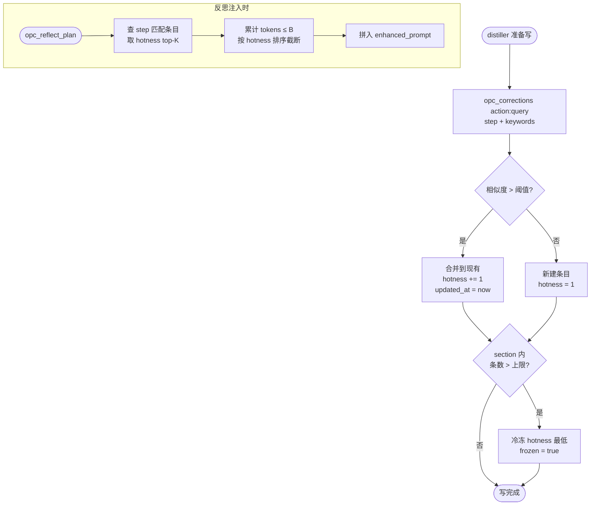
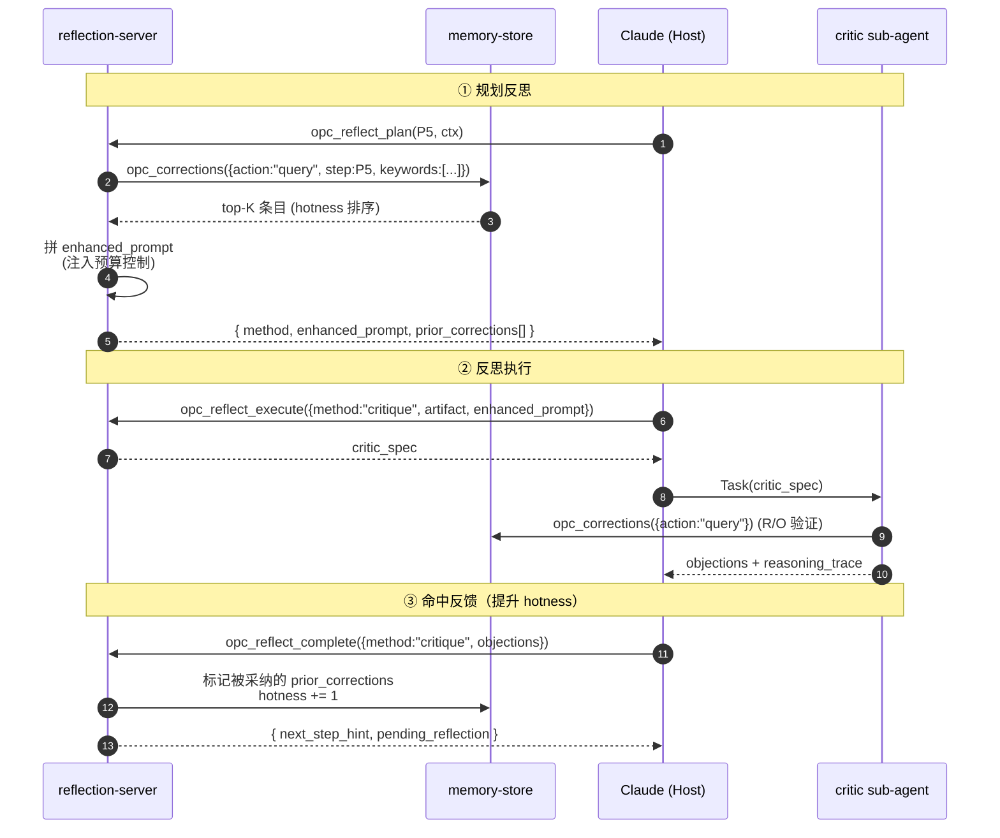

# 03 corrections 存储

> 用户介入纠正与反思教训的存储引擎。**复用 opc-knowledge-server 的三层模型**（unit→section→subsection）与 `shared/memory-store/` 写引擎，配合三层存储位置（L1/L2/L3）+ 4 个膨胀控制 + seed corrections 冷启动 + schema 演化。

---

## 一、三层存储位置（L1 / L2 / L3）

| 层 | 位置 | 内容 | 生命周期 |
|---|---|---|---|
| L1 | `<workspace>/.opc/state/flow-state.json` 的 `user_interventions[]` | 单次 pipeline 的原始介入流水（带时间戳、原文、阶段、节点、`trigger` 类型）。两类 trigger：`ask_user_rounds_exceeded`（state-server 反思 rounds 耗尽主动询问 → A3 回灌）+ `user_initiated`（用户主动 revise/restart/replan/phase_reset） | pipeline 结束随快照保留 |
| L2 | `<workspace>/opc-memory/corrections/<unit>/<section>/<sub>.md` | 项目级提炼后的纠正库（三层模型） | 项目持久 |
| L3 | `~/.opc/global-corrections.jsonl` | 跨项目通用教训（脱敏） | 全局持久 |

**流向**：L1（每次 pipeline）→ distiller sub-agent 提炼 → L2（项目库）→ 用户标记「通用」时晋升 → L3。

> **distiller 优先级**：L1 中带 `trigger: "ask_user_rounds_exceeded"` 的条目优先处理——它们由 A3 闭环写入，附带 `linked_reflection_artifacts`（指向 N 轮反思 artifact 路径），上下文丰富度远高于纯用户主动纠错，提炼为 corrections 后命中率与召回率都更高。详见 [04-reflection-flow/06_call-sequence-contract.md 八·补](../04-reflection-flow/06_call-sequence-contract.md#八补-ask_user-回灌闭环a3-契约)。

---

## 二、复用知识三层模型

corrections 库目录布局与 opc-knowledge/ 完全一致：

```
opc-memory/
  corrections/
    intent-analysis/                    # unit
      task-vs-chat/                     # section
        ambiguous-question.md           # subsection
        single-action.md
      missing-context/
        agent-context.md
    node-selection/
      file-domain-conflict/
        parallel-write.md
      blocked-by-loop/
        cycle-detected.md
    decomposition/
      sub-pipeline-coupling/
        tight-interface.md
  lessons/                              # meta-reflection 产物（同结构）
  .opc-memory.idx                       # 全文搜索索引（派生，可重建）
```

**与 knowledge 的关系**：
- 共用 `shared/memory-store/` 引擎（原子写、frontmatter version、reindex）
- 共用三层概念模型与目录约定
- 不共用具体目录（corrections 独立于 knowledge，避免污染）

---

## 三、纠正条目 schema

每个 `.md` 文件结构：

```markdown
---
id: corr-<ulid>
type: correction | lesson
step: P1 | P2 | ... | P8
unit: intent-analysis
section: task-vs-chat
subsection: ambiguous-question
hotness: 12                # 命中次数，每次 +1，每周 *0.9 衰减
frozen: false              # 冷冻后停止注入但保留
source: user | distiller | reflexion | seed
created_at: ...
updated_at: ...
schema_version: 2
related: [corr-xxx, corr-yyy]
keywords: [agent, ambiguous, single-question]
applies_when:              # 注入条件（TS 可判定）
  - step: P1
  - intent_signals_contains: ["问句无动作"]
deprecated_by: null        # 若被新纠正替代
---

# 标题（简短）

## 失败模式
原始用户介入或反思 objection 的精炼描述。

## 纠正建议
应该如何避免 / 修正（具体可操作）。

## 反思 prompt 增强片段
> 当 step={step} 且匹配 keywords 时，把本节注入 enhanced_prompt。

## 证据 / 原文链接
- L1 source: flow-state.json#user_interventions[3]
- pipeline-id: ...
```

---

## 四、4 个膨胀控制

| # | 控制 | 实现 |
|---|---|---|
| C1 | 合并优先于新建 | distiller 写入前先 `opc_corrections({action:"query", step, keywords})`，相似度 > 阈值 → 合并 + hotness+1；否则新建 |
| C2 | hotness 衰减 + 冷冻 | 每周扫描，hotness *= 0.9；< 阈值 → `frozen=true`，停止注入但保留可查 |
| C3 | per-step 容量上限 | 同 step 同时被注入的纠正条数 ≤ K（默认 5），按 hotness 取 top-K |
| C4 | 注入 prompt 预算 | enhanced_prompt 中纠正片段总 tokens ≤ B（默认 800），超出按 hotness 截断 |



---

## 五、Seed corrections（冷启动）

新项目 / 新用户首日没有 L2 数据时，从 marketplace 加载内置 seed：

```
platform/mcp/opc-reflection-server/seed-corrections/
  intent-analysis/...
  node-selection/...
  decomposition/...
```

| 性质 | 说明 |
|---|---|
| 来源 | OPC 维护者 + 社区贡献 |
| 注入策略 | `source=seed` 单独标记，hotness 初值 = 3（中等） |
| 用户覆盖 | 用户项目 L2 同 path 存在时，**项目优先** |
| 升级 | marketplace 更新时，diff 提示用户是否合并新版 |

冷启动效果：第 1 个 pipeline 就有「同类项目踩过的坑」可供反思参考。

---

## 六、Schema 演化

`schema_version` 字段允许向前演化：

| 版本 | 变更 | 兼容策略 |
|---|---|---|
| 1 | 初版 | — |
| 2 | 加入 `applies_when` / `deprecated_by` | reader 容忍缺失字段，writer 写最新版 |
| ≥ 3 | 未来 | 提供 `opc_corrections({action:"migrate"})` 工具，按 version 升级文件 |

**反例**：禁止删除已有字段。新字段必须 optional。

---

## 七、跨次反思的反向注入



---

## 八、L1 → L2 → L3 升级链

```mermaid
flowchart TD
    L1([flow-state.json<br/>user_interventions[]])
    L1 -->|pipeline_complete<br/>opc_reflect_admin action:record_interventions| Distill[distiller sub-agent]
    Distill --> Sim{相似条目?}
    Sim -->|有| Merge[L2 合并 + hotness++]
    Sim -->|无| New[L2 新建]
    Merge --> L2([opc-memory/corrections/])
    New --> L2
    L2 -->|用户手动晋升<br/>opc_corrections action:promote| L3([~/.opc/global-corrections.jsonl])
    L3 -->|新项目冷启动| Seed[seed 注入新 workspace]
```

---

## 九、子文档导航

| 子文档 | 状态 | 内容 |
|------|------|------|
| 01_storage-layers.md | 占位 | L1/L2/L3 完整定义 + 字段映射 |
| 02_schema-and-evolution.md | 占位 | correction `.md` schema + version 演化 |
| 03_expansion-controls.md | 占位 | C1–C4 控制策略 + 调优参数 |
| 04_seed-corrections.md | 占位 | 冷启动 seed 库结构 + 升级流程 |
| [05_distiller-agent.md](05_distiller-agent.md) | ✅ 已落地（A3）| distiller sub-agent 输入 / 输出 / 提示词模板 + 合并策略 + 失败处理 |

---

## 十、核心设计原则

- **复用知识引擎**：corrections / lessons 与 knowledge 共用 memory-store，零重复实现
- **三层模型抗膨胀**：unit→section→sub 天然分桶，配合 4 个控制不会爆炸
- **冷启动有 seed**：第 1 次 pipeline 也能受益于历史教训
- **schema 向前兼容**：只加不删，升级用 migrate 工具
- **L1 是流水、L2 是项目库、L3 是全局画像**：层次清晰，提炼有方向

---

## 十一、相关文档

- [01 反思方法学](../01-method-theory/00_overview.md) — M2 Reflexion 教训记忆的来源
- [02 server 设计](../02-server-design/00_overview.md) — corrections CRUD 工具规范
- [04 反思流程](../04-reflection-flow/00_overview.md) — distiller 在 pipeline 结束时的归档时序
- [03 opc-knowledge-server / 01 知识模型](../../03-opc-knowledge-server/01-knowledge-model/00_overview.md) — 三层模型与 memory-store 共用引擎
