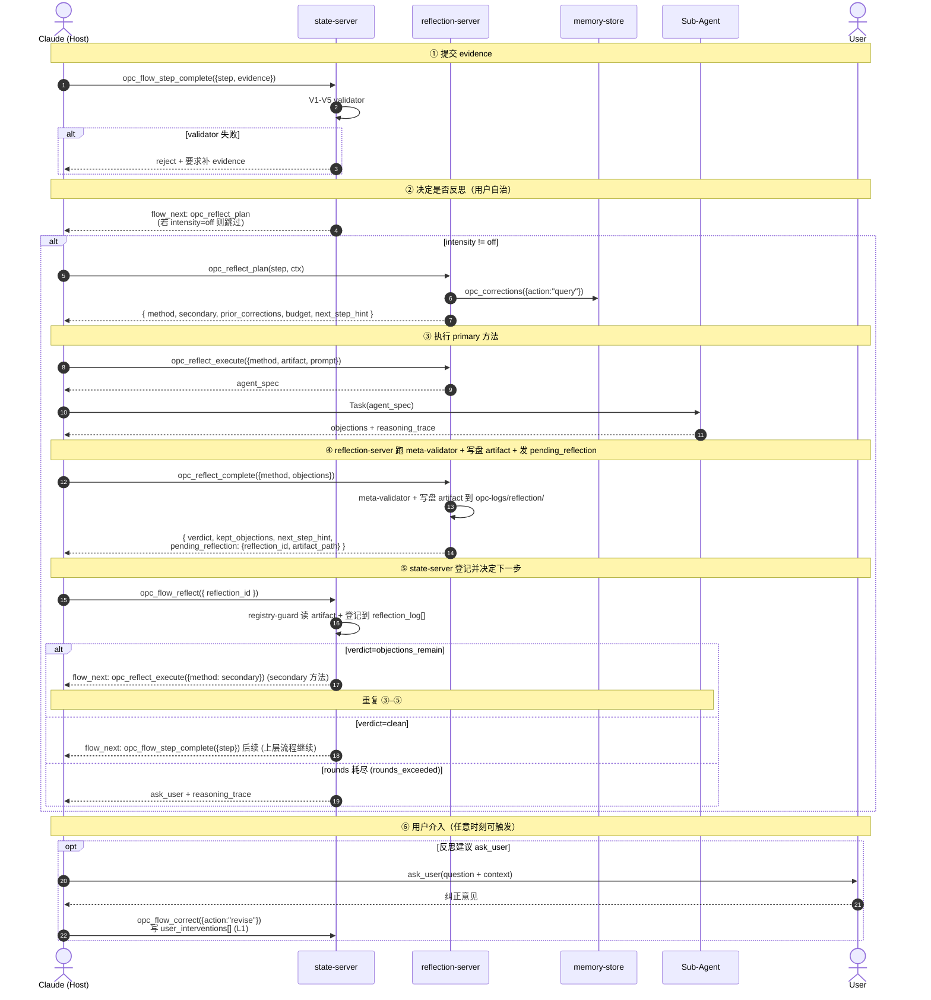
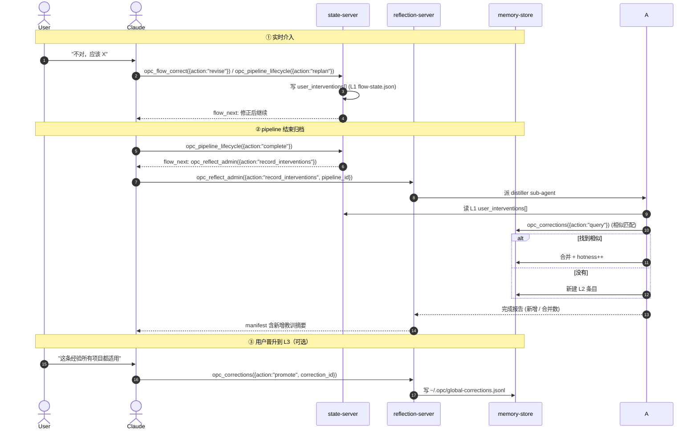
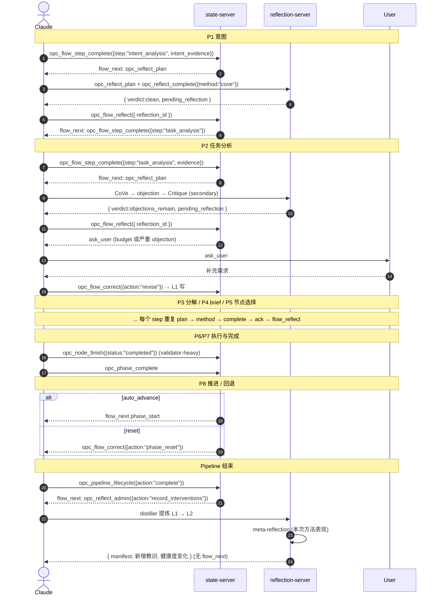

# 04 反思流程

> 反思在 pipeline 全链路中的串联：per-step 反思时序、用户介入处理、用户自治（intensity / skip / on_demand）、pipeline 级 meta-reflection、与 `opc_flow_correct({action:"phase_reset"})` 的交互。

---

## 一、per-step 反思链路（标准时序）

> ⚠️ 本时序图遵循单驱动者原则：**`flow_next` 只从 state-server 发出**。`opc_reflect_complete({method})` 写盘 artifact 并发出 `pending_reflection`，Claude 必须调 `opc_flow_reflect({reflection_id})` 登记才能推进。详见 [06_call-sequence-contract.md](06_call-sequence-contract.md)。

每个判断点 P1–P8 的统一时序：

---

## 二、用户自治：intensity / skip / on_demand

用户对反思强度有完全控制权，三种模式：

| 模式 | 设置位置 | 行为 |
|---|---|---|
| `intensity: high` | `.opc/config.json` 或 `/opc reflect intensity high` | 所有 step 都跑 primary + secondary |
| `intensity: medium` (默认) | 同上 | step P3/P5/P8 跑 primary + secondary，其余 primary |
| `intensity: low` | 同上 | 只在 step P3 / P5 跑 primary，其他仅 validator |
| `intensity: off` | 同上 | 全部跳过反思，仅 validator-only |
| `skip once` | `opc_flow_skip_reflection({step})` | 仅当前 step 跳过 |
| `on_demand` | `opc_reflect_admin({action:"on_demand", target})` | 用户主动触发对历史 step 的事后反思 |

**降级建议**：如果某 step 近 N 次反思 FP 率 > 阈值，server 会建议 `intensity` 降级或 `opc_reflect_admin({action:"unlearn_method"})`，但**最终权在用户**。

---

## 三、用户介入处理（intervention → L1 → L2）

---

## 四、Meta-reflection（pipeline 级总结）

pipeline 结束时除了归档纠正，还跑一次 meta-reflection，**反思本次反思本身**：

| 评估项 | 方法 |
|---|---|
| 各 step 反思的命中率（objection → evidence_diff 转化率） | TS 统计 + meta synthesizer agent |
| 哪些方法在哪些 step 表现差（FP 率高） | 自动建议 `opc_reflect_admin({action:"unlearn_method"})` |
| 哪些 corrections 被反复命中（应升 L3） | 推送给用户决定 |
| 反思总开销占比是否合理 | 与 budget 对比 |
| 用户介入与反思发现的重合率（反思是否「发现了用户会发现的事」） | 关键质量指标 |

输出：
- `opc-logs/meta-reflection/<pipeline-id>.md`
- 写入 `opc-memory/lessons/` 三层结构
- pipeline manifest 末尾追加「反思开销 / 新增教训 / 方法健康度变化」

---

## 五、与 `opc_flow_correct({action:"phase_reset"})` 的交互

phase 回退时反思状态如何处理：

| 回退层级 | 反思状态处理 |
|---|---|
| L0 仅当前 phase | 当前 step 的反思日志保留（供 audit），corrections 不回滚（教训不可丢失） |
| L1 + 下游 phase | 同 L0；下游 phase 的反思记录标记 `superseded=true` |
| L2 + 跨 sub 下游 | 同 L1 |
| L3 整个 pipeline | 反思日志保留；user_interventions[] 保留；新一轮 phase_start 时 prior_corrections 仍可注入 |

**关键性质**：反思状态**只追加、不回滚**。回退会重做反思，但历史教训永久留底，供后续 reflexion 注入。

---

## 六、端到端时序（pipeline 全程反思视角）

> ⚠️ 简化版示意：仅展示 state-server 与 reflection-server 的接力主线。完整 5 步铁律见 [06_call-sequence-contract.md 二](06_call-sequence-contract.md)。

---

## 七、子文档导航

| 子文档 | 内容 |
|------|------|
| [01_per-step-sequence.md](01_per-step-sequence.md) | **P3 / P4 / P7 / P8 反思工作示例**（P1 / P2 / P5 / P6 在本文档六 + e2e 04/05 已展开）|
| 02_user-autonomy.md | intensity / skip / on_demand 完整 API + 默认 |
| 03_intervention-archival.md | L1 → L2 → L3 归档链与 distiller 提示词 |
| [04_meta-reflection.md](04_meta-reflection.md) | **A/B/C/D 四类 meta-validator 规则 + FP/FN 指标 + unlearn 阈值（PoC TODO）** |
| 05_phase-reset-interaction.md | 与 state-server phase_reset 的边界 |
| [06_call-sequence-contract.md](06_call-sequence-contract.md) | 单驱动者契约 + reflection-registry-guard 三层防御 + 5 步铁律 + 命名约定 + 不变量 |
| [07_three-server-seam-matrix.md](07_three-server-seam-matrix.md) | **接缝矩阵**：P1–P8 × 触发器/evidence/方法/pending/持久化/knowledge/降级一表打通 |

---

## 八、核心设计原则

- **per-step 统一时序**：plan → method → meta-validator → 路由，所有 step 复用
- **用户自治优先**：intensity / skip / on_demand 三档自由切换，server 只建议不强制
- **介入永久沉淀**：L1 → L2 → L3 链路保证教训不丢失
- **反思自身被反思**：每个 pipeline 跑一次 meta-reflection，淘汰差方法
- **回退不丢教训**：反思状态只追加不回滚，phase_reset 后历史 corrections 仍可注入
- **永不阻塞**：所有反思失败链最差降级到 validator-only + ask_user

---

## 九、相关文档

- [01 反思方法学](../01-method-theory/00_overview.md) — 各 step 的 primary / secondary 方法
- [02 server 设计](../02-server-design/00_overview.md) — 反思工具 + meta-validator + 可观测性
- [03 corrections 存储](../03-corrections-store/00_overview.md) — L1 / L2 / L3 三层存储
- [02 opc-state-server / 03 phase](../../02-opc-state-server/03-phase/00_overview.md) — phase_reset 与反思状态交互
- [04 e2e](../../04-e2e/00_index.md) — 反思相关测试用例 11–15
